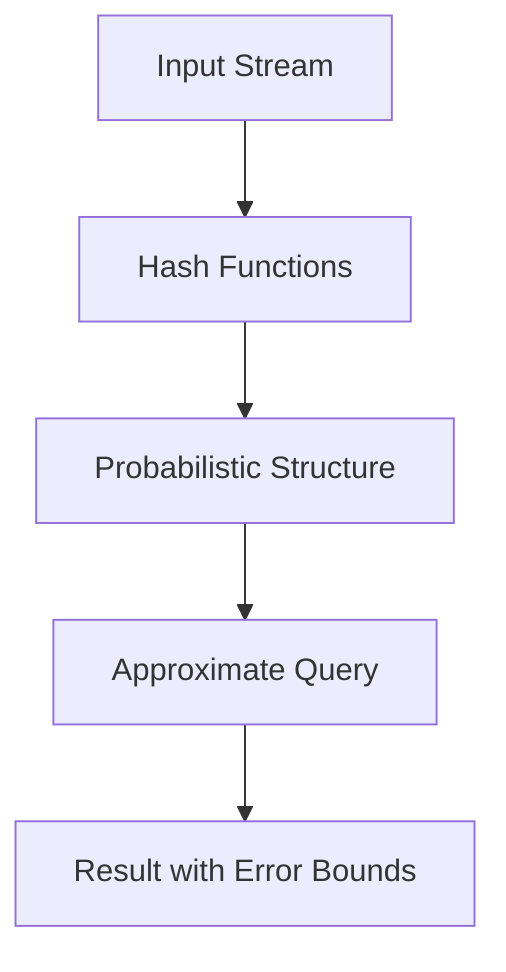

# Probabilistic Data Structures

## Overview

Probabilistic data structures are space-efficient algorithms that provide approximate answers to queries with a certain probability of error, trading accuracy for reduced memory usage. They are essential for handling large-scale data streams, big data analytics, and scenarios where exact computation is infeasible. Common examples include Bloom filters for set membership, HyperLogLog for cardinality estimation, and Count-Min Sketch for frequency counting. These structures use hashing and probabilistic techniques to achieve sub-linear space complexity while guaranteeing bounds on error rates.

## Detailed Explanation

Probabilistic data structures leverage randomness to approximate computations that would otherwise require storing entire datasets. They operate on principles like hashing collisions, statistical sampling, and error bounds derived from probability theory.

### Key Concepts
- **Trade-offs**: Space vs. accuracy; they use O(1) or O(log n) space instead of O(n).
- **Error Types**: False positives (e.g., Bloom filters), false negatives (rare or none), overestimation (e.g., Count-Min Sketch).
- **Hash Functions**: Pairwise independent hashes ensure low collision probabilities.
- **Parameters**: Tuned for error rate ε and confidence δ.

### Common Types
1. **Bloom Filter**: Tests set membership with possible false positives but no false negatives.
2. **HyperLogLog (HLL)**: Estimates cardinality of unique elements in a set.
3. **Count-Min Sketch**: Approximates frequency counts of elements in a stream.
4. **MinHash**: Estimates similarity between sets using Jaccard index.
5. **Count Sketch**: Similar to Count-Min but uses different hashing for unbiased estimates.

### How They Work
- **Bloom Filter**: Bit array with k hash functions; set bits for insertions, check for queries.
- **HyperLogLog**: Tracks maximum leading zeros in hashed values across registers; harmonic mean estimates cardinality.
- **Count-Min Sketch**: 2D array (d rows, w columns); increments counters via hashes; queries minimum value.

### Mathematical Foundations
- Bloom Filter false positive rate: (1 - e^(-kn/m))^k ≈ (1/2)^(m ln2 / n)
- HyperLogLog error: σ ≈ 1.04 / √m
- Count-Min error: Additive εN with probability 1-δ



## Real-world Examples & Use Cases

| Data Structure | Use Case | Example Application |
|----------------|----------|---------------------|
| Bloom Filter | Caching, duplicate detection | Web browsers check malicious URLs; databases avoid disk lookups |
| HyperLogLog | Cardinality estimation | Counting unique visitors in analytics; Redis PFCOUNT |
| Count-Min Sketch | Frequency estimation | Network traffic monitoring; heavy hitter detection in DDoS |
| MinHash | Similarity search | Recommendation systems; plagiarism detection |
| Count Sketch | Streaming analytics | Estimating item frequencies in e-commerce logs |

- **Big Data**: Apache Spark, Kafka use probabilistic structures for real-time processing.
- **Networking**: Routers use Bloom filters for packet filtering.
- **Databases**: PostgreSQL, Cassandra employ Bloom filters for index lookups.

## Code Examples

### Bloom Filter in Python
```python
import hashlib

class BloomFilter:
    def __init__(self, size, hash_count):
        self.size = size
        self.hash_count = hash_count
        self.bit_array = [0] * size

    def _hashes(self, item):
        hashes = []
        for i in range(self.hash_count):
            hash_obj = hashlib.md5((str(i) + item).encode())
            hashes.append(int(hash_obj.hexdigest(), 16) % self.size)
        return hashes

    def add(self, item):
        for h in self._hashes(item):
            self.bit_array[h] = 1

    def check(self, item):
        return all(self.bit_array[h] for h in self._hashes(item))

# Usage
bf = BloomFilter(1000, 3)
bf.add("apple")
print(bf.check("apple"))  # True
print(bf.check("banana"))  # False (likely)
```

### HyperLogLog in Python (Simplified)
```python
import math

class HyperLogLog:
    def __init__(self, b):
        self.b = b
        self.m = 1 << b
        self.registers = [0] * self.m
        self.alpha = {16: 0.673, 32: 0.697, 64: 0.709}.get(self.m, 0.7213 / (1 + 1.079 / self.m))

    def add(self, item):
        x = hash(item)
        j = x >> (32 - self.b)
        w = x & ((1 << (32 - self.b)) - 1)
        rho = 1 + (w.bit_length() if w else 32)
        self.registers[j] = max(self.registers[j], rho)

    def count(self):
        Z = 1 / sum(2 ** -r for r in self.registers if r)
        E = self.alpha * self.m ** 2 * Z
        return E

# Usage
hll = HyperLogLog(4)
hll.add("item1")
hll.add("item2")
print(hll.count())  # Approximate unique count
```

### Count-Min Sketch in Python
```python
import hashlib

class CountMinSketch:
    def __init__(self, w, d):
        self.w = w
        self.d = d
        self.table = [[0] * w for _ in range(d)]

    def _hash(self, item, seed):
        return int(hashlib.md5((str(seed) + item).encode()).hexdigest(), 16) % self.w

    def add(self, item, count=1):
        for i in range(self.d):
            j = self._hash(item, i)
            self.table[i][j] += count

    def query(self, item):
        return min(self.table[i][self._hash(item, i)] for i in range(self.d))

# Usage
cms = CountMinSketch(100, 4)
cms.add("apple", 5)
print(cms.query("apple"))  # At least 5
```

## References

- Cormode, G., & Muthukrishnan, S. (2005). An improved data stream summary: The count-min sketch and its applications. *Journal of Algorithms*, 55(1), 58-75. [DOI:10.1016/j.jalgor.2003.12.001](https://doi.org/10.1016/j.jalgor.2003.12.001)
- Flajolet, P., et al. (2007). HyperLogLog: The analysis of a near-optimal cardinality estimation algorithm. *Discrete Mathematics and Theoretical Computer Science*, AH, 137-156. [PDF](http://algo.inria.fr/flajolet/Publications/FlFuGaMe07.pdf)
- Bloom, B. H. (1970). Space/time trade-offs in hash coding with allowable errors. *Communications of the ACM*, 13(7), 422-426. [DOI:10.1145/362686.362692](https://doi.org/10.1145/362686.362692)
- Broder, A., & Mitzenmacher, M. (2004). Network applications of Bloom filters: A survey. *Internet Mathematics*, 1(4), 485-509. [DOI:10.1080/15427951.2004.10129096](https://doi.org/10.1080/15427951.2004.10129096)

## Github-README Links & Related Topics

- [Algorithms and Data Structures](../algorithms-and-data-structures/)
- [Hashing and Hash Tables](../algorithms-and-data-structures/hashing/)
- [Streaming Algorithms](../algorithms-and-data-structures/streaming-algorithms/)
- [Big Data Processing](../big-data-processing/)
- [Database Indexing Strategies](../database-indexing-strategies/)

## Common Pitfalls & Edge Cases

- **Hash Collisions**: Poor hash functions lead to higher error rates; use cryptographic hashes or pairwise independent ones.
- **Parameter Tuning**: Underestimating ε/δ causes excessive errors; overestimating wastes space.
- **False Positives in Bloom**: Cannot remove elements; use counting variants for deletions.
- **Bias in Count-Min**: Overestimates; mitigate with conservative updates or MLE estimators.
- **Cardinality Underestimation in HLL**: For small sets, switch to linear counting.
- **Edge Cases**: Empty sets, single elements, or highly skewed distributions may violate error bounds.

## Tools & Libraries

- **Java**: Stream-lib (Bloom, HLL, Count-Min)
- **Python**: datasketch (MinHash, LSH), mmh3 for hashing
- **C++**: Boost (Bloom filters)
- **Go**: go-probabilistic-datastructures
- **Databases**: Redis (HyperLogLog), Cassandra (Bloom filters)