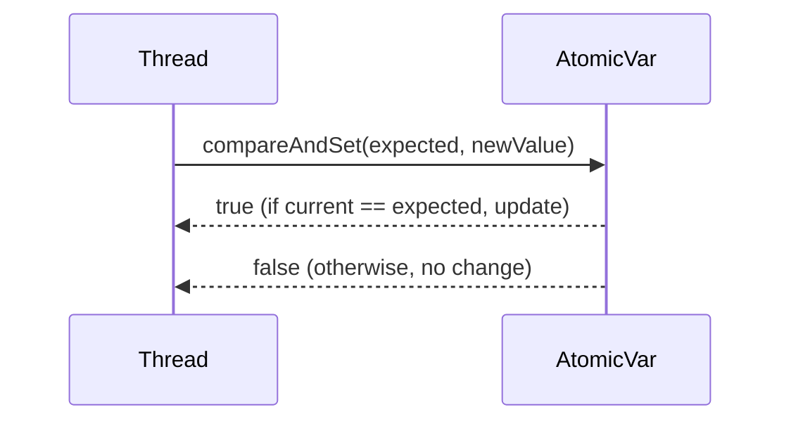

# Java Atomic Variables

## Overview

Java Atomic Variables provide lock-free, thread-safe operations on single variables. They use Compare-And-Swap (CAS) operations to ensure atomicity without blocking threads.

## Detailed Explanation

Classes like `AtomicInteger`, `AtomicLong`, `AtomicBoolean`, and `AtomicReference` offer methods for atomic updates. Common operations include `get()`, `set()`, `incrementAndGet()`, `compareAndSet()`.

CAS works by checking if the current value matches an expected value, and if so, updates it to a new value atomically.



## Real-world Examples & Use Cases

- Thread-safe counters in high-concurrency applications.
- Implementing locks or flags without synchronization.
- Statistics collection in multi-threaded servers.

## Code Examples

```java
import java.util.concurrent.atomic.AtomicInteger;

public class AtomicCounter {
    private final AtomicInteger counter = new AtomicInteger(0);

    public void increment() {
        counter.incrementAndGet();
    }

    public int getValue() {
        return counter.get();
    }

    public boolean compareAndSet(int expect, int update) {
        return counter.compareAndSet(expect, update);
    }
}
```

## Common Pitfalls & Edge Cases

- Atomic operations are only for single variables; for multiple variables, use locks.
- ABA problem: Use `AtomicStampedReference` to avoid.

## References

- [Oracle JavaDoc: AtomicInteger](https://docs.oracle.com/javase/8/docs/api/java/util/concurrent/atomic/AtomicInteger.html)
- [Java Concurrency in Practice - Chapter 15](https://www.amazon.com/Java-Concurrency-Practice-Brian-Goetz/dp/0321349601)

## Github-README Links & Related Topics

- [java-volatile-keyword](java-volatile-keyword/README.md)
- [Multithreading & Concurrency in Java](../multithreading-and-concurrency-in-java/README.md)