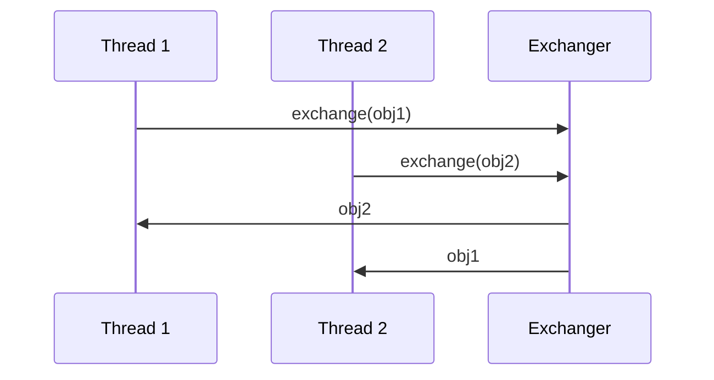

# Overview

A synchronization point at which threads can pair and swap elements within pairs. Each thread presents some object on entry to the `exchange` method, matches with a partner thread, and receives its partner's object on return. An Exchanger may be viewed as a bidirectional form of a `SynchronousQueue`. Exchangers may be useful in applications such as genetic algorithms and pipeline designs.

# Detailed Explanation

When two threads call exchange, they swap objects. If one thread arrives first, it waits for the second. Memory consistency: actions prior to exchange happen-before after.

## Constructors

- `Exchanger<V>()`: Creates a new Exchanger.

## Key Methods

- `V exchange(V x)`: Waits for another thread and exchanges objects.
- `V exchange(V x, long timeout, TimeUnit unit)`: With timeout.

# Real-world Examples & Use Cases

- Pipeline designs: Swapping buffers between producer and consumer threads.
- Genetic algorithms: Exchanging data between threads.
- Data transfer: Between stages in a processing pipeline.

# Code Examples

```java
import java.util.concurrent.Exchanger;

class FillAndEmpty {
    Exchanger<DataBuffer> exchanger = new Exchanger<>();

    class FillingLoop implements Runnable {
        public void run() {
            DataBuffer currentBuffer = initialEmptyBuffer;
            try {
                while (currentBuffer != null) {
                    addToBuffer(currentBuffer);
                    if (currentBuffer.isFull())
                        currentBuffer = exchanger.exchange(currentBuffer);
                }
            } catch (InterruptedException ex) {}
        }
    }

    class EmptyingLoop implements Runnable {
        public void run() {
            DataBuffer currentBuffer = initialFullBuffer;
            try {
                while (currentBuffer != null) {
                    takeFromBuffer(currentBuffer);
                    if (currentBuffer.isEmpty())
                        currentBuffer = exchanger.exchange(currentBuffer);
                }
            } catch (InterruptedException ex) {}
        }
    }
}
```

Simple exchange:

```java
Exchanger<String> exchanger = new Exchanger<>();
String received = exchanger.exchange("Hello");
```

# References

- [Oracle Java Docs: Exchanger](https://docs.oracle.com/javase/8/docs/api/java/util/concurrent/Exchanger.html)

# Github-README Links & Related Topics

- [Java CyclicBarrier](java-cyclicbarrier/)
- [Java Semaphore](java-semaphore/)
- [Multithreading & Concurrency in Java](multithreading-and-concurrency-in-java/)

# Common Pitfalls & Edge Cases

- Blocking: exchange blocks until partner arrives.
- Timeout: Use timeout version to avoid indefinite wait.
- Type safety: Generic type ensures exchanged objects are compatible.

# Tools & Libraries

- Java Standard Library: java.util.concurrent.Exchanger

