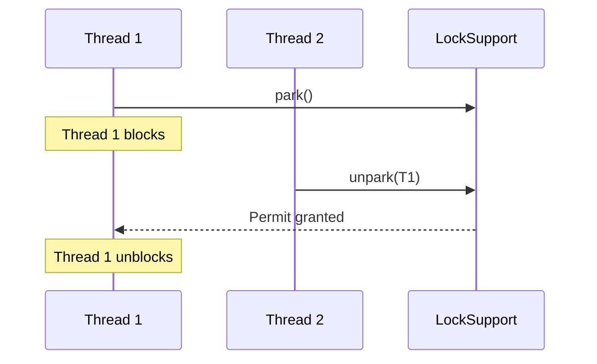

## Overview

LockSupport is a utility class in Java's `java.util.concurrent.locks` package that provides low-level primitives for thread blocking and unblocking. It serves as the foundation for higher-level synchronization utilities like ReentrantLock and Semaphore, allowing threads to park (block) and unpark (unblock) without the need for monitors or condition variables.

## Detailed Explanation

LockSupport operates by associating a permit with each thread. The `park()` method blocks the current thread if no permit is available, while `unpark(Thread)` makes a permit available to the specified thread, potentially unblocking it.

Key methods:
- `park()`: Blocks the current thread until a permit is available or interrupted.
- `parkNanos(long nanos)`: Blocks for a specified number of nanoseconds.
- `parkUntil(long deadline)`: Blocks until the specified deadline.
- `unpark(Thread thread)`: Makes a permit available to the given thread.

Unlike `Object.wait()`, LockSupport does not require acquiring a lock first and is not subject to spurious wakeups in the same way.

### Sequence Diagram



## Real-world Examples & Use Cases

1. **Custom Lock Implementation**: Building efficient locks without using synchronized blocks.
2. **Thread Pool Management**: Controlling worker threads in custom thread pools.
3. **Asynchronous Programming**: Implementing custom futures or promises.
4. **Rate Limiting**: Pausing threads to enforce rate limits in high-throughput systems.

## Code Examples

### Basic Park/Unpark Usage

```java
import java.util.concurrent.locks.LockSupport;

public class LockSupportExample {
    public static void main(String[] args) throws InterruptedException {
        Thread t = new Thread(() -> {
            System.out.println("Thread starting, about to park");
            LockSupport.park(); // Block until unparked
            System.out.println("Thread unparked, continuing");
        });
        
        t.start();
        Thread.sleep(1000); // Let thread start and park
        System.out.println("Unparking thread");
        LockSupport.unpark(t); // Unblock the thread
        t.join();
    }
}
```

### Custom Semaphore Using LockSupport

```java
import java.util.concurrent.locks.LockSupport;
import java.util.concurrent.atomic.AtomicInteger;

public class CustomSemaphore {
    private final AtomicInteger permits;
    
    public CustomSemaphore(int initialPermits) {
        this.permits = new AtomicInteger(initialPermits);
    }
    
    public void acquire() {
        while (true) {
            int current = permits.get();
            if (current > 0 && permits.compareAndSet(current, current - 1)) {
                return;
            }
            LockSupport.park();
        }
    }
    
    public void release() {
        permits.incrementAndGet();
        // Note: In a real implementation, you'd need to track waiting threads
        // This is a simplified example
    }
}
```

## Common Pitfalls & Edge Cases

- **Spurious Unparking**: Threads may unpark without an explicit unpark call due to JVM internals.
- **Permit Accumulation**: Multiple unpark calls before parking will only result in one permit being consumed.
- **Interrupt Handling**: Parked threads can be interrupted, throwing InterruptedException.
- **Performance**: LockSupport is low-level; prefer higher-level constructs when possible.

## Tools & Libraries

- **JDK**: Built-in `java.util.concurrent.locks.LockSupport`
- **Debugging**: Use thread dumps (`jstack`) to inspect parked threads

## References

- [Oracle Java Documentation: LockSupport](https://docs.oracle.com/javase/8/docs/api/java/util/concurrent/locks/LockSupport.html)
- [Java Concurrency in Practice - Chapter 14](https://www.amazon.com/Java-Concurrency-Practice-Brian-Goetz/dp/0321349601)

## Github-README Links & Related Topics

- [Java ReentrantLock](./java-reentrantlock/README.md)
- [Java Semaphore](./java-semaphore/README.md)
- [Multithreading & Concurrency in Java](./multithreading-and-concurrency-in-java/README.md)