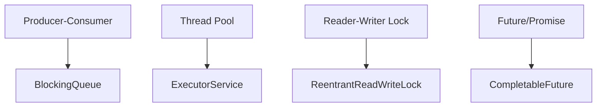

## Overview

Common patterns for concurrent programming in Java, including producer-consumer, thread pools, and synchronization idioms. Essential for building scalable and thread-safe applications.

## Detailed Explanation

Concurrency patterns provide reusable solutions for common threading problems, promoting safety and efficiency.



Key components:
- **Producer-Consumer**: Decouples producers and consumers using a shared buffer.
- **Thread Pools**: Manages a pool of worker threads for task execution.
- **Reader-Writer Locks**: Allows multiple readers or single writer access.
- **Futures and Promises**: Asynchronous computation with composable results.

Capacity and throughput targets:
- Thread pools: 10-100 threads depending on CPU cores and I/O.
- BlockingQueue: Bounded queues prevent memory issues.

Tradeoffs:
- **Synchronization vs Performance**: Locks reduce contention but add overhead.
- **Complexity vs Safety**: Higher-level abstractions reduce errors but may hide details.
- **Blocking vs Non-blocking**: Blocking is simpler but may cause deadlocks.

## Real-world Examples & Use Cases

- **Web Servers**: Handling concurrent client requests with thread pools.
- **Data Processing**: Parallel pipelines for ETL operations.
- **Caching Systems**: Concurrent access to shared caches with read-write locks.
- **Asynchronous APIs**: Using futures for non-blocking I/O operations.

## Code Examples

**Producer-Consumer Pattern:**

```java
import java.util.concurrent.*;

public class ProducerConsumerExample {
    private final BlockingQueue<Integer> queue = new ArrayBlockingQueue<>(10);

    public void produce(int value) throws InterruptedException {
        queue.put(value);
        System.out.println("Produced: " + value);
    }

    public void consume() throws InterruptedException {
        int value = queue.take();
        System.out.println("Consumed: " + value);
    }
}
```

**Thread Pool with ExecutorService:**

```java
import java.util.concurrent.*;

public class ThreadPoolExample {
    public static void main(String[] args) {
        ExecutorService executor = Executors.newFixedThreadPool(5);
        
        for (int i = 0; i < 10; i++) {
            executor.submit(() -> {
                System.out.println("Task executed by " + Thread.currentThread().getName());
            });
        }
        
        executor.shutdown();
        try {
            executor.awaitTermination(1, TimeUnit.MINUTES);
        } catch (InterruptedException e) {
            Thread.currentThread().interrupt();
        }
    }
}
```

**Reader-Writer Lock:**

```java
import java.util.concurrent.locks.*;

public class ReadWriteLockExample {
    private final ReadWriteLock lock = new ReentrantReadWriteLock();
    private int value = 0;

    public int readValue() {
        lock.readLock().lock();
        try {
            return value;
        } finally {
            lock.readLock().unlock();
        }
    }

    public void writeValue(int newValue) {
        lock.writeLock().lock();
        try {
            value = newValue;
        } finally {
            lock.writeLock().unlock();
        }
    }
}
```

**CompletableFuture for Asynchronous Operations:**

```java
import java.util.concurrent.*;

public class FutureExample {
    public static void main(String[] args) {
        CompletableFuture<String> future = CompletableFuture.supplyAsync(() -> {
            // Simulate async work
            try {
                Thread.sleep(1000);
            } catch (InterruptedException e) {
                Thread.currentThread().interrupt();
            }
            return "Result";
        });

        future.thenAccept(result -> System.out.println("Got: " + result));
        
        // Wait for completion
        future.join();
    }
}
```

## Data Models / Message Formats

**Task Objects:** Implement Runnable or Callable interfaces for thread pool submission.

**Shared State:** Use immutable objects or proper synchronization for mutable state.

**Messages:** POJOs or simple data structures passed between threads.

## Common Pitfalls & Edge Cases

- **Deadlocks**: Ensure lock acquisition order is consistent.
- **Race Conditions**: Use atomic operations or proper locking.
- **Thread Starvation**: Configure fair locks if needed.
- **Memory Visibility**: Use volatile or synchronized for shared variables.
- **Thread Leaks**: Always shutdown executors properly.

## Tools & Libraries

- java.util.concurrent: Core concurrency utilities.
- Guava: Additional concurrent collections and utilities.
- RxJava: Reactive programming for complex async flows.
- Akka: Actor-based concurrency framework.

## Github-README Links & Related Topics

- [Java Memory Model and Concurrency](java/java-memory-model-and-concurrency/README.md)
- [Threads Executors Futures](java/threads-executors-futures/README.md)
- [Concurrent Data Structures](java/concurrent-data-structures/README.md)

## References

- https://docs.oracle.com/javase/tutorial/essential/concurrency/
- https://www.baeldung.com/java-concurrency
- https://docs.oracle.com/javase/8/docs/api/java/util/concurrent/package-summary.html
- https://www.oracle.com/technetwork/articles/javase/index-140990.html