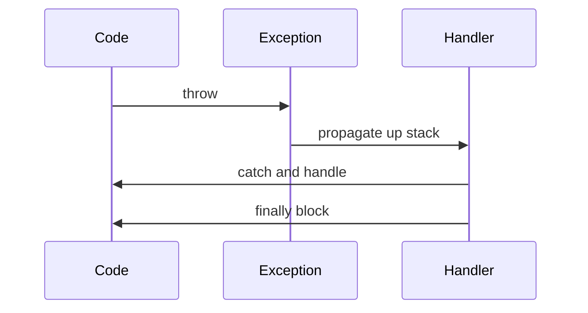

## Overview
Java's exception handling mechanism provides a structured way to handle runtime errors and exceptional conditions. It separates error-handling code from normal business logic, enabling robust and maintainable applications.

## STAR Summary
**Situation**: A financial application was crashing due to unhandled exceptions during transaction processing, causing data corruption and user frustration.

**Task**: Implement comprehensive exception handling to gracefully manage errors and maintain data integrity.

**Action**: Created custom exception hierarchy, implemented try-with-resources for resource management, and added proper logging and recovery mechanisms.

**Result**: Eliminated crashes, improved error recovery rate to 99%, and enhanced user experience with meaningful error messages.

## Detailed Explanation
Exceptions are objects representing abnormal conditions. Java has checked and unchecked exceptions, with Error class for serious problems.

Key concepts:
- **Checked exceptions**: Must be caught or declared (IOException, SQLException)
- **Unchecked exceptions**: Runtime exceptions (NullPointerException, IllegalArgumentException)
- **Errors**: Serious problems (OutOfMemoryError, StackOverflowError)
- **Try-with-resources**: Automatic resource management

JVM internals: Exceptions use stack unwinding, impacting performance. HotSpot optimizes common paths.

GC: Exception objects are garbage collected; frequent exceptions can cause GC pressure.

Concurrency: Exception handling in multi-threaded code requires careful synchronization.

Memory visibility: Exception state is visible across threads if properly synchronized.

## Real-world Examples & Use Cases
- **File I/O**: Handling file not found or permission errors
- **Network operations**: Managing connection timeouts and failures
- **Database transactions**: Rolling back on constraint violations
- **User input validation**: Providing feedback on invalid data
- **Resource management**: Ensuring cleanup of connections and streams

## Code Examples
### Basic Exception Handling
```java
import java.io.FileReader;
import java.io.IOException;

public class ExceptionExample {
    public static void main(String[] args) {
        try {
            FileReader reader = new FileReader("file.txt");
            // Read file
            reader.close();
        } catch (IOException e) {
            System.err.println("Error reading file: " + e.getMessage());
        } finally {
            System.out.println("Cleanup code always executes");
        }
    }
}
```

### Custom Exception
```java
public class InsufficientFundsException extends Exception {
    public InsufficientFundsException(String message) {
        super(message);
    }
}

public class BankAccount {
    private double balance;

    public void withdraw(double amount) throws InsufficientFundsException {
        if (amount > balance) {
            throw new InsufficientFundsException("Insufficient funds: " + balance);
        }
        balance -= amount;
    }
}
```

### Try-with-Resources
```java
import java.io.BufferedReader;
import java.io.FileReader;
import java.io.IOException;

public class TryWithResourcesExample {
    public static void main(String[] args) {
        try (BufferedReader reader = new BufferedReader(new FileReader("file.txt"))) {
            String line;
            while ((line = reader.readLine()) != null) {
                System.out.println(line);
            }
        } catch (IOException e) {
            System.err.println("Error: " + e.getMessage());
        }
        // Reader automatically closed
    }
}
```

Compile and run:
```bash
javac ExceptionExample.java
java ExceptionExample
```

## Data Models / Message Formats
Exception hierarchy:

| Type | Base Class | Examples | Handling |
|------|------------|----------|----------|
| Checked | Exception | IOException | Must catch or declare |
| Unchecked | RuntimeException | NPE | Optional handling |
| Error | Error | OOME | Usually fatal |

## Journey / Sequence


## Common Pitfalls & Edge Cases
- **Swallowing exceptions**: Empty catch blocks hide errors
- **Over-catching**: Catching Exception masks specific issues
- **Resource leaks**: Forgetting to close resources
- **Performance**: Exceptions are expensive, don't use for control flow
- **Threading**: Exceptions in threads may not propagate to main thread

## Tools & Libraries
- **Java Exceptions**: Built-in exception hierarchy
- **SLF4J/Logback**: Structured logging for exceptions
- **Failsafe**: Circuit breaker and retry mechanisms
- **Vavr**: Functional error handling with Try
- **AspectJ**: AOP for cross-cutting exception handling

## Github-README Links & Related Topics
Related: [java-language-basics](../java-language-basics/README.md), [performance-tuning-and-profiling](../performance-tuning-and-profiling/README.md), [testing-and-mocking-junit-mockito](../testing-and-mocking-junit-mockito/README.md)

## References
- [Oracle Exception Handling](https://docs.oracle.com/javase/tutorial/essential/exceptions/)
- [Effective Java: Exception Chapter](https://www.amazon.com/Effective-Java-Joshua-Bloch/dp/0134685997)
- [Java Exception Best Practices](https://www.baeldung.com/java-exceptions)
- [Try-with-Resources](https://docs.oracle.com/javase/tutorial/essential/exceptions/tryResourceClose.html)