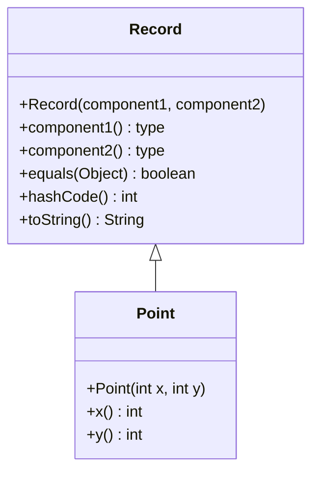

## Overview

Java Records, introduced as a preview feature in Java 14 and finalized in Java 16, are a special kind of class designed to act as transparent carriers for immutable data. They eliminate the need for boilerplate code by automatically generating constructors, accessors, `equals()`, `hashCode()`, and `toString()` methods based on the record's components. Records promote a more declarative style of programming, focusing on data rather than behavior, and are ideal for modeling simple data aggregates like DTOs, tuples, and configuration objects.

### Key Features
- **Immutability**: Records are shallowly immutable by default.
- **Conciseness**: Reduces code verbosity compared to traditional classes.
- **Automatic Generation**: Compiler generates essential methods.
- **Nominal Typing**: Records are classes with strong typing.
- **Serialization Support**: Built-in serialization with canonical constructor.



## Detailed Explanation

### Record Declaration and Syntax

A record is declared using the `record` keyword followed by the record name, a parameter list of components in parentheses, and an optional body in curly braces.

```java
[modifiers] record RecordName(ComponentType componentName, ...) [implements InterfaceList] {
    // optional body
}
```

- **Modifiers**: Records can be `public`, `private`, `protected`, or package-private.
- **Components**: Define the state; each component becomes a private final field, a public accessor method, and part of the canonical constructor.
- **Body**: Can include additional constructors, methods, and static members, but no instance fields or initializers.

Example:
```java
public record Point(int x, int y) {}
```

This declaration automatically generates:
- Private final fields: `private final int x;`, `private final int y;`
- Canonical constructor: `public Point(int x, int y) { this.x = x; this.y = y; }`
- Accessor methods: `public int x() { return x; }`, `public int y() { return y; }`
- `equals(Object o)`, `hashCode()`, and `toString()` methods.

### Components and State

Components are the immutable data fields of the record. They must be specified in the record header and cannot be modified after construction.

| Aspect | Description | Example |
|--------|-------------|---------|
| Types | Any valid Java type, including primitives, objects, generics, and varargs. | `record Pair<T, U>(T first, U second)` |
| Naming | Component names must be valid Java identifiers. | `record User(String userName, int userId)` |
| Annotations | Annotations on components propagate to fields, methods, and constructor parameters based on `@Target`. | `@NotNull String name` |
| Varargs | Supported for variable-length components. | `record LogEntry(String message, Object... args)` |

### Constructors

Records support multiple constructor forms:

1. **Canonical Constructor**: Automatically generated or explicitly declared to match the component list.
2. **Compact Canonical Constructor**: Allows validation and normalization without declaring parameters explicitly.
3. **Additional Constructors**: Must delegate to the canonical constructor using `this(...)`.

#### Compact Constructor Example
```java
public record Range(int start, int end) {
    public Range {
        if (start > end) {
            throw new IllegalArgumentException("Start must be <= end");
        }
    }
}
```

#### Additional Constructor Example
```java
public record Person(String name, int age) {
    public Person(String name) {
        this(name, 0); // Delegate to canonical
    }
}
```

### Methods and Behavior

- **Accessor Methods**: Automatically generated; can be overridden for custom logic (e.g., defensive copying).
- **Custom Methods**: Records can define additional instance methods, static methods, and nested types.
- **Overrides**: `equals()`, `hashCode()`, and `toString()` can be customized, but must preserve semantic invariants.

Example of custom accessor:
```java
public record Address(String street, String city, List<String> residents) {
    public Address {
        residents = List.copyOf(residents); // Defensive copy
    }

    public List<String> residents() {
        return List.copyOf(residents); // Defensive copy in accessor
    }
}
```

### Inheritance and Interfaces

- Records implicitly extend `java.lang.Record` and are `final`; they cannot be extended.
- Records can implement interfaces but cannot declare additional instance fields or initializers.
- Sealed classes can restrict which records implement them, enabling algebraic data types.

### Serialization

Records support serialization if all components are serializable. Deserialization always uses the canonical constructor, enforcing validation rules.

- Cannot customize serialization with `writeObject`/`readObject`.
- `readResolve` and `writeReplace` are supported for proxy objects.

### Restrictions

- No instance fields beyond components.
- No field initializers or instance initializers.
- Cannot extend other classes or be extended.
- No `native` methods.
- Inner classes can declare record members (relaxed in Java 16).

## Real-world Examples & Use Cases

Records excel in scenarios where data immutability and simplicity are prioritized. They reduce boilerplate in data-centric code, making it easier to read, write, and maintain.

| Use Case | Example Record | Description |
|----------|----------------|-------------|
| Data Transfer Objects (DTOs) | `record UserDTO(String id, String email, LocalDateTime createdAt)` | Immutable objects for transferring data between layers (e.g., API responses, database entities). |
| Configuration Objects | `record DatabaseConfig(String url, String username, char[] password)` | Holding immutable configuration data with validation in constructors. |
| Event Modeling | `record OrderPlaced(UUID orderId, BigDecimal amount, Instant timestamp)` | Representing events in event-driven systems or event sourcing. |
| API Responses | `record ApiResponse<T>(T data, HttpStatus status, String message)` | Typed, immutable responses for REST APIs. |
| Tuples/Pairs | `record Pair<A, B>(A first, B second)` | Generic containers for two values, useful in collections or algorithms. |
| Value Objects | `record Money(BigDecimal amount, Currency currency)` | Domain-specific immutable values with business logic. |
| Stream Processing | `record AggregatedData(String key, long count, double average)` | Intermediate results in data pipelines. |

In enterprise applications, records are commonly used in:
- **Microservices**: For request/response payloads.
- **Data Processing**: In Apache Spark or Kafka streams for key-value pairs.
- **Testing**: As test data fixtures.
- **Functional Programming**: As product types in algebraic data types with sealed interfaces.

## Code Examples

### Basic Record Usage

```java
public record Point(int x, int y) {}

public class BasicExample {
    public static void main(String[] args) {
        Point p1 = new Point(3, 4);
        Point p2 = new Point(3, 4);

        System.out.println(p1); // Point[x=3, y=4]
        System.out.println(p1.x()); // 3
        System.out.println(p1.y()); // 4
        System.out.println(p1.equals(p2)); // true
        System.out.println(p1.hashCode() == p2.hashCode()); // true
    }
}
```

### Validation with Compact Constructor

```java
public record PositiveInteger(int value) {
    public PositiveInteger {
        if (value <= 0) {
            throw new IllegalArgumentException("Value must be positive");
        }
    }
}

public class ValidationExample {
    public static void main(String[] args) {
        PositiveInteger pi = new PositiveInteger(5);
        System.out.println(pi.value()); // 5
        // new PositiveInteger(-1); // Throws IllegalArgumentException
    }
}
```

### Normalization and Custom Accessors

```java
import java.util.List;

public record ShoppingCart(List<String> items, double total) {
    public ShoppingCart {
        items = List.copyOf(items); // Defensive copy
        if (total < 0) total = 0;
    }

    public List<String> items() {
        return List.copyOf(items); // Defensive copy
    }
}

public class NormalizationExample {
    public static void main(String[] args) {
        List<String> mutableList = List.of("Apple", "Banana");
        ShoppingCart cart = new ShoppingCart(mutableList, 10.5);
        System.out.println(cart.items()); // [Apple, Banana]
        System.out.println(cart.total()); // 10.5
    }
}
```

### Generic Records and Methods

```java
public record Result<T>(T data, String status) {
    public boolean isSuccess() {
        return "SUCCESS".equals(status);
    }

    public Result<T> withStatus(String newStatus) {
        return new Result<>(data, newStatus);
    }
}

public class GenericExample {
    public static void main(String[] args) {
        Result<String> success = new Result<>("Data loaded", "SUCCESS");
        Result<Integer> failure = new Result<>(404, "ERROR");

        System.out.println(success.isSuccess()); // true
        System.out.println(failure.withStatus("RETRY")); // Result[data=404, status=RETRY]
    }
}
```

### Records with Interfaces and Inheritance

```java
interface Shape {
    double area();
}

public record Circle(double radius) implements Shape {
    @Override
    public double area() {
        return Math.PI * radius * radius;
    }
}

public record Rectangle(double width, double height) implements Shape {
    @Override
    public double area() {
        return width * height;
    }
}

public class InterfaceExample {
    public static void main(String[] args) {
        Shape circle = new Circle(5);
        Shape rect = new Rectangle(4, 6);

        System.out.println("Circle area: " + circle.area()); // 78.53981633974483
        System.out.println("Rectangle area: " + rect.area()); // 24.0
    }
}
```

### Local Records for Improved Readability

```java
import java.util.List;
import java.util.Map;
import java.util.stream.Collectors;

public class LocalRecordExample {
    public record CityStats(String city, long population) {}

    public static void main(String[] args) {
        List<String> cities = List.of("New York", "Los Angeles", "New York", "Chicago");

        Map<String, Long> stats = cities.stream()
            .collect(Collectors.groupingBy(city -> city, Collectors.counting()));

        List<CityStats> topCities = stats.entrySet().stream()
            .map(entry -> new CityStats(entry.getKey(), entry.getValue()))
            .sorted((a, b) -> Long.compare(b.population, a.population))
            .limit(2)
            .toList();

        topCities.forEach(System.out::println);
        // CityStats[city=New York, population=2]
        // CityStats[city=Los Angeles, population=1]
    }
}
```

### Serialization Example

```java
import java.io.*;

public record SerializableRecord(String name, int value) implements Serializable {}

public class SerializationExample {
    public static void main(String[] args) throws IOException, ClassNotFoundException {
        SerializableRecord original = new SerializableRecord("Test", 42);

        // Serialize
        ByteArrayOutputStream baos = new ByteArrayOutputStream();
        ObjectOutputStream oos = new ObjectOutputStream(baos);
        oos.writeObject(original);
        oos.close();

        // Deserialize
        ByteArrayInputStream bais = new ByteArrayInputStream(baos.toByteArray());
        ObjectInputStream ois = new ObjectInputStream(bais);
        SerializableRecord deserialized = (SerializableRecord) ois.readObject();
        ois.close();

        System.out.println(deserialized.equals(original)); // true
    }
}
```

## Common Pitfalls & Edge Cases

### Mutability Issues
Records provide shallow immutability. If a component is a mutable object (e.g., `List`, `Map`), the record's immutability can be compromised.

```java
public record BadRecord(List<String> items) {}

public class PitfallExample {
    public static void main(String[] args) {
        List<String> list = new ArrayList<>(List.of("A"));
        BadRecord record = new BadRecord(list);
        list.add("B"); // Modifies the record's state!
        System.out.println(record.items()); // [A, B] - Unexpected mutation
    }
}
```

**Solution**: Use defensive copying in constructors and accessors.

### Inheritance Limitations
Records cannot be extended, and attempting to do so results in a compile-time error.

```java
public record BaseRecord(int value) {}

// public record ExtendedRecord(int value, int extra) extends BaseRecord {} // Error
```

**Workaround**: Use composition or interfaces.

### Annotation Propagation
Annotations on components propagate based on their `@Target`. Misuse can lead to unexpected behavior.

```java
@Target(ElementType.FIELD)
public @interface MyAnnotation {}

public record AnnotatedRecord(@MyAnnotation String field) {}
// Annotation applies to the private field, not the accessor or constructor parameter.
```

### Serialization Constraints
Records cannot customize serialization. If components aren't serializable, the record isn't either.

```java
public record NonSerializableRecord(NotSerializableClass obj) {} // Won't serialize
```

### Performance Considerations
For very simple data, records might have slight overhead compared to plain classes. Use primitives where possible.

### Edge Cases
- **Empty Records**: `record Empty() {}` is valid but unusual.
- **Recursive Records**: Components can reference the record type, but be cautious with `equals`/`hashCode`.
- **Varargs in Records**: `record VarargsRecord(String... args) {}` treats `args` as an array.
- **Local Records**: Can be declared inside methods, implicitly static.

## Tools & Libraries

- **Jackson**: Seamless JSON serialization/deserialization for records in REST APIs.
- **Lombok**: Provides alternatives like `@Value` for immutable classes, though records are preferred for new code.
- **MapStruct**: Automatic mapping between records and JPA entities.
- **Spring Boot**: Enhanced support for records in data binding and validation.
- **Hibernate**: Records can be used as embeddable objects or query results.
- **JUnit 5**: Records work well as test data containers.

## Github-README Links & Related Topics

- [Java Fundamentals](../java-fundamentals/README.md)
- [Java Generics](../java-generics/README.md)
- [OOP Principles in Java](../oop-principles-in-java/README.md)
- [Java Annotations](../java-annotations/README.md)
- [Serialization in Java](../serialization-and-deserialization/README.md)
- [Design Patterns in Java](../design-patterns-in-java/README.md)
- [Functional Programming in Java](../java-stream-api-and-functional-programming/README.md)

## References

- [JEP 395: Records](https://openjdk.java.net/jeps/395) - Official JEP for Records feature.
- [Oracle Java Tutorial: Records](https://docs.oracle.com/javase/tutorial/java/javaOO/records.html) - Comprehensive tutorial from Oracle.
- [Java Language Specification (JLS) - Records](https://docs.oracle.com/javase/specs/jls/se21/html/jls-8.html#jls-8.10) - Formal specification.
- [Dev.java: Using Record to Model Immutable Data](https://dev.java/learn/records/) - In-depth guide with examples.
- [Baeldung: Java Records](https://www.baeldung.com/java-record-vs-class) - Comparison with traditional classes.
- [OpenJDK Records Documentation](https://openjdk.org/projects/amber/guides/records) - Additional resources from OpenJDK.</content>
</xai:function_call ><xai:function_call name="edit">
<parameter name="filePath">README.md