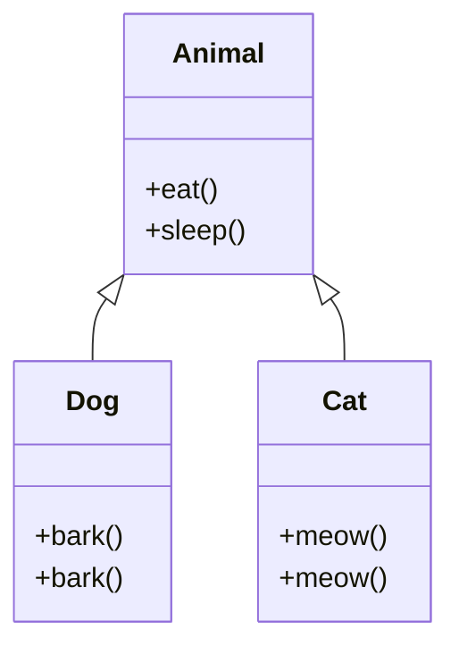

# Inheritance in Java

## Overview

Inheritance is a fundamental OOP concept where a class (subclass) inherits properties and methods from another class (superclass). It promotes code reuse and establishes an "is-a" relationship.

## Detailed Explanation

### Types of Inheritance

- **Single Inheritance**: One subclass extends one superclass.
- **Multilevel Inheritance**: A -> B -> C.
- **Hierarchical Inheritance**: One superclass, multiple subclasses.
- Java doesn't support multiple inheritance for classes (diamond problem), but interfaces allow it.

### Key Concepts

- **extends** keyword for class inheritance.
- **implements** for interfaces.
- **super** keyword to access superclass members.
- Method overriding: Subclass provides specific implementation.
- **final** classes cannot be inherited.



### Method Overriding Rules

- Same method signature.
- Covariant return types allowed (Java 5+).
- Cannot override final, static, private methods.
- Access modifier can be more permissive.

### Constructor Chaining

- Subclass constructors call superclass constructor implicitly or via super().

## Real-world Examples & Use Cases

- **Animal Hierarchy**: Animal -> Mammal -> Dog.
- **GUI Components**: Component -> Button, TextField.
- **Employee System**: Employee -> Manager, Developer.
- **Vehicle Types**: Vehicle -> Car, Truck.

## Code Examples

### Basic Inheritance

```java
class Animal {
    void eat() {
        System.out.println("Animal eats");
    }
}

class Dog extends Animal {
    void bark() {
        System.out.println("Dog barks");
    }
}

public class InheritanceExample {
    public static void main(String[] args) {
        Dog dog = new Dog();
        dog.eat(); // Inherited
        dog.bark(); // Own method
    }
}
```

### Method Overriding

```java
class Animal {
    void makeSound() {
        System.out.println("Animal sound");
    }
}

class Dog extends Animal {
    @Override
    void makeSound() {
        System.out.println("Woof");
    }
}

class Cat extends Animal {
    @Override
    void makeSound() {
        System.out.println("Meow");
    }
}

public class OverrideExample {
    public static void main(String[] args) {
        Animal dog = new Dog();
        Animal cat = new Cat();
        dog.makeSound(); // Woof
        cat.makeSound(); // Meow
    }
}
```

### Constructor and super()

```java
class Person {
    String name;
    Person(String name) {
        this.name = name;
    }
}

class Employee extends Person {
    int id;
    Employee(String name, int id) {
        super(name); // Call superclass constructor
        this.id = id;
    }
}

public class ConstructorExample {
    public static void main(String[] args) {
        Employee emp = new Employee("John", 123);
        System.out.println(emp.name + " " + emp.id);
    }
}
```

### Abstract Classes

```java
abstract class Shape {
    abstract double area();
    void display() {
        System.out.println("Shape");
    }
}

class Circle extends Shape {
    double radius;
    Circle(double r) { radius = r; }
    double area() { return Math.PI * radius * radius; }
}

public class AbstractExample {
    public static void main(String[] args) {
        Shape shape = new Circle(5);
        System.out.println("Area: " + shape.area());
    }
}
```

## Common Pitfalls & Edge Cases

- **Fragile Base Class Problem**: Changes in superclass can break subclasses.
- **Diamond Problem**: Avoided by not allowing multiple class inheritance.
- **Overriding vs Overloading**: Overriding is runtime polymorphism, overloading is compile-time.
- **Access Levels**: Private members not inherited.

## References

- [Oracle Inheritance](https://docs.oracle.com/javase/tutorial/java/IandI/subclasses.html)
- [Method Overriding](https://docs.oracle.com/javase/tutorial/java/IandI/override.html)

## Github-README Links & Related Topics

- [OOP Principles in Java](../oop-principles-in-java/README.md)
- [Polymorphism in Java](../polymorphism-in-java/README.md)
- [Java Abstract Classes](../java-abstract-classes/README.md)