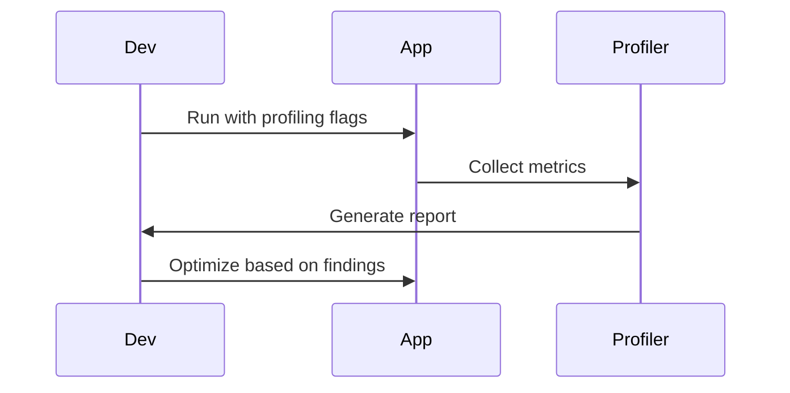

## Overview
Performance tuning involves optimizing JVM and application code for better speed, memory usage, and throughput. Profiling identifies bottlenecks using tools like VisualVM, JProfiler, and Java Flight Recorder (JFR).

## STAR Case Study
**Situation:** In a high-traffic e-commerce platform, the application was experiencing slow response times during peak hours, leading to user complaints and potential revenue loss.

**Task:** As the lead backend engineer, I was tasked with diagnosing and resolving the performance issues to ensure the system could handle 10k+ concurrent users with sub-200ms response times.

**Action:** I started by enabling JFR on production instances to collect detailed performance data without significant overhead. The recordings revealed excessive GC pauses due to heap fragmentation. I switched from CMS to G1 GC, adjusted heap sizes (-Xms4g -Xmx8g), and optimized code by reducing object allocations in hot paths. Additionally, I used VisualVM to profile CPU hotspots, identifying inefficient string concatenations that I replaced with StringBuilder.

**Result:** Post-optimization, average response time dropped to 150ms, throughput increased by 35%, and GC pauses were reduced by 60%, allowing the platform to scale effectively.

## Detailed Explanation
- **JVM Tuning:** Heap size (-Xms, -Xmx), GC algorithms (G1, CMS), flags for low-latency.
- **Profiling:** CPU sampling, memory heap dumps, thread analysis.
- **Tools:** VisualVM (free), JProfiler (commercial), JFR (built-in).

## Real-world Examples & Use Cases
- Optimizing web servers for high concurrency.
- Reducing memory leaks in long-running apps.
- Tuning databases and caches.

## Code Examples
### Basic JVM Tuning Flags
```bash
java -Xms512m -Xmx2g -XX:+UseG1GC -XX:MaxGCPauseMillis=200 MyApp
```

### Using JFR for Profiling
```java
import jdk.jfr.*;

@Event(name = "com.example.CustomEvent")
public class CustomEvent extends Event {
    public String message;
}

public class ProfilingExample {
    public static void main(String[] args) {
        CustomEvent event = new CustomEvent();
        event.message = "Starting profiling";
        event.commit();
        // Application code
    }
}
```

Compile and run: `javac -cp $JAVA_HOME/lib/jfr.jar *.java && java -XX:StartFlightRecording:filename=recording.jfr,duration=10s ProfilingExample`

## Data Models / Message Formats
| Metric | Tool | Description |
|--------|------|-------------|
| CPU Time | VisualVM | Time spent in methods |
| Heap Usage | JProfiler | Memory allocation |
| GC Pauses | JFR | Garbage collection events |

## Journey / Sequence


## Common Pitfalls & Edge Cases
- Over-tuning leading to instability.
- Profiling in production environments.
- Ignoring warm-up periods.

## Common Interview Questions

1. How do you identify performance bottlenecks in a Java application?

   Use profiling tools like VisualVM, JProfiler, or JFR to analyze CPU usage, memory allocation, and thread activity.

2. What are common JVM tuning flags?

   -Xms and -Xmx for heap size, -XX:+UseG1GC for GC algorithm, -XX:MaxGCPauseMillis for pause time.

3. Explain the difference between profiling and benchmarking.

   Profiling analyzes application behavior in detail, benchmarking measures performance metrics under specific conditions.

4. How to use Java Flight Recorder (JFR)?

   Enable with -XX:StartFlightRecording, analyze with Java Mission Control.

5. What is the impact of GC on performance?

   Frequent GC pauses can cause latency spikes; choose appropriate GC for low-latency apps.

## Tools & Libraries
- VisualVM: Free JVM profiler.
- JProfiler: Advanced commercial tool.
- JFR: Built-in Oracle JDK tool.

## Github-README Links & Related Topics
Related: [jvm-internals-and-classloading](../jvm-internals-and-classloading/), [garbage-collection-algorithms](../garbage-collection-algorithms/), [testing-and-mocking-junit-mockito](../testing-and-mocking-junit-mockito/)

## References
- https://docs.oracle.com/javase/8/docs/technotes/tools/unix/jvisualvm.html
- https://docs.oracle.com/javacomponents/jmc-5-4/jfr-runtime-guide/about.htm
- https://visualvm.github.io/
- https://www.oracle.com/java/technologies/javase/vmoptions-jsp.html