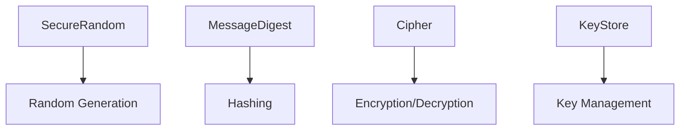

# Overview

Java Security API provides cryptography, authentication, and secure coding practices to protect applications from threats. Essential for building secure systems.

Canonical Interview Prompt: Implement secure password storage using Java's security APIs.

# Detailed Explanation

## High-Level Design

Java Cryptography Architecture (JCA) provides pluggable providers for algorithms. Secure coding prevents vulnerabilities like injection and XSS.



## Key Components

- **Cryptography**: Hashing (SHA-256), encryption (AES), digital signatures.
- **Secure Random**: Cryptographically strong random numbers.
- **Key Management**: KeyStore for storing keys securely.
- **Secure Coding**: Input validation, avoiding SQL injection.

## Capacity and Throughput Targets

- Hashing: 100k-1M operations/second depending on algorithm.
- Encryption: Slower; use for sensitive data only.

## Tradeoffs

- **Security vs Performance**: Strong algorithms are slower.
- **Complexity**: Proper key management adds overhead.
- **Compliance**: Follow standards like OWASP.

# Real-world Examples & Use Cases

- **Password Storage**: Hash with salt using PBKDF2.
- **Data Encryption**: Encrypt sensitive data at rest/transit.
- **Authentication**: Secure token generation.

# Code Examples

**Password Hashing:**

```java
import java.security.MessageDigest;
import java.security.SecureRandom;
import java.util.Base64;

SecureRandom random = new SecureRandom();
byte[] salt = new byte[16];
random.nextBytes(salt);

MessageDigest md = MessageDigest.getInstance("SHA-256");
md.update(salt);
byte[] hash = md.digest(password.getBytes());

String hashed = Base64.getEncoder().encodeToString(hash);
```

**AES Encryption:**

```java
import javax.crypto.Cipher;
import javax.crypto.KeyGenerator;
import javax.crypto.SecretKey;

KeyGenerator keyGen = KeyGenerator.getInstance("AES");
keyGen.init(128);
SecretKey key = keyGen.generateKey();

Cipher cipher = Cipher.getInstance("AES");
cipher.init(Cipher.ENCRYPT_MODE, key);
byte[] encrypted = cipher.doFinal(data.getBytes());
```

# Data Models / Message Formats

**Hashed Password:**

Salt + Hash (Base64 encoded)

**Encrypted Data:**

Ciphertext with IV for AES.

# Common Pitfalls & Edge Cases

- **Weak Algorithms**: Avoid MD5; use SHA-256 or better.
- **Key Storage**: Never hardcode keys; use KeyStore.
- **Timing Attacks**: Use constant-time comparisons for secrets.

# Tools & Libraries

- Java Security API
- Bouncy Castle for additional algorithms
- OWASP libraries for secure coding

# Github-README Links & Related Topics

[security-authz-authn-tokens](../security-authz-authn-tokens/README.md), [jvm-internals-and-classloading](../jvm-internals-and-classloading/README.md)

# References

- https://docs.oracle.com/javase/8/docs/technotes/guides/security/
- https://www.oracle.com/java/technologies/javase/javase-tech-security.html
- https://owasp.org/