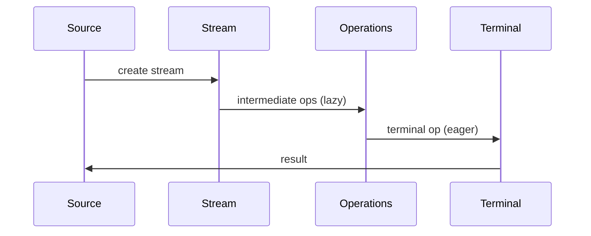

## Overview
Java Streams API and functional programming features enable declarative, composable data processing. Introduced in Java 8, they provide a modern approach to handling collections and I/O operations with functional interfaces and lambda expressions.

## STAR Summary
**Situation**: A data analytics pipeline was using imperative loops for processing large datasets, leading to verbose code and performance issues.

**Task**: Refactor to functional programming paradigm for better readability and parallel processing capabilities.

**Action**: Replaced nested loops with Stream API operations, utilized parallel streams for CPU-intensive tasks, and implemented functional interfaces for data transformations.

**Result**: Reduced code lines by 60%, improved parallel processing performance by 3x, and enhanced maintainability.

## Detailed Explanation
Streams represent sequences of elements supporting sequential and parallel operations. Functional interfaces like Predicate, Function, Consumer enable lambda expressions.

Key concepts:
- **Intermediate operations**: filter, map, flatMap (lazy, return Stream)
- **Terminal operations**: collect, forEach, reduce (eager, produce result)
- **Functional interfaces**: @FunctionalInterface with single abstract method
- **Method references**: Shorthand for lambda expressions (:: operator)

JVM internals: Streams can be sequential or parallel; parallel streams use ForkJoinPool.

GC: Stream operations create intermediate objects; careful with large datasets to avoid excessive GC.

Concurrency: Parallel streams handle partitioning automatically, but require stateless operations.

Memory visibility: Functional operations should be pure functions for thread safety.

## Real-world Examples & Use Cases
- **Data filtering**: Processing user data with complex criteria
- **Aggregation**: Computing statistics from large datasets
- **Transformation**: Converting data formats (JSON to objects)
- **Parallel processing**: CPU-intensive computations on multi-core systems
- **I/O processing**: Reading and processing files line-by-line

## Code Examples
### Basic Stream Operations
```java
import java.util.Arrays;
import java.util.List;
import java.util.stream.Collectors;

public class StreamExample {
    public static void main(String[] args) {
        List<String> words = Arrays.asList("Java", "Streams", "API", "Functional");
        
        List<String> result = words.stream()
            .filter(word -> word.length() > 4)
            .map(String::toUpperCase)
            .sorted()
            .collect(Collectors.toList());
        
        System.out.println(result); // [STREAMS, FUNCTIONAL]
    }
}
```

### Parallel Stream Processing
```java
import java.util.stream.IntStream;

public class ParallelStreamExample {
    public static void main(String[] args) {
        long count = IntStream.range(1, 1000000)
            .parallel()
            .filter(n -> n % 2 == 0)
            .count();
        
        System.out.println("Even numbers: " + count);
    }
}
```

### Custom Functional Interface
```java
@FunctionalInterface
interface Processor<T, R> {
    R process(T input);
}

public class FunctionalInterfaceExample {
    public static void main(String[] args) {
        Processor<String, Integer> lengthProcessor = String::length;
        
        System.out.println(lengthProcessor.process("Hello")); // 5
    }
}
```

Compile and run:
```bash
javac StreamExample.java
java StreamExample
```

## Data Models / Message Formats
Stream processing pipeline:

| Stage | Operation | Input | Output |
|-------|-----------|-------|--------|
| Source | stream() | Collection | Stream |
| Filter | filter() | Stream | Stream |
| Transform | map() | Stream | Stream |
| Aggregate | collect() | Stream | Result |

## Journey / Sequence


## Common Pitfalls & Edge Cases
- **Stateful operations**: Avoid mutable state in parallel streams
- **Infinite streams**: Use limit() with infinite sources
- **Performance**: Parallel streams have overhead for small datasets
- **Exception handling**: Checked exceptions in lambdas require wrapping
- **Debugging**: Streams are harder to debug than loops

## Tools & Libraries
- **Java Streams**: Built-in java.util.stream
- **Vavr**: Functional programming library for Java
- **Cyclops**: Enhanced functional operations
- **StreamEx**: Additional stream utilities
- **IntelliJ IDEA**: Excellent lambda debugging support

## Github-README Links & Related Topics
Related: [collections-framework](../collections-framework/README.md), [performance-tuning-and-profiling](../performance-tuning-and-profiling/README.md), [java-language-basics](../java-language-basics/README.md)

## References
- [Oracle Streams API](https://docs.oracle.com/javase/8/docs/api/java/util/stream/package-summary.html)
- [Functional Programming in Java](https://www.amazon.com/Functional-Programming-Java-Harnessing/dp/1937785467)
- [Java 8 Streams](https://www.baeldung.com/java-8-streams)
- [Lambda Expressions](https://docs.oracle.com/javase/tutorial/java/javaOO/lambdaexpressions.html)