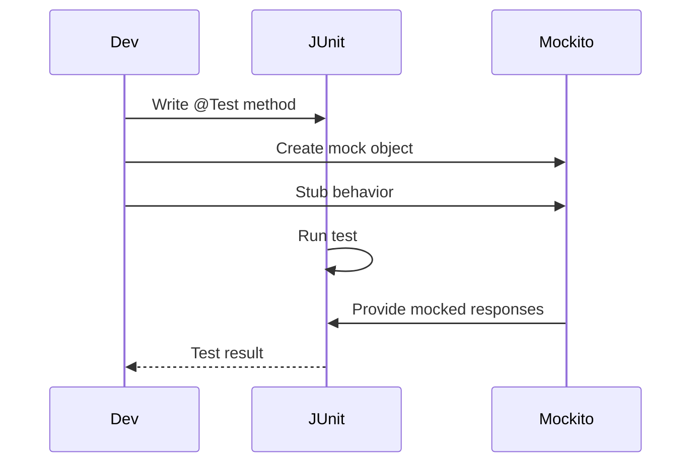

## Overview
JUnit is a framework for writing and running unit tests in Java. Mockito is a mocking framework for creating mock objects in tests. Together, they enable robust, isolated testing of code.

## STAR Summary
**Situation:** Developing a service with external API dependencies.  
**Task:** Ensure unit tests don't fail due to external calls.  
**Action:** Used Mockito to mock dependencies and JUnit for test execution.  
**Result:** Achieved 95% test coverage with reliable, fast tests.

## Detailed Explanation
- **JUnit:** Annotations like @Test, @BeforeEach; assertions for verifying behavior.
- **Mockito:** @Mock, when().thenReturn() for stubbing; verify() for interaction checks.
- **Integration:** JUnit runs tests, Mockito provides mocks.

## Real-world Examples & Use Cases
- Unit testing business logic.
- Testing service layers with mocked repositories.
- Integration tests with mocked external services.

## Code Examples
### JUnit Test
```java
import org.junit.jupiter.api.Test;
import static org.junit.jupiter.api.Assertions.*;

public class CalculatorTest {
    @Test
    void testAdd() {
        Calculator calc = new Calculator();
        assertEquals(5, calc.add(2, 3));
    }
}
```

### Mockito Mock
```java
import org.junit.jupiter.api.Test;
import org.mockito.Mockito;
import static org.mockito.Mockito.*;

public class ServiceTest {
    @Test
    void testService() {
        Repository repo = mock(Repository.class);
        when(repo.getData()).thenReturn("mocked");
        Service service = new Service(repo);
        assertEquals("processed mocked", service.process());
    }
}
```

Compile and run: `mvn test` or `gradle test`

## Data Models / Message Formats
| Component | JUnit | Mockito |
|-----------|-------|---------|
| Annotation | @Test | @Mock |
| Assertion | assertEquals | verify |

## Journey / Sequence


## Common Pitfalls & Edge Cases
- Forgetting to verify interactions.
- Over-mocking leading to brittle tests.
- Not handling exceptions in tests.

## Common Interview Questions
- **What is the difference between @Mock and @Spy in Mockito?** @Mock creates a completely mocked object with no real behavior. @Spy wraps a real object and allows calling real methods unless stubbed.
- **How do you verify method calls in Mockito?** Use verify(mock).methodCall() to check if a method was called with specific arguments.
- **Explain JUnit lifecycle annotations.** @BeforeEach runs before each test, @AfterEach after each, @BeforeAll once before all tests, @AfterAll once after all.
- **What is a parameterized test in JUnit?** @ParameterizedTest allows running the same test with different inputs, using @ValueSource or custom providers.
- **How to handle exceptions in JUnit tests?** Use assertThrows() to verify exceptions are thrown.

## Tools & Libraries
- JUnit: junit-jupiter
- Mockito: mockito-core
- IDE plugins for running tests.

## Github-README Links & Related Topics
Related: [build-tools-maven-gradle](../build-tools-maven-gradle/), [performance-tuning-and-profiling](../performance-tuning-and-profiling/), [jvm-internals-and-classloading](../jvm-internals-and-classloading/)

## References
- https://junit.org/junit5/docs/current/user-guide/
- https://javadoc.io/doc/org.mockito/mockito-core/latest/org/mockito/Mockito.html