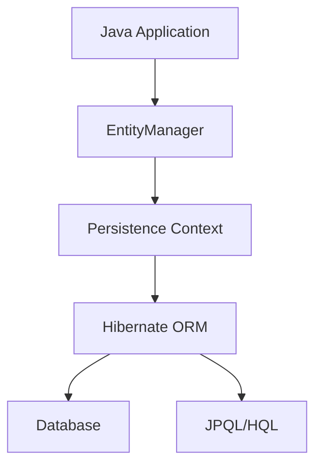

# JPA and Hibernate

## Overview

Java Persistence API (JPA) is a specification for object-relational mapping (ORM) in Java. Hibernate is the most popular implementation of JPA, providing a framework for mapping Java objects to database tables and vice versa. JPA and Hibernate simplify database operations by allowing developers to work with objects instead of SQL queries directly.

## Detailed Explanation

JPA defines a set of interfaces and annotations for managing relational data in Java applications. Hibernate implements these interfaces and adds additional features.

### Key Concepts

- **Entity**: A Java class mapped to a database table.
- **EntityManager**: Interface for performing CRUD operations.
- **Persistence Context**: Manages entity instances.
- **JPQL**: Java Persistence Query Language for querying entities.
- **Annotations**: `@Entity`, `@Id`, `@Column`, etc., for mapping.

### Architecture



## Real-world Examples & Use Cases

- **E-commerce Applications**: Manage products, orders, and users.
- **Content Management Systems**: Store and retrieve articles, comments.
- **Financial Systems**: Handle transactions and account data.
- **Social Networks**: Manage user profiles and relationships.
- **Enterprise Applications**: Integrate with legacy databases.

## Code Examples

### Entity Class

```java
import javax.persistence.Entity;
import javax.persistence.Id;
import javax.persistence.GeneratedValue;
import javax.persistence.GenerationType;

@Entity
public class User {
    @Id
    @GeneratedValue(strategy = GenerationType.IDENTITY)
    private Long id;

    private String name;
    private String email;

    // Getters and setters
    public Long getId() { return id; }
    public void setId(Long id) { this.id = id; }

    public String getName() { return name; }
    public void setName(String name) { this.name = name; }

    public String getEmail() { return email; }
    public void setEmail(String email) { this.email = email; }
}
```

### Repository Interface

```java
import org.springframework.data.jpa.repository.JpaRepository;
import org.springframework.stereotype.Repository;

@Repository
public interface UserRepository extends JpaRepository<User, Long> {
    User findByEmail(String email);
}
```

### Service Class

```java
import org.springframework.beans.factory.annotation.Autowired;
import org.springframework.stereotype.Service;

@Service
public class UserService {
    @Autowired
    private UserRepository userRepository;

    public User saveUser(User user) {
        return userRepository.save(user);
    }

    public User findUserById(Long id) {
        return userRepository.findById(id).orElse(null);
    }

    public List<User> findAllUsers() {
        return userRepository.findAll();
    }
}
```

### JPQL Query

```java
import javax.persistence.EntityManager;
import javax.persistence.PersistenceContext;
import javax.persistence.Query;
import java.util.List;

@Service
public class UserService {
    @PersistenceContext
    private EntityManager entityManager;

    public List<User> findUsersByName(String name) {
        Query query = entityManager.createQuery("SELECT u FROM User u WHERE u.name LIKE :name");
        query.setParameter("name", "%" + name + "%");
        return query.getResultList();
    }
}
```

### Hibernate Configuration

In `application.properties`:

```properties
spring.datasource.url=jdbc:h2:mem:testdb
spring.datasource.driverClassName=org.h2.Driver
spring.jpa.database-platform=org.hibernate.dialect.H2Dialect
spring.jpa.hibernate.ddl-auto=create-drop
spring.jpa.show-sql=true
```

## Common Pitfalls & Edge Cases

- **N+1 Query Problem**: Avoid by using fetch joins or batch fetching.
- **Lazy Loading Issues**: Be aware of LazyInitializationException.
- **Transaction Management**: Ensure proper transaction boundaries.
- **Caching**: Understand first-level and second-level caching.
- **Version Conflicts**: Handle optimistic locking with @Version.

## Tools & Libraries

- **Hibernate**: JPA implementation.
- **Spring Data JPA**: Simplifies JPA usage in Spring.
- **EclipseLink**: Alternative JPA implementation.
- **H2 Database**: In-memory database for testing.

## References

- [JPA Specification](https://jakarta.ee/specifications/persistence/)
- [Hibernate Documentation](https://hibernate.org/orm/documentation/)
- [Spring Data JPA](https://spring.io/projects/spring-data-jpa)
- [JPA and Hibernate Guide](https://www.baeldung.com/jpa-hibernate-difference)

## Github-README Links & Related Topics

- [hibernate-orm](hibernate-orm/README.md)
- [database-design-patterns](database-design-patterns/README.md)
- [spring-boot-microservices](spring-boot-microservices/README.md)