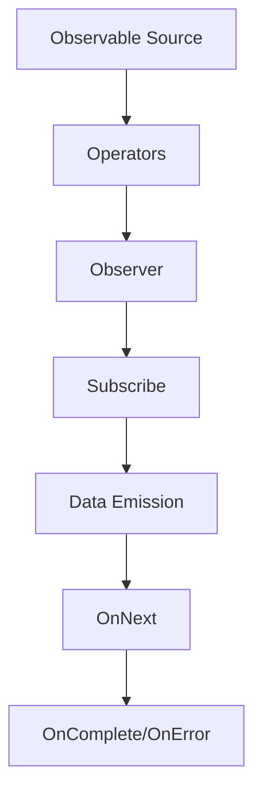

# Reactive Programming with RxJava

## Overview

Reactive Programming is a programming paradigm focused on asynchronous data streams and the propagation of change. RxJava is a Java library that implements the Reactive Extensions (Rx) for composing asynchronous and event-based programs using observable sequences. It allows developers to handle asynchronous operations in a more declarative and composable way, making it easier to manage complex asynchronous workflows.

## Detailed Explanation

RxJava revolves around the concept of Observables, which represent streams of data or events that can be observed over time. Key components include:

- **Observable**: The source of data streams.
- **Observer**: Consumes the data emitted by the Observable.
- **Operators**: Functions that transform, filter, or combine Observables.
- **Schedulers**: Control the threading context for operations.

### Core Concepts

1. **Observable Creation**: Create Observables from various sources like arrays, futures, or custom logic.
2. **Operators**: Chain operations like `map`, `filter`, `flatMap` to process data.
3. **Subscription**: Observers subscribe to Observables to receive data.
4. **Backpressure**: Mechanism to handle fast producers and slow consumers.

### Flow Diagram



## Real-world Examples & Use Cases

- **Streaming Data Processing**: Handle real-time data from APIs or sensors.
- **UI Event Handling**: Manage user interactions in Android apps without blocking the main thread.
- **Network Requests**: Chain multiple HTTP calls with error handling and retries.
- **File I/O**: Process large files asynchronously without blocking.
- **Microservices Communication**: Implement reactive APIs for better scalability.

## Code Examples

### Basic Observable Creation and Subscription

```java
import io.reactivex.rxjava3.core.Observable;
import io.reactivex.rxjava3.core.Observer;
import io.reactivex.rxjava3.disposables.Disposable;

public class RxJavaExample {
    public static void main(String[] args) {
        // Create an Observable that emits integers
        Observable<Integer> observable = Observable.just(1, 2, 3, 4, 5);

        // Create an Observer
        Observer<Integer> observer = new Observer<Integer>() {
            @Override
            public void onSubscribe(Disposable d) {
                System.out.println("Subscribed");
            }

            @Override
            public void onNext(Integer value) {
                System.out.println("Received: " + value);
            }

            @Override
            public void onError(Throwable e) {
                System.err.println("Error: " + e.getMessage());
            }

            @Override
            public void onComplete() {
                System.out.println("Completed");
            }
        };

        // Subscribe the Observer to the Observable
        observable.subscribe(observer);
    }
}
```

### Using Operators

```java
import io.reactivex.rxjava3.core.Observable;

public class OperatorsExample {
    public static void main(String[] args) {
        Observable.just(1, 2, 3, 4, 5)
            .filter(n -> n % 2 == 0)  // Filter even numbers
            .map(n -> n * 10)         // Multiply by 10
            .subscribe(System.out::println);  // Output: 20, 40
    }
}
```

### Handling Asynchronous Operations

```java
import io.reactivex.rxjava3.core.Observable;
import io.reactivex.rxjava3.schedulers.Schedulers;

public class AsyncExample {
    public static void main(String[] args) {
        Observable<String> observable = Observable.fromCallable(() -> {
            // Simulate a long-running operation
            Thread.sleep(1000);
            return "Result";
        });

        observable
            .subscribeOn(Schedulers.io())  // Perform on IO thread
            .observeOn(Schedulers.single()) // Observe on single thread
            .subscribe(result -> System.out.println("Result: " + result));
    }
}
```

## Common Pitfalls & Edge Cases

- **Memory Leaks**: Forgetting to dispose subscriptions can lead to memory leaks.
- **Backpressure Issues**: Fast producers can overwhelm slow consumers; use backpressure strategies.
- **Threading Confusion**: Incorrect use of Schedulers can cause race conditions.
- **Error Handling**: Unhandled errors can crash the application; always implement proper error handling.
- **Infinite Streams**: Be cautious with infinite Observables to avoid resource exhaustion.

## Tools & Libraries

- **RxJava**: Core library for reactive programming in Java.
- **RxAndroid**: Android-specific bindings for RxJava.
- **Reactor**: Alternative reactive library, part of Spring WebFlux.
- **Project Reactor**: Foundation for reactive programming in the JVM.

## References

- [RxJava Official Documentation](https://github.com/ReactiveX/RxJava)
- [ReactiveX Documentation](http://reactivex.io/)
- [RxJava Wiki](https://github.com/ReactiveX/RxJava/wiki)
- [Reactive Programming with RxJava](https://www.baeldung.com/rx-java)

## Github-README Links & Related Topics

- [java-reactive-streams](java-reactive-streams/README.md)
- [java-completablefuture](java-completablefuture/README.md)
- [event-streaming-with-apache-kafka](event-streaming-with-apache-kafka/README.md)