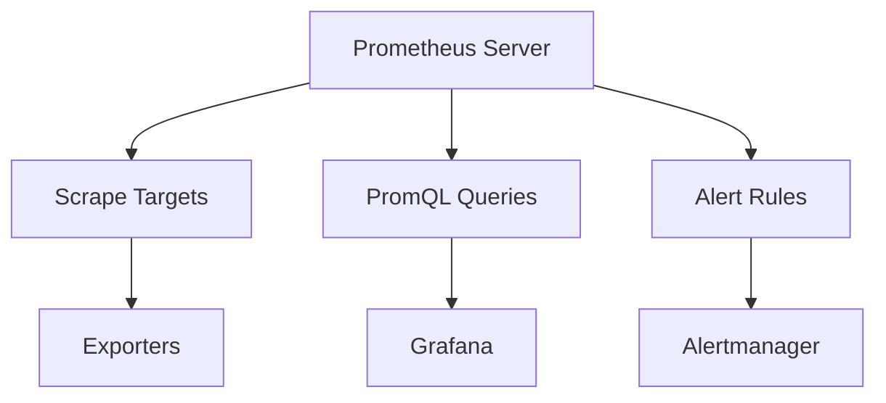

# Prometheus Monitoring

## Overview

Prometheus is an open-source monitoring and alerting toolkit designed for reliability and scalability. It collects metrics from configured targets at specified intervals, evaluates rule expressions, displays results, and can trigger alerts when specified conditions are met. Prometheus is widely used in cloud-native environments, especially with Kubernetes.

## Detailed Explanation

Prometheus uses a pull-based model to scrape metrics from targets. It stores time-series data and provides a powerful query language called PromQL.

### Key Components

- **Prometheus Server**: Core component that scrapes and stores metrics.
- **Exporters**: Tools that expose metrics from applications.
- **Alertmanager**: Handles alerts from Prometheus.
- **Pushgateway**: Allows push-based metrics collection.

### Architecture



## Real-world Examples & Use Cases

- **Infrastructure Monitoring**: Track server CPU, memory, disk usage.
- **Application Metrics**: Monitor request rates, error rates, latencies.
- **Kubernetes Clusters**: Observe pod health, resource usage.
- **Microservices**: Collect metrics from distributed services.
- **Alerting**: Notify on system failures or performance issues.

## Code Examples

### Prometheus Configuration

```yaml
global:
  scrape_interval: 15s

scrape_configs:
  - job_name: 'prometheus'
    static_configs:
      - targets: ['localhost:9090']

  - job_name: 'node'
    static_configs:
      - targets: ['node-exporter:9100']

  - job_name: 'spring-boot'
    metrics_path: '/actuator/prometheus'
    static_configs:
      - targets: ['app:8080']
```

### Alert Rules

```yaml
groups:
  - name: example
    rules:
      - alert: HighRequestLatency
        expr: http_request_duration_seconds{quantile="0.5"} > 0.5
        for: 10m
        labels:
          severity: warning
        annotations:
          summary: "High request latency"
```

### PromQL Queries

```promql
# CPU usage
100 - (avg by(instance) (irate(node_cpu_seconds_total{mode="idle"}[5m])) * 100)

# Memory usage
(1 - node_memory_MemAvailable_bytes / node_memory_MemTotal_bytes) * 100

# HTTP request rate
rate(http_requests_total[5m])
```

### Node Exporter Setup

```bash
# Download and run Node Exporter
wget https://github.com/prometheus/node_exporter/releases/download/v1.6.1/node_exporter-1.6.1.linux-amd64.tar.gz
tar xvfz node_exporter-*.tar.gz
cd node_exporter-*/
./node_exporter
```

### Kubernetes Deployment

```yaml
apiVersion: apps/v1
kind: Deployment
metadata:
  name: prometheus
spec:
  replicas: 1
  selector:
    matchLabels:
      app: prometheus
  template:
    metadata:
      labels:
        app: prometheus
    spec:
      containers:
      - name: prometheus
        image: prom/prometheus
        ports:
        - containerPort: 9090
        volumeMounts:
        - name: config
          mountPath: /etc/prometheus
      volumes:
      - name: config
        configMap:
          name: prometheus-config
```

## Common Pitfalls & Edge Cases

- **Cardinality Explosion**: High-cardinality metrics can overwhelm storage.
- **Scrape Interval Tuning**: Balance between freshness and resource usage.
- **Alert Fatigue**: Over-alerting can desensitize teams.
- **Data Retention**: Plan for long-term storage needs.
- **Security**: Secure Prometheus endpoints in production.

## Tools & Libraries

- **Prometheus**: Core monitoring system.
- **Grafana**: Visualization dashboard for metrics.
- **Alertmanager**: Alert handling component.
- **Thanos**: Long-term storage and querying for Prometheus.

## References

- [Prometheus Documentation](https://prometheus.io/docs/)
- [PromQL Guide](https://prometheus.io/docs/prometheus/latest/querying/basics/)
- [Prometheus Best Practices](https://prometheus.io/docs/practices/)
- [Monitoring Kubernetes with Prometheus](https://www.oreilly.com/library/view/kubernetes-up-and/9781492046521/)

## Github-README Links & Related Topics

- [Monitoring and Logging](./monitoring-and-logging/)
- [Grafana Dashboards](./grafana-dashboards/)
- [Kubernetes Ingress and Load Balancing](./kubernetes-ingress-and-load-balancing/)