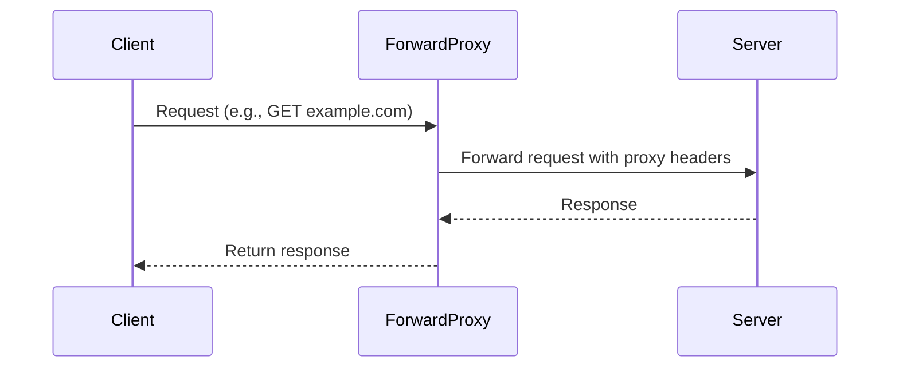
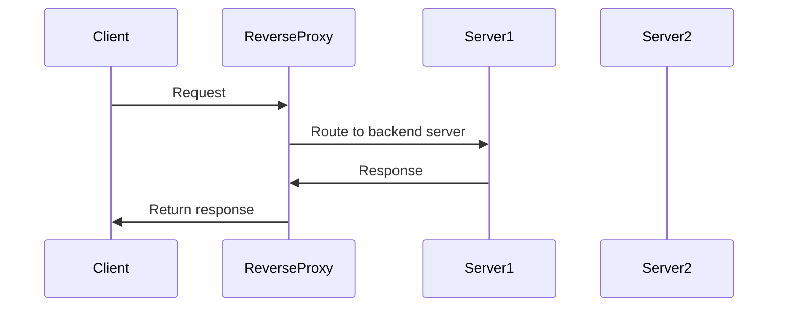

## Overview

Proxies act as intermediaries between clients and servers, facilitating request routing, security, and performance optimization. A **forward proxy** sits between clients and the internet, handling outbound requests on behalf of clients. A **reverse proxy** sits between the internet and servers, managing inbound requests to protect and balance backend services.

## Detailed Explanation

### Forward Proxy

A forward proxy routes client requests to external servers, often used for anonymity, caching, or content filtering. It hides the client's IP address from the destination server.



### Reverse Proxy

A reverse proxy sits in front of servers, routing inbound requests to appropriate backends. It provides load balancing, SSL termination, and security layers.



## Comparison

| Aspect | Forward Proxy | Reverse Proxy |
|--------|---------------|---------------|
| Position | Client-side | Server-side |
| Purpose | Client anonymity, access control | Load balancing, security |
| Visibility | Hides client from server | Hides server from client |
| Common Uses | Corporate firewalls, VPNs | Web acceleration, API gateways |

## Real-world Examples & Use Cases

- **Corporate Networks**: Forward proxies enforce content filtering and monitor employee internet usage.
- **Load Balancing**: Reverse proxies distribute traffic across multiple servers for high availability.
- **CDN Integration**: Reverse proxies cache static content to reduce server load and improve response times.
- **API Gateways**: Reverse proxies handle authentication, rate limiting, and protocol translation for microservices.
- **SSL Termination**: Reverse proxies decrypt HTTPS traffic before forwarding to backend servers.

## Code Examples

## Node.js Forward Proxy

```javascript
const http = require('http');
const url = require('url');

const server = http.createServer((req, res) => {
  const target = url.parse(req.url);
  const options = {
    hostname: target.hostname,
    port: target.port || 80,
    path: target.path,
    method: req.method,
    headers: req.headers
  };

  const proxyReq = http.request(options, (proxyRes) => {
    res.writeHead(proxyRes.statusCode, proxyRes.headers);
    proxyRes.pipe(res);
  });

  req.pipe(proxyReq);
});

server.listen(8080, () => console.log('Forward proxy listening on port 8080'));
```

## NGINX Reverse Proxy Configuration

```nginx
upstream backend {
    server backend1.example.com;
    server backend2.example.com;
}

server {
    listen 80;
    server_name example.com;

    location / {
        proxy_pass http://backend;
        proxy_set_header Host $host;
        proxy_set_header X-Real-IP $remote_addr;
        proxy_set_header X-Forwarded-For $proxy_add_x_forwarded_for;
        proxy_set_header X-Forwarded-Proto $scheme;
    }
}
```

# STAR Summary

**Situation**: Modern web architectures require efficient traffic management and security.

**Task**: Implement intermediaries to handle client-server communication.

**Action**: Deploy forward proxies for outbound control and reverse proxies for inbound distribution.

**Result**: Improved performance, security, and scalability in network communications.

# Journey / Sequence

1. Client initiates request
2. Proxy intercepts and processes request
3. Proxy forwards to appropriate destination
4. Response flows back through proxy
5. Proxy applies transformations (caching, headers)
6. Final response delivered to client

# Data Models / Message Formats

## HTTP Headers

- `X-Forwarded-For`: Original client IP
- `X-Forwarded-Proto`: Original protocol (HTTP/HTTPS)
- `X-Real-IP`: Client IP without proxies
- `Via`: Proxy server information

## Proxy Configuration

```json
{
  "type": "reverse",
  "backends": ["server1:8080", "server2:8080"],
  "loadBalancing": "round_robin",
  "ssl": {
    "certificate": "/path/to/cert.pem",
    "key": "/path/to/key.pem"
  }
}
```

# Common Pitfalls & Edge Cases

- **Header Spoofing**: Malicious clients can forge X-Forwarded-For headers
- **Infinite Loops**: Misconfigured proxies routing to themselves
- **SSL Certificate Issues**: Reverse proxies must handle certificate validation
- **Session Persistence**: Ensuring sticky sessions in load-balanced environments
- **Caching Conflicts**: Stale content from aggressive caching policies

# Tools & Libraries

- **NGINX**: High-performance reverse proxy and load balancer
- **HAProxy**: TCP/HTTP load balancer with proxy capabilities
- **Squid**: Forward proxy with extensive caching features
- **Traefik**: Modern reverse proxy with automatic configuration
- **http-proxy (Node.js)**: Library for creating proxies in JavaScript

# References

- [Wikipedia: Proxy server](https://en.wikipedia.org/wiki/Proxy_server)
- [MDN: Proxy servers and tunneling](https://developer.mozilla.org/en-US/docs/Web/HTTP/Proxy_servers_and_tunneling)
- [NGINX Reverse Proxy](https://docs.nginx.com/nginx/admin-guide/web-server/reverse-proxy/)
- [RFC 7230: HTTP/1.1 Message Syntax and Routing](https://datatracker.ietf.org/doc/html/rfc7230)

# Github-README Links & Related Topics

- [API Gateway](../api-gateway/)
- [Load Balancing](../load-balancing/)
- [Caching](../caching/)
- [SSL Termination](../ssl-termination/)
- [Microservices Architecture](../microservices/)