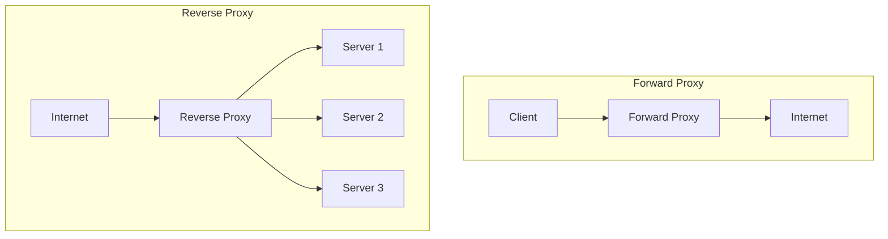

# Proxy Forward and Reverse

## Overview

Proxy servers act as intermediaries between clients and servers, providing various functionalities such as caching, security, and load distribution. Forward proxies serve clients by forwarding their requests to the internet, while reverse proxies sit in front of servers and forward client requests to appropriate backend servers.

## Detailed Explanation

### Forward Proxy

A forward proxy acts on behalf of clients, intercepting requests from clients to external servers:

- **Client-Side Proxy**: Positioned between client and internet
- **Anonymity**: Can hide client IP addresses
- **Caching**: Stores frequently requested content
- **Access Control**: Enforces organizational policies

### Reverse Proxy

A reverse proxy appears to clients as an ordinary server, forwarding requests to backend servers:

- **Server-Side Proxy**: Positioned between internet and backend servers
- **Load Balancing**: Distributes requests across multiple servers
- **SSL Termination**: Handles HTTPS encryption/decryption
- **Caching**: Serves cached content to reduce backend load

### Key Differences

| Aspect | Forward Proxy | Reverse Proxy |
|--------|---------------|---------------|
| Position | Client-side | Server-side |
| Visibility | Visible to clients | Invisible to clients |
| Purpose | Client anonymity, content filtering | Load balancing, security |
| Configuration | Client-configured | Server-configured |



## Real-world Examples & Use Cases

1. **Corporate Networks**: Forward proxies for employee internet access control and monitoring
2. **CDN Networks**: Reverse proxies caching static content at edge locations
3. **API Gateways**: Reverse proxies managing API traffic, authentication, and rate limiting
4. **Microservices**: Reverse proxies routing requests to appropriate services

## Code Examples

### Nginx Reverse Proxy Configuration

```nginx
# nginx.conf
events {
    worker_connections 1024;
}

http {
    upstream backend {
        server backend1.example.com:8080;
        server backend2.example.com:8080;
        server backend3.example.com:8080;
    }

    server {
        listen 80;
        server_name api.example.com;

        location / {
            proxy_pass http://backend;
            proxy_set_header Host $host;
            proxy_set_header X-Real-IP $remote_addr;
            proxy_set_header X-Forwarded-For $proxy_add_x_forwarded_for;
            proxy_set_header X-Forwarded-Proto $scheme;
        }
    }
}
```

### Apache Reverse Proxy with Load Balancing

```apache
<VirtualHost *:80>
    ServerName api.example.com
    
    ProxyPass / balancer://backend/
    ProxyPassReverse / balancer://backend/
    
    <Proxy balancer://backend>
        BalancerMember http://backend1.example.com:8080
        BalancerMember http://backend2.example.com:8080
        BalancerMember http://backend3.example.com:8080
        ProxySet lbmethod=byrequests
    </Proxy>
</VirtualHost>
```

### Squid Forward Proxy Configuration

```squid
# squid.conf
http_port 3128

acl localnet src 192.168.1.0/24
http_access allow localnet
http_access deny all

cache_dir ufs /var/spool/squid 100 16 256
maximum_object_size 100 MB

# Access logging
access_log /var/log/squid/access.log squid
```

### Java Client with Forward Proxy

```java
import java.net.*;
import java.io.*;

public class ProxyClient {
    public static void main(String[] args) throws IOException {
        // Set system properties for proxy
        System.setProperty("http.proxyHost", "proxy.example.com");
        System.setProperty("http.proxyPort", "8080");
        
        URL url = new URL("http://target-server.com/api/data");
        HttpURLConnection connection = (HttpURLConnection) url.openConnection();
        
        // Make request through proxy
        try (BufferedReader reader = new BufferedReader(
                new InputStreamReader(connection.getInputStream()))) {
            String line;
            while ((line = reader.readLine()) != null) {
                System.out.println(line);
            }
        }
    }
}
```

## Common Pitfalls & Edge Cases

- **SSL Certificate Issues**: Proper certificate configuration for HTTPS termination
- **Header Forwarding**: Ensuring correct headers are passed (X-Forwarded-For, etc.)
- **Session Persistence**: Maintaining session affinity for stateful applications
- **Caching Invalidation**: Ensuring cached content is properly invalidated
- **Security Vulnerabilities**: Protecting against proxy-related attacks

## Tools & Libraries

- **Reverse Proxy**: Nginx, Apache HTTP Server, HAProxy, Traefik
- **Forward Proxy**: Squid, Privoxy, Charles Proxy
- **Cloud Proxies**: AWS API Gateway, Cloudflare, Akamai

## References

- [Nginx Reverse Proxy](https://docs.nginx.com/nginx/admin-guide/web-server/reverse-proxy/)
- [Apache Proxy Documentation](https://httpd.apache.org/docs/2.4/mod/mod_proxy.html)
- [Squid Proxy](http://www.squid-cache.org/Doc/)
- [HAProxy Documentation](http://www.haproxy.org/#docs)

## Github-README Links & Related Topics

- [API Gateway Design](api-gateway-design/)
- [Load Balancing and Strategies](load-balancing-and-strategies/)
- [HTTP Caching Headers](http-caching-headers/)
- [Security Best Practices in Microservices](security-best-practices-in-microservices/)
- [Networking](networking/)
