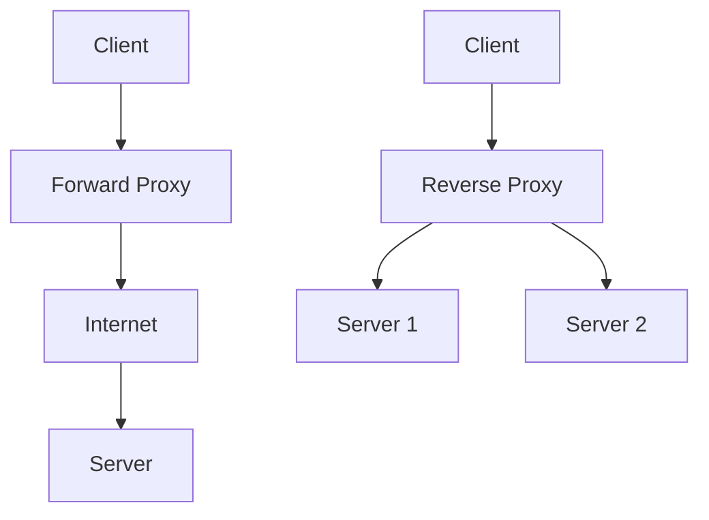

# Proxy Forward and Reverse

## Overview

Proxies act as intermediaries between clients and servers, enhancing security, performance, and control. Forward proxies handle requests from clients to the internet, while reverse proxies manage requests from the internet to servers. They are essential in modern web architectures for load balancing, caching, and security.

## Detailed Explanation

### Forward Proxy

A forward proxy sits between clients and the external network. Clients send requests to the proxy, which then forwards them to the destination server. The server sees the proxy's IP, not the client's.

**Benefits:**
- Anonymity and privacy
- Content filtering and access control
- Caching to reduce bandwidth

**Use Cases:**
- Corporate networks restricting internet access
- VPN-like functionality for secure browsing

### Reverse Proxy

A reverse proxy sits in front of web servers and forwards client requests to the appropriate server. The client sees the proxy's IP, not the server's.

**Benefits:**
- Load balancing across multiple servers
- SSL termination
- Caching static content
- Security through obscurity

**Use Cases:**
- Distributing traffic in high-traffic websites
- API gateways

## Real-world Examples & Use Cases

- **CDN (Content Delivery Network):** Uses reverse proxies to cache and serve content closer to users.
- **Load Balancers:** Nginx or HAProxy as reverse proxies distributing requests.
- **Corporate Firewalls:** Forward proxies for employee internet access control.
- **API Management:** Reverse proxies like Kong for routing and authentication.

## Code Examples

### Nginx Reverse Proxy Configuration

```nginx
server {
    listen 80;
    server_name example.com;

    location / {
        proxy_pass http://backend_servers;
        proxy_set_header Host $host;
        proxy_set_header X-Real-IP $remote_addr;
    }
}

upstream backend_servers {
    server backend1.example.com;
    server backend2.example.com;
}
```

### Squid Forward Proxy Configuration

```squid
http_port 3128

acl localnet src 192.168.1.0/24
http_access allow localnet
http_access deny all

cache_dir ufs /var/spool/squid 100 16 256
```

## Common Pitfalls & Edge Cases

- **SSL Termination Issues**: Improper handling of HTTPS requests
- **Header Spoofing**: Failing to sanitize forwarded headers
- **Caching Inconsistencies**: Stale cached content in reverse proxies
- **Single Point of Failure**: Proxy becoming a bottleneck
- **Configuration Complexity**: Misconfigured routing rules

## Tools & Libraries

- **Reverse Proxies**: Nginx, HAProxy, Apache HTTP Server
- **Forward Proxies**: Squid, Privoxy
- **API Gateways**: Kong, Traefik, Envoy
- **Load Balancers**: AWS ELB, Google Cloud Load Balancing

## References

- [Nginx Proxy Documentation](https://nginx.org/en/docs/http/ngx_http_proxy_module.html)
- [HAProxy Documentation](https://www.haproxy.org/)
- [Squid Proxy](https://www.squid-cache.org/)

## Github-README Links & Related Topics

- [Load Balancing and Strategies](./load-balancing-and-strategies/)
- [API Gateway Design](./api-gateway-design/)
- [CDN Architecture](./cdn-architecture/)

## Proxy Types Diagram

