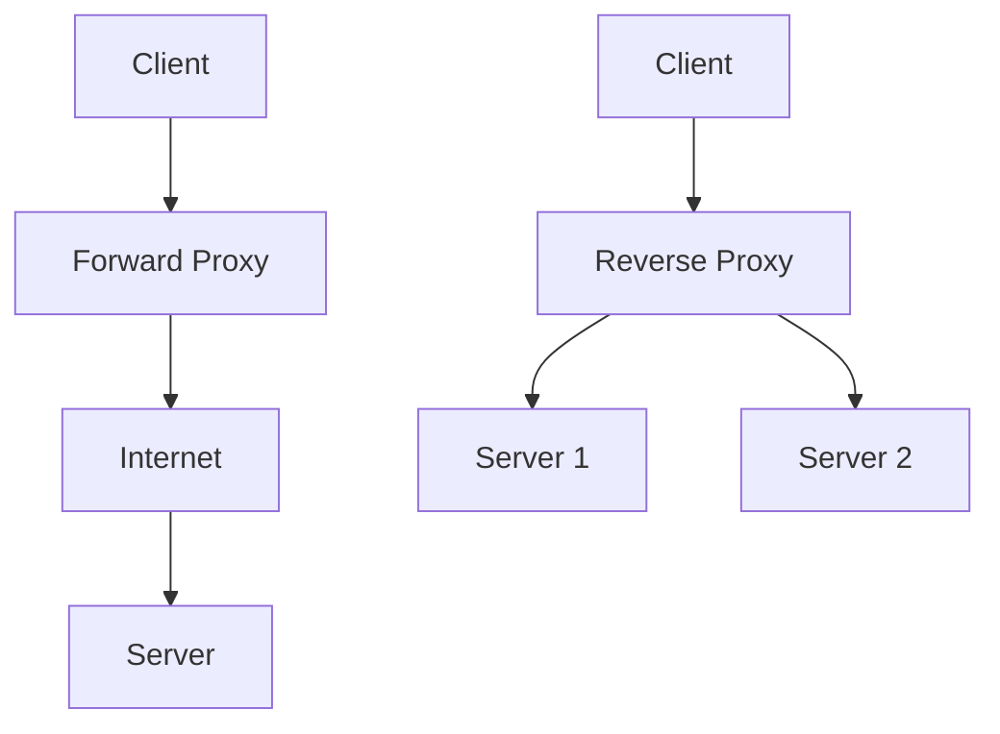
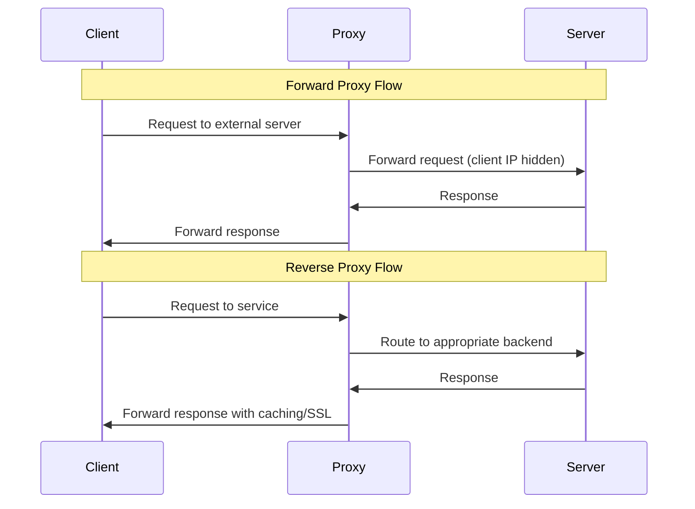

## Overview

Proxies act as intermediaries between clients and servers, enhancing security, performance, and control. Forward proxies handle requests from clients to the internet, while reverse proxies manage requests from the internet to servers. They are essential in modern web architectures for load balancing, caching, and security.

## STAR Summary

**Situation:** E-commerce site experiencing slow response times and security vulnerabilities from direct server exposure.  
**Task:** Implement reverse proxy to improve performance and security.  
**Action:** Deployed Nginx as reverse proxy with SSL termination, load balancing, and caching.  
**Result:** Reduced response time by 50%, improved security posture, and enabled horizontal scaling.

## Detailed Explanation

### Forward Proxy

A forward proxy sits between clients and the external network. Clients send requests to the proxy, which then forwards them to the destination server. The server sees the proxy's IP, not the client's.

**Benefits:**
- Anonymity and privacy
- Content filtering and access control
- Caching to reduce bandwidth

**Use Cases:**
- Corporate networks restricting internet access
- VPN-like functionality for secure browsing

### Reverse Proxy

A reverse proxy sits in front of web servers and forwards client requests to the appropriate server. The client sees the proxy's IP, not the server's.

**Benefits:**
- Load balancing across multiple servers
- SSL termination
- Caching static content
- Security through obscurity

**Use Cases:**
- Distributing traffic in high-traffic websites
- API gateways



## Journey / Sequence



## Data Models / Message Formats

Proxy servers handle HTTP requests and responses, manipulating headers for proper routing and security.

| Header | Purpose | Forward Proxy | Reverse Proxy |
|--------|---------|---------------|---------------|
| X-Forwarded-For | Original client IP | Added by proxy | Passed through |
| X-Real-IP | Real client IP | Set by proxy | Set by proxy |
| Host | Target host | Modified if needed | Preserved |
| Via | Proxy chain | Added | Added |
| X-Forwarded-Proto | Original protocol | Added for HTTPS | Added for HTTPS |

Example HTTP Request through Reverse Proxy:

```
GET /api/users HTTP/1.1
Host: api.example.com
X-Real-IP: 192.168.1.100
X-Forwarded-For: 192.168.1.100
X-Forwarded-Proto: https
User-Agent: Mozilla/5.0...
```
```

## Real-world Examples & Use Cases

- **CDN (Content Delivery Network):** Uses reverse proxies to cache and serve content closer to users.
- **Load Balancers:** Nginx or HAProxy as reverse proxies distributing requests.
- **Corporate Firewalls:** Forward proxies for employee internet access control.
- **API Management:** Reverse proxies like Kong for routing and authentication.

## Code Examples

### Nginx Reverse Proxy Configuration

```nginx
server {
    listen 80;
    server_name example.com;

    location / {
        proxy_pass http://backend_servers;
        proxy_set_header Host $host;
        proxy_set_header X-Real-IP $remote_addr;
    }
}

upstream backend_servers {
    server backend1.example.com;
    server backend2.example.com;
}
```

### Squid Forward Proxy Configuration

```squid
http_port 3128

acl localnet src 192.168.1.0/24
http_access allow localnet
http_access deny all

cache_dir ufs /var/spool/squid 100 16 256
```

### HAProxy Load Balancing

```haproxy
frontend http_front
    bind *:80
    default_backend http_back

backend http_back
    balance roundrobin
    server server1 192.168.1.10:80 check
    server server2 192.168.1.11:80 check
```

## Common Pitfalls & Edge Cases

- **SSL Termination Issues**: Improper handling of HTTPS requests
- **Header Spoofing**: Failing to sanitize forwarded headers
- **Caching Inconsistencies**: Stale cached content in reverse proxies
- **Single Point of Failure**: Proxy becoming a bottleneck
- **Configuration Complexity**: Misconfigured routing rules

## Tools & Libraries

- **Reverse Proxies**: Nginx, HAProxy, Apache HTTP Server
- **Forward Proxies**: Squid, Privoxy
- **API Gateways**: Kong, Traefik, Envoy
- **Load Balancers**: AWS ELB, Google Cloud Load Balancing

## References

- [Nginx Proxy Module](https://nginx.org/en/docs/http/ngx_http_proxy_module.html)
- [HAProxy Documentation](https://www.haproxy.org/)
- [Squid Cache Wiki](https://wiki.squid-cache.org/)
- [Forward vs Reverse Proxy](https://www.cloudflare.com/learning/cdn/glossary/reverse-proxy/)

## Github-README Links & Related Topics

- [Load Balancing and Strategies](../load-balancing-and-strategies/)
- [API Gateway Design](../api-gateway-design/)
- [CDN Architecture](../cdn-architecture/)
- [API Gateway vs Load Balancer](../api-gateway-vs-load-balancer/)