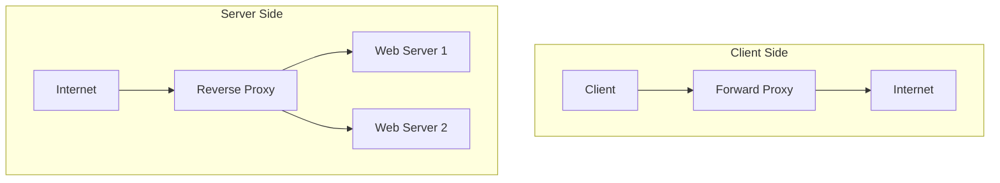

# Proxy Forward and Reverse

## Overview

Proxies act as intermediaries between clients and servers. Forward proxies serve clients (e.g., for anonymity), while reverse proxies serve servers (e.g., for load balancing and security).

## Detailed Explanation

### Forward Proxy
- Client-side proxy.
- Hides client IP, filters requests.
- Used for caching, access control, anonymity (e.g., VPNs).

### Reverse Proxy
- Server-side proxy.
- Hides server details, load balances.
- Provides SSL termination, caching, security.

### Architecture Diagram



### Common Pitfalls & Edge Cases
- SSL certificate handling in reverse proxies.
- Session persistence in load balancing.
- Proxy chaining.

## Real-world Examples & Use Cases

- **Forward Proxy**: Squid for corporate firewalls.
- **Reverse Proxy**: Nginx/HAProxy for web servers.

Use cases: CDN, API gateways, security.

## Code Examples

### Nginx Reverse Proxy Config

```nginx
server {
    listen 80;
    server_name example.com;

    location / {
        proxy_pass http://backend_servers;
        proxy_set_header Host $host;
        proxy_set_header X-Real-IP $remote_addr;
    }
}

upstream backend_servers {
    server server1.example.com;
    server server2.example.com;
}
```

### Simple Forward Proxy in Java (Using Netty)

```java
// Simplified example
public class ForwardProxy {
    public static void main(String[] args) {
        // Netty setup for proxy
        // Handle client connections, forward to target
    }
}
```

## References

- [Forward vs Reverse Proxy](https://www.nginx.com/resources/glossary/reverse-proxy-vs-forward-proxy/)
- [Proxy Server](https://en.wikipedia.org/wiki/Proxy_server)

## Github-README Links & Related Topics

- [Load Balancing Strategies](load-balancing-strategies/)
- [API Gateway Design](api-gateway-design/)
- [Docker Networking](docker-networking/)
