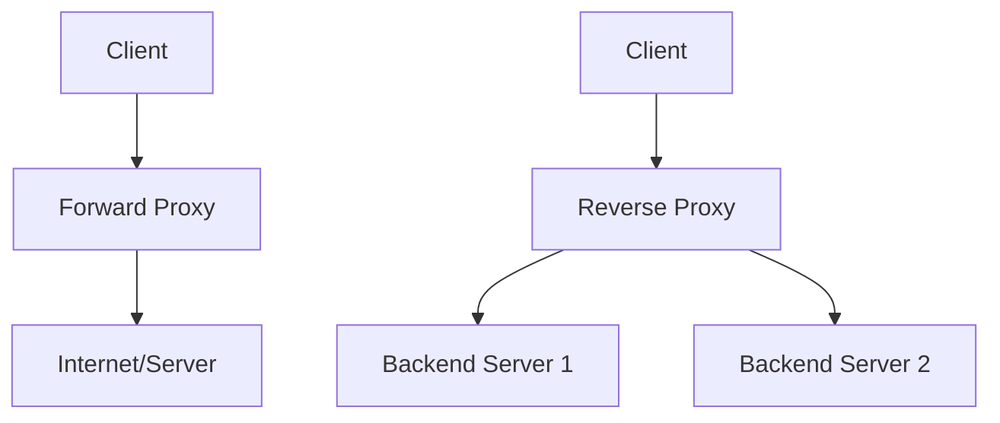

## Overview

Proxies act as intermediaries in network communications, forwarding requests between clients and servers. Forward proxies serve clients, while reverse proxies serve servers, enhancing security, performance, and scalability.

## Detailed Explanation

### Forward Proxy

A forward proxy sits between clients and the internet. It forwards client requests to external servers, often for anonymity, caching, or content filtering.

- **Use cases**: Corporate firewalls, VPNs, web scraping.
- **Tools**: Squid, Privoxy.

### Reverse Proxy

A reverse proxy sits in front of web servers, receiving requests from clients and forwarding them to backend servers. It provides load balancing, SSL termination, and protection.

- **Use cases**: Load balancing, API gateways, CDN integration.
- **Tools**: Nginx, HAProxy, Apache HTTP Server.



## Real-world Examples & Use Cases

- **Forward Proxy**: Companies use it to monitor employee internet usage.
- **Reverse Proxy**: Cloudflare acts as a reverse proxy for DDoS protection and caching.
- **Nginx as Reverse Proxy**: Used by many websites for load balancing and serving static content.

Use cases: Improving performance with caching, securing APIs, distributing traffic.

## Code Examples

### Nginx Reverse Proxy Configuration

```nginx
# /etc/nginx/sites-available/default
server {
    listen 80;
    server_name example.com;

    location / {
        proxy_pass http://backend_servers;
        proxy_set_header Host $host;
        proxy_set_header X-Real-IP $remote_addr;
    }
}

upstream backend_servers {
    server 192.168.1.10:8080;
    server 192.168.1.11:8080;
}
```

### Squid Forward Proxy Configuration

```conf
# /etc/squid/squid.conf
http_port 3128
acl localnet src 192.168.1.0/24
http_access allow localnet
http_access deny all
cache_dir ufs /var/spool/squid 100 16 256
```

## References

- [Nginx Reverse Proxy](https://docs.nginx.com/nginx/admin-guide/web-server/reverse-proxy/)
- [HAProxy Documentation](http://www.haproxy.org/)
- [Squid Proxy Wiki](http://wiki.squid-cache.org/)

## Common Pitfalls & Edge Cases

- **Forward Proxy:** Clients bypassing proxy for direct access, leading to security risks; cache poisoning.
- **Reverse Proxy:** Single point of failure if not highly available; SSL termination issues; misconfiguration exposing backend servers.
- **Edge Cases:** Handling WebSocket connections; large file uploads/downloads; IPv6 support.

## Tools & Libraries

- **Reverse Proxy:** Nginx, HAProxy, Traefik, Apache mod_proxy
- **Forward Proxy:** Squid, Privoxy, Charles Proxy
- **API Gateways:** Kong, Apigee, AWS API Gateway

## Github-README Links & Related Topics

- [Load Balancing and Routing](../system-design/load-balancing-and-routing/)
- [API Gateway Patterns](../system-design/api-gateway-patterns/)
- [Security in Distributed Systems](../system-design/security-in-distributed-systems/)