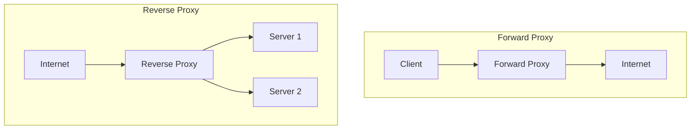

## Overview

Proxy servers act as intermediaries between clients and servers, providing functionality like caching, security, load balancing, and anonymity. Forward proxies serve clients by forwarding requests to the internet, while reverse proxies serve servers by receiving requests from clients and forwarding them to backend servers.

## Detailed Explanation

### Forward Proxy

A forward proxy sits between a client and the internet. It forwards client requests to external servers, often used for content filtering, caching, or bypassing restrictions.

- **Client-side proxy**: Protects client identity, caches responses.
- **Use cases**: Corporate firewalls, VPNs, web scraping.

### Reverse Proxy

A reverse proxy sits in front of web servers and forwards client requests to the appropriate backend server. It provides load balancing, SSL termination, and security.

- **Server-side proxy**: Protects backend servers, improves performance.
- **Use cases**: Load balancing, API gateways, CDN edge servers.

### Key Differences

| Aspect | Forward Proxy | Reverse Proxy |
|--------|---------------|---------------|
| Position | Client-side | Server-side |
| Purpose | Client anonymity, filtering | Server protection, load balancing |
| Visibility | Client knows proxy exists | Client unaware of proxy |
| Direction | Client → Proxy → Internet | Internet → Proxy → Server |



## Real-world Examples & Use Cases

- **Forward Proxy**: Corporate networks using Squid proxy for employee internet access control.
- **Reverse Proxy**: Nginx or HAProxy in front of a cluster of web servers for load balancing.
- **API Gateway**: Reverse proxy managing microservices APIs with authentication and rate limiting.
- **CDN**: Reverse proxies at edge locations caching content closer to users.

## Code Examples

### Nginx Reverse Proxy Configuration

```nginx
# Reverse proxy for a web application
server {
    listen 80;
    server_name example.com;

    location / {
        proxy_pass http://backend_servers;
        proxy_set_header Host $host;
        proxy_set_header X-Real-IP $remote_addr;
        proxy_set_header X-Forwarded-For $proxy_add_x_forwarded_for;
        proxy_set_header X-Forwarded-Proto $scheme;
    }
}

upstream backend_servers {
    server app1.example.com:8080;
    server app2.example.com:8080;
    server app3.example.com:8080;
}
```

### Apache Forward Proxy

```apache
# httpd.conf
<IfModule mod_proxy.c>
    ProxyRequests On
    ProxyVia On

    <Proxy *>
        Order deny,allow
        Deny from all
        Allow from 192.168.1.0/24
    </Proxy>
</IfModule>
```

### HAProxy Load Balancing

```haproxy
frontend http_front
    bind *:80
    default_backend http_back

backend http_back
    balance roundrobin
    server web1 192.168.1.10:80 check
    server web2 192.168.1.11:80 check
    server web3 192.168.1.12:80 check
```

## Common Pitfalls & Edge Cases

| Pitfall | Description | Mitigation |
|---------|-------------|------------|
| SSL Termination Issues | Improper header forwarding breaks HTTPS | Use proxy_set_header correctly |
| Session Stickiness | Load balancer doesn't maintain sessions | Configure sticky sessions or shared storage |
| Buffer Overflow | Large requests overwhelm proxy | Set appropriate buffer sizes |
| Security Vulnerabilities | Proxy exposed to attacks | Keep software updated, use WAF |
| Caching Problems | Stale cached content | Implement cache invalidation strategies |

## Tools & Libraries

| Tool | Type | Description |
|------|------|-------------|
| Nginx | Reverse Proxy | High-performance web server and reverse proxy |
| Apache HTTP Server | Both | Modular web server with proxy modules |
| HAProxy | Load Balancer/Proxy | TCP/HTTP load balancer and proxy |
| Squid | Forward Proxy | Caching proxy for HTTP/HTTPS |
| Envoy | Service Proxy | Cloud-native proxy for service mesh |
| Traefik | Reverse Proxy | Modern reverse proxy with automatic config |

## References

- [Nginx Reverse Proxy Documentation](https://docs.nginx.com/nginx/admin-guide/web-server/reverse-proxy/)
- [HAProxy Configuration Manual](https://www.haproxy.org/#docs)
- [Apache Proxy Documentation](https://httpd.apache.org/docs/2.4/mod/mod_proxy.html)
- [Forward vs Reverse Proxy](https://www.cloudflare.com/learning/cdn/glossary/reverse-proxy/)

## Github-README Links & Related Topics

- [API Gateway Design](./api-gateway-design/README.md)
- [Load Balancing and Strategies](./load-balancing-and-strategies/README.md)
- [CDN Architecture](./cdn-architecture/README.md)
- [Networking](./networking/README.md)
