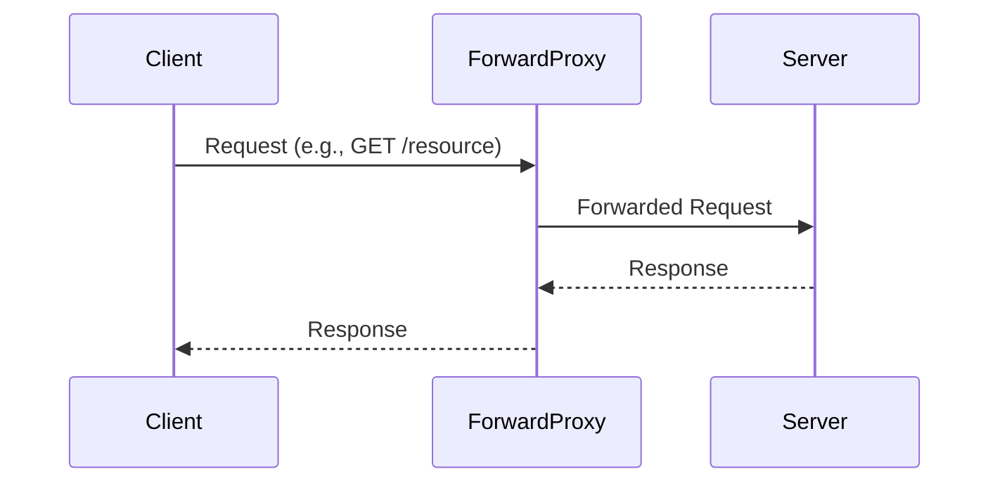
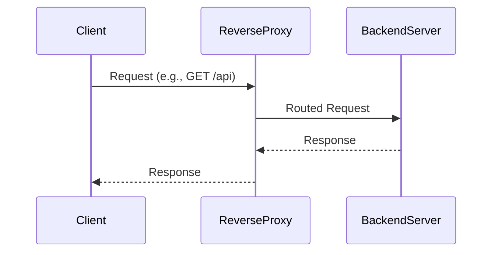

# Overview

Proxy servers act as intermediaries between clients and servers, facilitating requests and responses. There are two primary types: **forward proxies** (client-side proxies) and **reverse proxies** (server-side proxies). Forward proxies handle requests from clients to external servers, often for anonymity or access control. Reverse proxies manage requests from clients to internal servers, providing load balancing, caching, and security. Understanding both is crucial for network architecture, security, and performance optimization in distributed systems.

# Detailed Explanation

## Forward Proxy

A forward proxy sits between a client and the internet, intercepting client requests and forwarding them to destination servers. It masks the client's IP address, enabling anonymity and bypassing restrictions.

### How It Works

1. Client sends request to proxy.
2. Proxy forwards request to target server.
3. Server responds to proxy.
4. Proxy relays response to client.

Forward proxies are commonly used in corporate environments for content filtering or in consumer scenarios for privacy (e.g., VPNs or Tor).

## Reverse Proxy

A reverse proxy sits in front of one or more servers, receiving client requests and routing them to appropriate backend servers. It hides server details, enhances security, and improves performance.

### How It Works

1. Client sends request to reverse proxy.
2. Proxy routes request to backend server(s).
3. Backend server responds to proxy.
4. Proxy sends response to client.

Reverse proxies are essential for load balancing, SSL termination, and protecting against attacks.

## Comparison

| Aspect              | Forward Proxy                          | Reverse Proxy                          |
|---------------------|----------------------------------------|----------------------------------------|
| Position           | Client-side                           | Server-side                           |
| Purpose            | Anonymity, access control             | Load balancing, security, caching     |
| Hides              | Client identity                       | Server identity                       |
| Common Use         | Bypassing filters, privacy            | Web acceleration, API gateways        |
| Examples           | Squid, corporate proxies              | NGINX, HAProxy, Apache mod_proxy      |

## Sequence Diagrams

### Forward Proxy Request Flow



### Reverse Proxy Request Flow



# Real-world Examples & Use Cases

## Forward Proxy Use Cases

- **Corporate Networks**: Employees access the internet through a proxy that enforces policies, logs activity, and blocks malicious sites.
- **Anonymity and Privacy**: Tools like Tor use chained forward proxies to obscure user identity.
- **Content Filtering**: Schools or libraries use proxies to restrict access to certain websites.
- **Geolocation Bypass**: Accessing region-locked content by routing through proxies in allowed locations.

## Reverse Proxy Use Cases

- **Load Balancing**: Distributing traffic across multiple servers (e.g., NGINX balancing requests to app servers).
- **SSL Termination**: Handling HTTPS decryption at the proxy, offloading from backend servers.
- **Caching**: Storing static content to reduce backend load (e.g., CDNs like Cloudflare).
- **Security**: Acting as a firewall, protecting against DDoS or SQL injection.
- **API Gateways**: Managing microservices traffic, authentication, and rate limiting.

Examples include:
- **Web Acceleration**: Facebook uses reverse proxies to cache and compress content.
- **Microservices**: Kubernetes Ingress controllers route traffic to pods.
- **CDNs**: Akamai or CloudFront as reverse proxies for global content delivery.

# Code Examples

## NGINX Reverse Proxy Configuration

Basic setup for proxying to a backend server:

```nginx
server {
    listen 80;
    server_name example.com;

    location / {
        proxy_pass http://backend_server:8080;
        proxy_set_header Host $host;
        proxy_set_header X-Real-IP $remote_addr;
        proxy_set_header X-Forwarded-For $proxy_add_x_forwarded_for;
        proxy_set_header X-Forwarded-Proto $scheme;
    }
}
```

With load balancing:

```nginx
upstream backend {
    server backend1:8080;
    server backend2:8080;
}

server {
    listen 80;
    server_name example.com;

    location / {
        proxy_pass http://backend;
        proxy_buffering on;
        proxy_buffers 16 4k;
        proxy_buffer_size 2k;
    }
}
```

## Simple Forward Proxy with Squid (Conceptual)

Squid configuration snippet:

```
http_port 3128
acl allowed_clients src 192.168.1.0/24
http_access allow allowed_clients
http_access deny all
```

Client configures browser to use proxy at `192.168.1.1:3128`.

## Python Simple Reverse Proxy (Using Flask)

```python
from flask import Flask, request, redirect

app = Flask(__name__)

@app.route('/<path:path>', methods=['GET', 'POST'])
def proxy(path):
    # Forward to backend
    backend_url = f"http://backend:8080/{path}"
    # In real implementation, use requests to proxy
    return redirect(backend_url)

if __name__ == '__main__':
    app.run(host='0.0.0.0', port=80)
```

# References

- [Proxy server - Wikipedia](https://en.wikipedia.org/wiki/Proxy_server)
- [Proxy servers and tunneling - MDN Web Docs](https://developer.mozilla.org/en-US/docs/Web/HTTP/Proxy_servers_and_tunneling)
- [NGINX Reverse Proxy - NGINX Documentation](https://docs.nginx.com/nginx/admin-guide/web-server/reverse-proxy/)

# Github-README Links & Related Topics

- [api-gateway-design](../api-gateway-design/README.md)
- [api-gateway-vs-load-balancer](../api-gateway-vs-load-balancer/README.md)
- [load-balancing](../load-balancing/README.md)
- [cdn-architecture](../cdn-architecture/README.md)
- [distributed-caching-with-redis](../distributed-caching-with-redis/README.md)
- [circuit-breaker-pattern](../circuit-breaker-pattern/README.md)

# STAR Summary

- **Situation**: Clients need secure, efficient access to servers; servers require protection and scalability.
- **Task**: Implement proxies to handle traffic intermediation.
- **Action**: Configure forward proxies for client anonymity and reverse proxies for server-side management.
- **Result**: Improved security, performance, and reliability in network architectures.

# Journey / Sequence

1. **Client Request**: Initiates to proxy.
2. **Proxy Processing**: Validates, modifies headers, routes.
3. **Backend Interaction**: Proxy communicates with target server.
4. **Response Handling**: Proxy buffers, caches, or modifies response.
5. **Client Delivery**: Final response sent back.

# Data Models / Message Formats

Proxies handle HTTP/HTTPS requests with headers like:
- `X-Forwarded-For`: Original client IP.
- `Forwarded`: Standardized forwarding info.
- `Via`: Indicates proxy involvement.

For non-HTTP, protocols like FastCGI or WebSocket are proxied.

# Common Pitfalls & Edge Cases

- **Header Spoofing**: Ensure proper header forwarding to avoid security issues.
- **Buffering Issues**: Large responses may cause memory exhaustion; tune buffers.
- **SSL Termination**: Misconfiguration can expose sensitive data.
- **Loop Prevention**: Avoid proxy loops by checking `Via` headers.
- **Caching Stale Data**: Implement cache invalidation strategies.
- **Geolocation Conflicts**: Forward proxies may alter perceived location.

# Tools & Libraries

- **NGINX**: Versatile reverse proxy with extensive modules.
- **HAProxy**: High-performance load balancer and reverse proxy.
- **Squid**: Popular forward proxy for caching and filtering.
- **Apache mod_proxy**: Reverse proxy module for Apache.
- **Traefik**: Modern reverse proxy with Kubernetes integration.
- **Envoy Proxy**: High-performance proxy for service meshes.