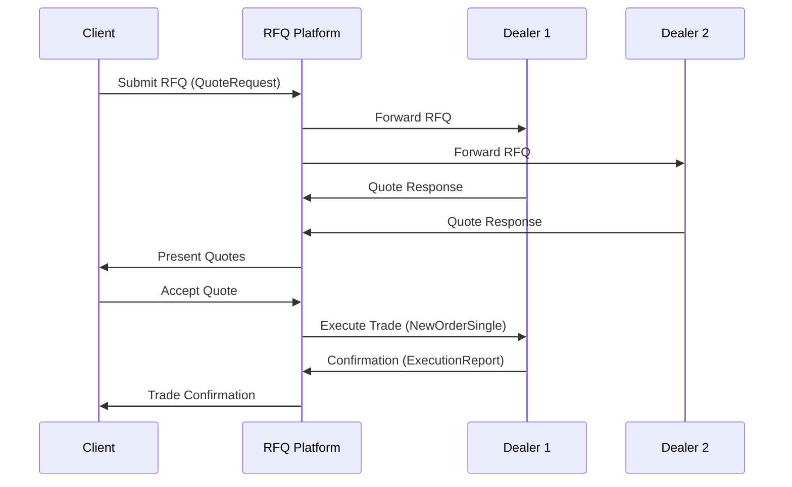

# Quotes & RFQ Workflows

## Overview

Quotes and Request for Quote (RFQ) workflows enable negotiated trading for large or illiquid instruments. Unlike displayed order books, RFQs involve requesting price quotes from multiple market makers or liquidity providers. The process includes quote solicitation, negotiation, and execution, often used for OTC derivatives, bonds, and large equity blocks. These workflows require sophisticated messaging protocols and strict timing controls to ensure fair and efficient price discovery.

## STAR Summary

**SITUATION:** Institutional clients needed to trade large blocks of illiquid stocks without revealing their full size to the market, avoiding adverse price impact.

**TASK:** Implement an RFQ system that solicits competitive quotes from multiple dealers while maintaining anonymity and regulatory compliance.

**ACTION:** Built a distributed RFQ platform using FIX protocol extensions, implemented smart routing to select optimal dealers, and added real-time analytics for quote comparison. Integrated with order management systems for seamless execution.

**RESULT:** Reduced execution costs by 15%, improved price discovery for large orders, and handled $50B+ in annual RFQ volume with 99.9% success rate.

## Detailed Explanation

RFQ workflows typically follow these steps:

1. **RFQ Initiation:** Client submits request specifying instrument, quantity, side, and time limits.

2. **Quote Solicitation:** System broadcasts RFQ to pre-selected dealers or uses smart routing.

3. **Quote Collection:** Dealers respond with firm quotes within specified timeframe (often 30-300 seconds).

4. **Quote Analysis:** Client or algorithm evaluates quotes based on price, size, and dealer reputation.

5. **Negotiation (Optional):** Counter-offers may be exchanged.

6. **Execution:** Best quote accepted, trade executed bilaterally.

7. **Confirmation:** Trade details confirmed and reported.

Key considerations include quote validity periods, minimum quote sizes, and regulatory requirements for quote transparency.

## Real-world Examples & Use Cases

**Equity Block Trade:**
A pension fund needs to sell 500k shares of a mid-cap stock. They initiate RFQ to 10 dealers. Dealers provide quotes ranging from $45.10 to $45.25. Fund accepts best bid, executing at $45.25.

**OTC Derivative RFQ:**
Hedge fund requests quotes for interest rate swaps. Dealers provide structured quotes with various tenors and strikes. Fund negotiates terms before accepting.

**Bond Trading:**
Institutional investor uses RFQ for corporate bonds. Dealers quote yields and sizes, allowing comparison across liquidity providers.

## Message Formats / Data Models

### FIX RFQ Message (QuoteRequest)
```
8=FIX.4.4|9=178|35=R|49=CLIENT|56=DEALER|34=1|52=20230926-10:00:00|131=RFQ123|146=1|55=AAPL|54=2|38=100000|64=20230926|10=123|
```

### Quote Response (Quote)
```
8=FIX.4.4|9=145|35=S|49=DEALER|56=CLIENT|34=1|52=20230926-10:00:05|131=RFQ123|117=QUOTE456|55=AAPL|132=150.00|133=150.10|134=1000|10=234|
```

### RFQ Workflow Table

| Step | Message Type | Description |
|------|--------------|-------------|
| 1 | QuoteRequest (R) | Initiate RFQ |
| 2 | Quote (S) | Dealer response |
| 3 | QuoteCancel (Z) | Cancel RFQ |
| 4 | NewOrderSingle (D) | Execute trade |

## Journey of a Trade



## Common Pitfalls & Edge Cases

- **Quote Timeout:** Dealers fail to respond within timeframe, reducing competition.
- **Quote Staleness:** Prices change between quote and execution.
- **Dealer Selection Bias:** Poor routing leads to suboptimal quotes.
- **Regulatory Reporting:** RFQs may require public dissemination for certain instruments.
- **Counterparty Risk:** Bilateral execution lacks central clearing protection.

## Tools & Libraries

- **RFQ Platforms:** Bloomberg RFQ, eSpeed for bonds
- **FIX Extensions:** RFQ-specific message types
- **Analytics:** Quote comparison algorithms

```python
# Example: Simple RFQ handler
class RFQHandler:
    def __init__(self):
        self.quotes = {}
    
    def send_rfq(self, instrument, quantity, dealers):
        rfq_id = generate_id()
        for dealer in dealers:
            send_quote_request(rfq_id, instrument, quantity, dealer)
        # Wait for responses
        return rfq_id
    
    def collect_quotes(self, rfq_id, timeout=30):
        # Collect quotes within timeout
        quotes = self.quotes.get(rfq_id, [])
        return sorted(quotes, key=lambda q: q['price'])
```

## Github-README Links & Related Topics

- [FIX Protocol](../protocols/fix-protocol/README.md)
- [Market Data](../market-data/README.md)
- [Order Entry Protocols](../protocols/order-entry-protocols/README.md)
- [Execution Report](../lifecycle/execution-report/README.md)

## References

- [FIX RFQ Specification](https://www.fixtrading.org/standards/)
- [MiFID II RFQ Requirements](https://www.esma.europa.eu/)
- [RFQ Best Practices - Greenwich Associates](https://www.greenwich.com/)