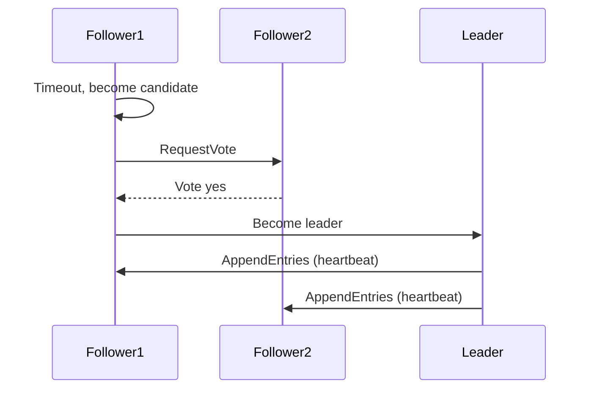

## Overview
Raft is a consensus algorithm for managing replicated logs in distributed systems, ensuring fault tolerance and consistency. It simplifies leader election and log replication compared to Paxos, making it suitable for building reliable distributed services like databases and coordination systems.

## STAR Summary
**Situation:** Building a fault-tolerant configuration service for microservices, requiring strong consistency.  
**Task:** Implement leader election and log replication to handle node failures.  
**Action:** Adopted Raft algorithm, implemented in Java with custom RPC, tested with network partitions.  
**Result:** Achieved 99.9% uptime, with automatic failover in <5 seconds.

## Detailed Explanation
Raft operates in three phases:
- **Leader Election:** Nodes elect a leader via heartbeats and votes.
- **Log Replication:** Leader replicates commands to followers.
- **Safety:** Ensures committed entries are durable and consistent.

Key properties: Leader completeness, state machine safety, election safety. Handles up to (n-1)/2 failures.

For system design, capacity: n nodes, throughput limited by network latency. Tradeoffs: Consistency vs availability (CP in CAP).

## Real-world Examples & Use Cases
- **Etcd:** Kubernetes configuration store.
- **Consul:** Service discovery with Raft.
- **Distributed Databases:** CockroachDB, TiDB.

## Code Examples
Pseudocode for leader election:

```java
class RaftNode {
    int term = 0;
    int votedFor = -1;
    State state = FOLLOWER;

    void requestVote(int candidateTerm) {
        if (candidateTerm > term) {
            term = candidateTerm;
            votedFor = candidateId;
            // Send vote
        }
    }
}
```

Runnable Java snippet for simple election simulation (using threads):

```java
import java.util.concurrent.*;

public class RaftSimulation {
    public static void main(String[] args) {
        // Simulate nodes
        ExecutorService exec = Executors.newFixedThreadPool(3);
        // Implement election logic
    }
}
```

## Data Models / Message Formats
| Field | Type | Description |
|-------|------|-------------|
| term | int | Election term |
| leaderId | int | Current leader |
| log | List<Entry> | Replicated log |
| commitIndex | int | Last committed index |

Sample RPC message (JSON):
```json
{
  "type": "AppendEntries",
  "term": 5,
  "leaderId": 1,
  "entries": [{"command": "set key value"}]
}
```

## Journey / Sequence


## Common Pitfalls & Edge Cases
- **Split brain:** Network partitions causing multiple leaders; mitigated by majority votes.
- **Log inconsistencies:** Resolved via leader's log overwrite.
- **Edge case:** Single node cluster; always leader.

## Tools & Libraries
- **Etcd:** Raft implementation for KV store.
- **Consul:** Service mesh with Raft.
- **ZooKeeper:** Similar consensus.

## Github-README Links & Related Topics
- [Consistency and Availability](system-design/consistency-and-availability/README.md)
- [Partitioning and Sharding](system-design/partitioning-and-sharding/README.md)
- [Distributed Tracing and Observability](system-design/distributed-tracing-and-observability/README.md)
- [Message Queues and Kafka](system-design/message-queues-and-kafka/README.md)

## References
- https://raft.github.io/
- https://etcd.io/
- https://www.consul.io/