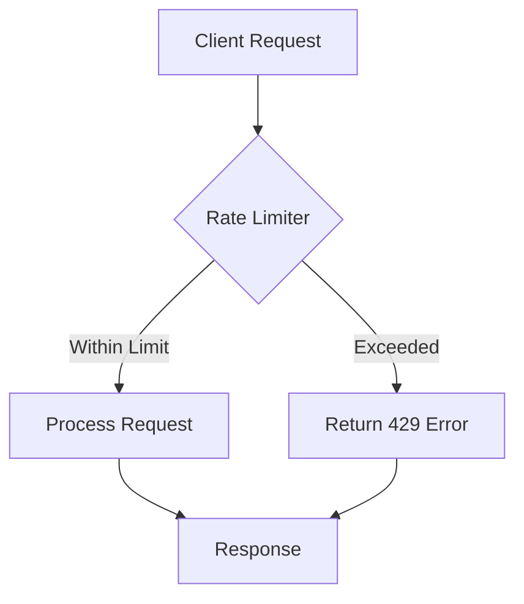
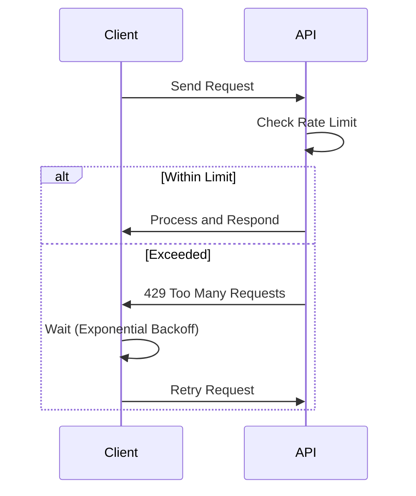

# Rate Limiting

## Overview

API rate limiting controls the number of requests a client can make to an API within a specified time window. It prevents abuse, ensures fair resource allocation, protects against DDoS attacks, and maintains service availability and performance. Rate limiting is essential for scalable APIs, helping to manage traffic spikes and enforce usage policies.

## Detailed Explanation

Rate limiting can be implemented at various levels: client-side, server-side, or network level. It uses algorithms to track and enforce request limits, often returning HTTP 429 (Too Many Requests) when limits are exceeded.

### Common Rate Limiting Algorithms

| Algorithm       | Description | Pros | Cons | Use Case |
|-----------------|-------------|------|------|----------|
| **Fixed Window** | Counts requests in fixed time intervals (e.g., 100 requests per minute). | Simple to implement | Boundary issues (e.g., 60 requests in last second of window, 60 in first second of next) | Basic limiting for low-traffic APIs |
| **Sliding Window** | Uses a rolling time window for smoother limiting. | More accurate than fixed window | Higher memory usage | APIs needing precise control |
| **Token Bucket** | Tokens are added at a fixed rate; requests consume tokens. Allows bursting. | Handles bursts well | Requires storage of tokens | Variable traffic with burst allowance |
| **Leaky Bucket** | Requests are processed at a constant rate, queuing excess. | Smooths traffic | Can cause delays | Consistent rate enforcement |



### Implementation Strategies

- **Distributed Rate Limiting:** Using Redis or similar for shared state across multiple servers.
- **Per-User vs Global:** Limiting per user, IP, API key, or endpoint.
- **Bursting:** Allowing short bursts above the limit using algorithms like token bucket.

### Benefits

- Prevents resource exhaustion and ensures system stability.
- Improves security by mitigating DDoS and abuse.
- Ensures fair usage among clients.
- Reduces operational costs by optimizing resource allocation.

## Journey / Sequence

The typical flow for handling a rate-limited request involves client-side retries with backoff.



## Data Models / Message Formats

Rate limiting often uses HTTP headers to communicate limits to clients:

- `X-RateLimit-Limit`: Maximum requests allowed in the window.
- `X-RateLimit-Remaining`: Remaining requests in the current window.
- `X-RateLimit-Reset`: Time when the window resets (Unix timestamp).
- `Retry-After`: Seconds to wait before retrying (for 429 responses).

Example Response Headers:
```
HTTP/1.1 429 Too Many Requests
X-RateLimit-Limit: 100
X-RateLimit-Remaining: 0
X-RateLimit-Reset: 1633072800
Retry-After: 60
```

## Real-world Examples & Use Cases

- **API Gateways:** Limiting requests to backend services (e.g., Stripe API allows 100 operations/sec in live mode).
- **Social Media Platforms:** Preventing spam and abuse (e.g., Twitter API limits).
- **Cloud Services:** AWS API rate limits, GitHub API (5000 requests/hour for authenticated users).
- **E-commerce:** Limiting checkout requests during flash sales to prevent overload.
- **IoT Devices:** Controlling data transmission rates to conserve bandwidth.
- **Microservices:** Protecting individual services from cascading failures.

## Code Examples

### Nginx Rate Limiting

```nginx
# /etc/nginx/nginx.conf
limit_req_zone $binary_remote_addr zone=api:10m rate=10r/s;
limit_req_zone $server_name zone=server:10m rate=100r/m;

server {
    listen 80;
    location /api/ {
        limit_req zone=api burst=20 nodelay;
        proxy_pass http://backend;
    }
}
```

### Redis-based Token Bucket (Python)

```python
import redis
import time

class TokenBucket:
    def __init__(self, redis_client, key, capacity, refill_rate):
        self.redis = redis_client
        self.key = key
        self.capacity = capacity
        self.refill_rate = refill_rate

    def allow_request(self, tokens=1):
        now = time.time()
        pipe = self.redis.pipeline()
        pipe.zremrangebyscore(self.key, '-inf', now - 60)  # Remove old tokens
        pipe.zcard(self.key)
        pipe.zadd(self.key, {now: now})
        pipe.expire(self.key, 60)
        results = pipe.execute()
        
        current_tokens = results[1]
        if current_tokens + tokens <= self.capacity:
            return True
        return False

# Usage
r = redis.Redis()
bucket = TokenBucket(r, 'user:123', capacity=100, refill_rate=10)
if bucket.allow_request():
    # Process request
    pass
else:
    # Rate limit exceeded
    pass
```

### Express.js with express-rate-limit

```javascript
const express = require('express');
const rateLimit = require('express-rate-limit');

const app = express();

const limiter = rateLimit({
  windowMs: 15 * 60 * 1000, // 15 minutes
  max: 100, // limit each IP to 100 requests per windowMs
  message: 'Too many requests from this IP, please try again later.',
  standardHeaders: true,
  legacyHeaders: false,
});

app.use('/api/', limiter);

app.get('/api/user', (req, res) => {
  res.send('User data');
});
```

### Java with Bucket4j

```java
import io.github.bucket4j.Bandwidth;
import io.github.bucket4j.Bucket;
import io.github.bucket4j.Refill;

import java.time.Duration;

public class RateLimiterExample {
    public static void main(String[] args) {
        Bandwidth limit = Bandwidth.classic(100, Refill.intervally(100, Duration.ofMinutes(1)));
        Bucket bucket = Bucket.builder().addLimit(limit).build();

        if (bucket.tryConsume(1)) {
            // Process request
            System.out.println("Request allowed");
        } else {
            // Rate limit exceeded
            System.out.println("Rate limit exceeded");
        }
    }
}
```

## Common Pitfalls & Edge Cases

- **Race Conditions:** In distributed systems, concurrent requests may bypass limits; use atomic operations.
- **Memory Usage:** Storing counters for many clients; consider eviction policies.
- **False Positives:** Legitimate bursts flagged as abuse; tune burst allowances.
- **Clock Skew:** In distributed environments, synchronize clocks to avoid inconsistencies.
- **Configuration Errors:** Too restrictive limits causing user frustration; monitor and adjust.
- **Thundering Herd:** Many clients retrying simultaneously; implement jittered backoff.

## Tools & Libraries

- **Web Servers:** Nginx, Apache mod_ratelimit
- **API Gateways:** Kong, Apigee, AWS API Gateway, Tyk
- **Libraries:** 
  - Node.js: express-rate-limit
  - Python: django-ratelimit, Flask-Limiter
  - Java: Bucket4j, Resilience4j
  - .NET: AspNetCoreRateLimit
- **Services:** Redis, Memcached for distributed counters
- **Cloud Providers:** AWS WAF, Google Cloud Armor, Cloudflare Rate Limiting

## Github-README Links & Related Topics

- [API Design Principles](../api-design-principles/README.md)
- [API Gateway Design](../api-gateway-design/README.md)
- [Load Balancing and Strategies](../load-balancing-and-strategies/README.md)
- [Security Best Practices in Java](../security-best-practices-in-java/README.md)
- [Fault Tolerance in Distributed Systems](../fault-tolerance-in-distributed-systems/README.md)
- [High Scalability Patterns](../high-scalability-patterns/README.md)

## References

- [Rate Limiting - Wikipedia](https://en.wikipedia.org/wiki/Rate_limiting)
- [What is Rate Limiting? - Cloudflare](https://www.cloudflare.com/learning/bots/what-is-rate-limiting/)
- [Rate Limiting Strategies for Reliability - AWS](https://aws.amazon.com/blogs/architecture/rate-limiting-strategies-reliability/)
- [Rate Limits - Stripe Documentation](https://stripe.com/docs/rate-limits)
- [Token Bucket Algorithm - Wikipedia](https://en.wikipedia.org/wiki/Token_bucket)
- [Nginx Rate Limiting](https://docs.nginx.com/nginx/admin-guide/security-controls/controlling-access-proxied-http/)
- [Express Rate Limit - NPM](https://www.npmjs.com/package/express-rate-limit)
- [Bucket4j - GitHub](https://github.com/bucket4j/bucket4j)