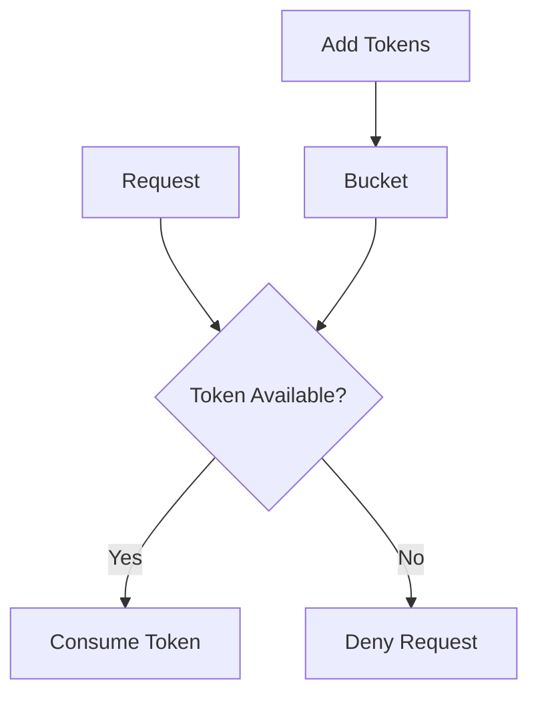
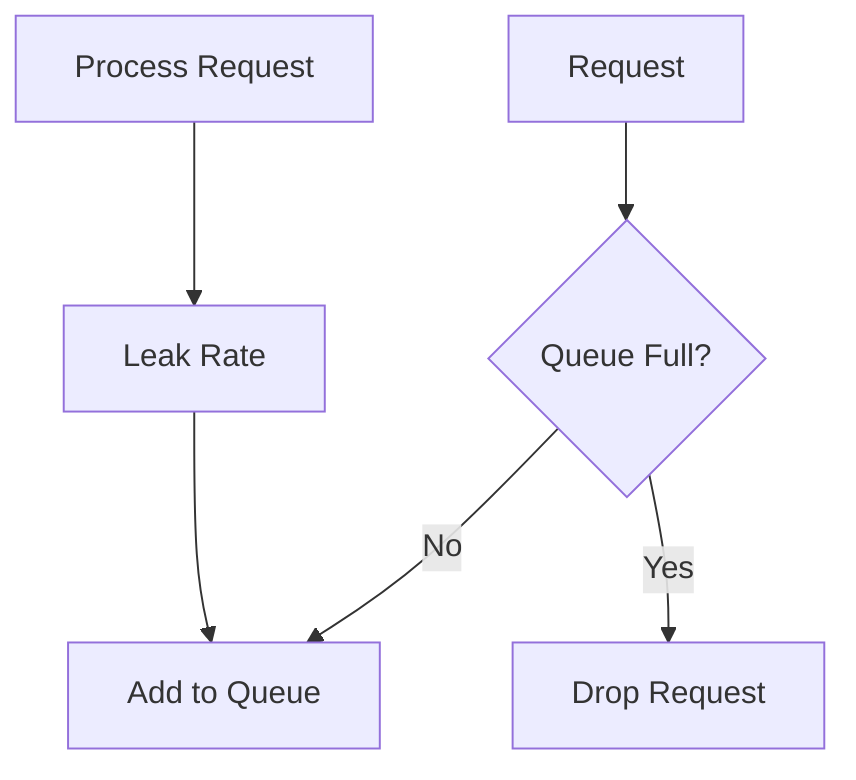
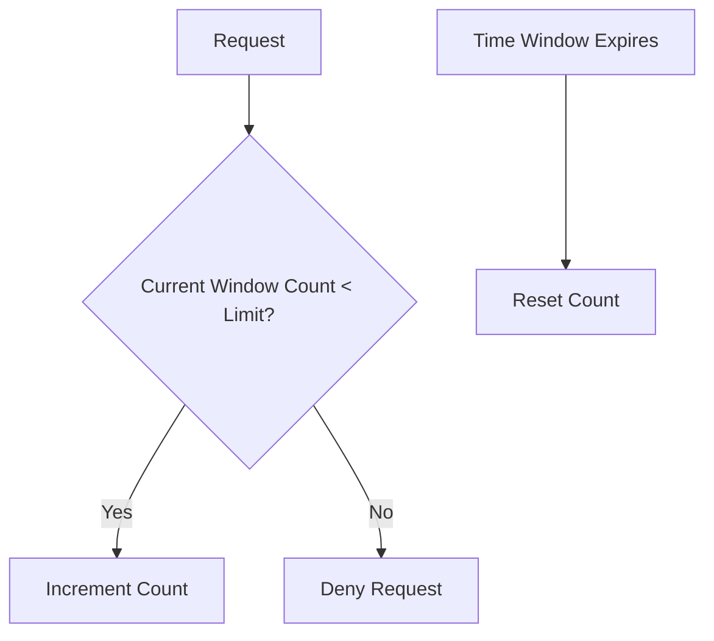
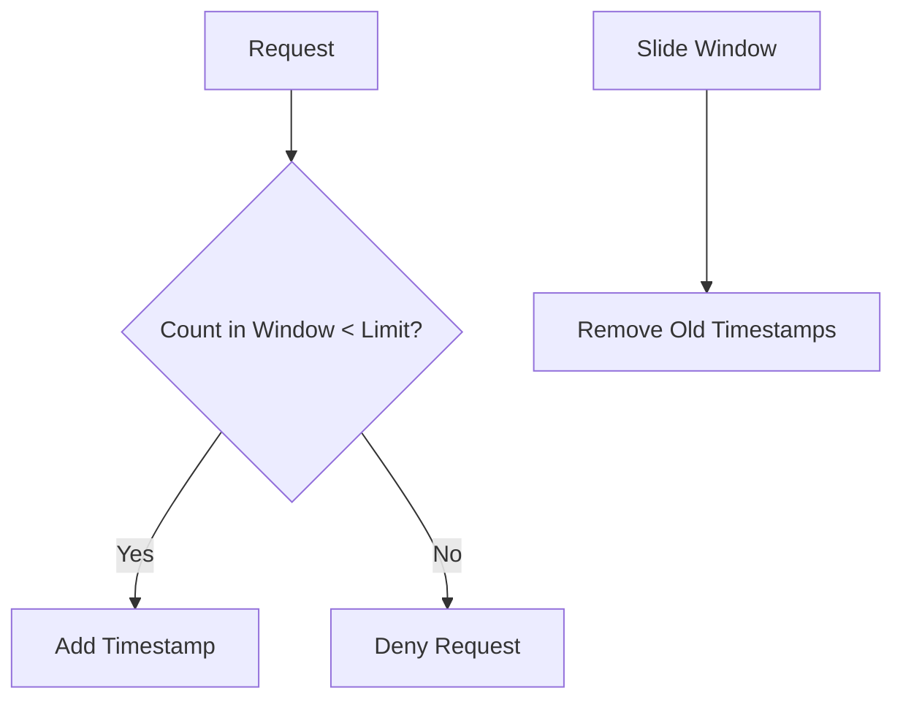

# Rate Limiting

## Overview

Rate limiting controls the rate of requests to prevent abuse, ensure fair usage, and protect resources. It limits the number of requests a client can make in a given time period, commonly used in APIs, web servers, and network devices to mitigate DoS attacks, brute-force attempts, and resource exhaustion.

## Detailed Explanation

Rate limiting algorithms determine how requests are allowed or denied. Common algorithms include:

### Token Bucket
Tokens are added to a bucket at a fixed rate. Each request consumes a token. If no tokens are available, the request is denied.



### Leaky Bucket
Requests are added to a queue (bucket). The bucket "leaks" requests at a constant rate. If the bucket overflows, requests are dropped.



### Fixed Window
Requests are counted in fixed time windows (e.g., per minute). If the count exceeds the limit, requests are denied until the next window.



### Sliding Window
Tracks requests in a moving window, providing smoother rate limiting than fixed windows.



| Algorithm      | Pros                          | Cons                          |
|----------------|-------------------------------|-------------------------------|
| Token Bucket   | Allows bursts, smooth rate    | Complex implementation        |
| Leaky Bucket   | Constant output rate          | No burst handling             |
| Fixed Window   | Simple                        | Boundary bursts               |
| Sliding Window | Accurate, handles boundaries  | Higher memory usage           |

## Real-world Examples & Use Cases

- **API Protection**: GitHub limits API requests to 5,000 per hour per user. Twitter uses rate limiting to prevent spam.
- **DDoS Mitigation**: Cloud providers like AWS and Cloudflare apply rate limiting to absorb attack traffic.
- **Billing & Fair Usage**: Services like Stripe limit API calls based on subscription tiers.
- **Web Scraping Prevention**: Sites like Amazon throttle requests to deter bots.

## Code Examples

### Python (Token Bucket with Redis)

```python
import redis
import time

class RateLimiter:
    def __init__(self, redis_client, key, capacity, refill_rate):
        self.redis = redis_client
        self.key = key
        self.capacity = capacity
        self.refill_rate = refill_rate

    def allow_request(self):
        now = time.time()
        pipe = self.redis.pipeline()
        pipe.zremrangebyscore(self.key, '-inf', now - 1)
        pipe.zcard(self.key)
        pipe.zadd(self.key, {now: now})
        pipe.expire(self.key, 1)
        _, count, _, _ = pipe.execute()
        return count <= self.capacity

# Usage
r = redis.Redis()
limiter = RateLimiter(r, 'user:123', 10, 1)  # 10 requests per second
if limiter.allow_request():
    print("Allowed")
else:
    print("Denied")
```

### Java (Leaky Bucket)

```java
import java.util.concurrent.BlockingQueue;
import java.util.concurrent.LinkedBlockingQueue;
import java.util.concurrent.TimeUnit;

public class LeakyBucket {
    private final BlockingQueue<Object> queue;
    private final int capacity;
    private final long leakInterval;

    public LeakyBucket(int capacity, long leakInterval) {
        this.capacity = capacity;
        this.leakInterval = leakInterval;
        this.queue = new LinkedBlockingQueue<>(capacity);
        startLeaking();
    }

    public boolean allowRequest() {
        return queue.offer(new Object());
    }

    private void startLeaking() {
        new Thread(() -> {
            while (true) {
                try {
                    queue.poll(leakInterval, TimeUnit.MILLISECONDS);
                } catch (InterruptedException e) {
                    Thread.currentThread().interrupt();
                }
            }
        }).start();
    }
}

// Usage
LeakyBucket bucket = new LeakyBucket(10, 100);  // 10 capacity, leak every 100ms
if (bucket.allowRequest()) {
    System.out.println("Allowed");
} else {
    System.out.println("Denied");
}
```

### Node.js (Fixed Window with Express)

```javascript
const express = require('express');
const app = express();
const rateLimit = require('express-rate-limit');

const limiter = rateLimit({
    windowMs: 15 * 60 * 1000, // 15 minutes
    max: 100, // limit each IP to 100 requests per windowMs
    message: 'Too many requests from this IP, please try again later.'
});

app.use(limiter);

app.get('/', (req, res) => {
    res.send('Hello World!');
});

app.listen(3000);
```

## References

- [Rate limiting - Wikipedia](https://en.wikipedia.org/wiki/Rate_limiting)
- [Rate Limiting Strategies - Google Cloud](https://cloud.google.com/architecture/rate-limiting-strategies)
- [Rate Limiting with NGINX](https://www.nginx.com/blog/rate-limiting-nginx/)
- [INCR Command - Redis](https://redis.io/commands/INCR)

## Github-README Links & Related Topics

- [API Rate Limiting](api-rate-limiting/)
- [API Security Best Practices](api-security-best-practices/)
- [Circuit Breaker Pattern](circuit-breaker-pattern/)
- [Distributed Caching with Redis](distributed-caching-with-redis/)

## STAR Summary

**Situation**: A startup's API faced frequent outages due to abusive requests from a few users.  
**Task**: Implement rate limiting to protect the API without blocking legitimate users.  
**Action**: Adopted a token bucket algorithm with Redis for distributed rate limiting, setting limits based on user tiers.  
**Result**: Reduced abusive traffic by 80%, improved uptime, and enabled fair access for all users.

## Common Pitfalls & Edge Cases

- **Distributed Systems**: Use shared storage like Redis to avoid per-instance limits.
- **Race Conditions**: In sliding windows, concurrent requests may exceed limits; use atomic operations.
- **Burst Handling**: Fixed windows allow bursts at boundaries; sliding windows mitigate this.
- **IP Spoofing**: Rely on user authentication for accurate limiting.
- **Over-Limiting**: Ensure limits don't block legitimate traffic; monitor and adjust.

## Tools & Libraries

- **NGINX**: `limit_req` module for HTTP rate limiting.
- **Redis**: `INCR` and sorted sets for counters and sliding windows.
- **Libraries**:
  - Python: `ratelimit` or `redis-py` for custom implementations.
  - Java: `Bucket4j` for token/leaky bucket.
  - Node.js: `express-rate-limit` for Express apps.
  - Go: `golang.org/x/time/rate` for token bucket.