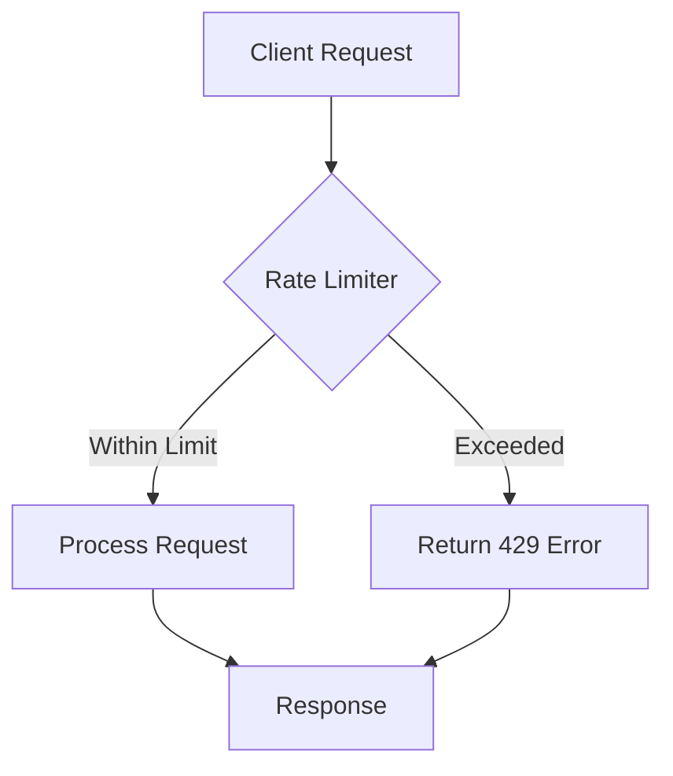

## Overview

Rate limiting controls the number of requests a client can make to an API or service within a specified time window. It prevents abuse, ensures fair resource allocation, protects against DDoS attacks, and maintains service availability and performance.

## Detailed Explanation

Rate limiting can be implemented at various levels: client-side, server-side, or network level. It uses algorithms to track and enforce request limits.

### Common Rate Limiting Algorithms

- **Fixed Window:** Counts requests in fixed time intervals (e.g., 100 requests per minute).
- **Sliding Window:** Uses a rolling time window for smoother limiting.
- **Token Bucket:** Tokens are added at a fixed rate; requests consume tokens.
- **Leaky Bucket:** Requests are processed at a constant rate, queuing excess.



### Implementation Strategies

- **Distributed Rate Limiting:** Using Redis or similar for shared state.
- **Per-User vs Global:** Limiting per user, IP, or API key.
- **Bursting:** Allowing short bursts above the limit.

### Benefits

- Prevents resource exhaustion.
- Improves security against attacks.
- Ensures fair usage among clients.
- Reduces operational costs.

## Real-world Examples & Use Cases

- **API Gateways:** Limiting requests to backend services (e.g., Stripe API).
- **Social Media Platforms:** Preventing spam and abuse.
- **Cloud Services:** AWS API rate limits, GitHub API limits.
- **E-commerce:** Limiting checkout requests during flash sales.
- **IoT Devices:** Controlling data transmission rates.

## Code Examples

### Nginx Rate Limiting

```nginx
# /etc/nginx/nginx.conf
limit_req_zone $binary_remote_addr zone=api:10m rate=10r/s;
limit_req_zone $server_name zone=server:10m rate=100r/m;

server {
    listen 80;
    location /api/ {
        limit_req zone=api burst=20 nodelay;
        proxy_pass http://backend;
    }
}
```

### Redis-based Token Bucket (Python)

```python
import redis
import time

class TokenBucket:
    def __init__(self, redis_client, key, capacity, refill_rate):
        self.redis = redis_client
        self.key = key
        self.capacity = capacity
        self.refill_rate = refill_rate

    def allow_request(self, tokens=1):
        now = time.time()
        pipe = self.redis.pipeline()
        pipe.zremrangebyscore(self.key, '-inf', now - 60)  # Remove old tokens
        pipe.zcard(self.key)
        pipe.zadd(self.key, {now: now})
        pipe.expire(self.key, 60)
        results = pipe.execute()
        
        current_tokens = results[1]
        if current_tokens + tokens <= self.capacity:
            return True
        return False

# Usage
r = redis.Redis()
bucket = TokenBucket(r, 'user:123', capacity=100, refill_rate=10)
if bucket.allow_request():
    # Process request
    pass
else:
    # Rate limit exceeded
    pass
```

### Express.js with express-rate-limit

```javascript
const express = require('express');
const rateLimit = require('express-rate-limit');

const app = express();

const limiter = rateLimit({
  windowMs: 15 * 60 * 1000, // 15 minutes
  max: 100, // limit each IP to 100 requests per windowMs
  message: 'Too many requests from this IP, please try again later.',
  standardHeaders: true,
  legacyHeaders: false,
});

app.use('/api/', limiter);

app.get('/api/user', (req, res) => {
  res.send('User data');
});
```

## Common Pitfalls & Edge Cases

- **Race Conditions:** In distributed systems, concurrent requests may bypass limits.
- **Memory Usage:** Storing counters for many clients.
- **False Positives:** Legitimate bursts flagged as abuse.
- **Edge Case:** Clock skew in distributed environments.
- **Configuration Errors:** Too restrictive limits causing user frustration.

## Tools & Libraries

- **Web Servers:** Nginx, Apache mod_ratelimit
- **API Gateways:** Kong, Apigee, AWS API Gateway
- **Libraries:** express-rate-limit (Node.js), django-ratelimit (Python), Bucket4j (Java)
- **Services:** Redis, Memcached for distributed counters

## Github-README Links & Related Topics

- [api-gateway-patterns](../system-design/api-gateway-patterns/)
- [security-in-distributed-systems](../system-design/security-in-distributed-systems/)
- [high-scalability-patterns](../high-scalability-patterns/)

## References

- Rate Limiting Patterns: https://stripe.com/docs/rate-limits
- Token Bucket Algorithm: https://en.wikipedia.org/wiki/Token_bucket
- Nginx Rate Limiting: https://docs.nginx.com/nginx/admin-guide/security-controls/controlling-access-proxied-http/
- Express Rate Limit: https://www.npmjs.com/package/express-rate-limit