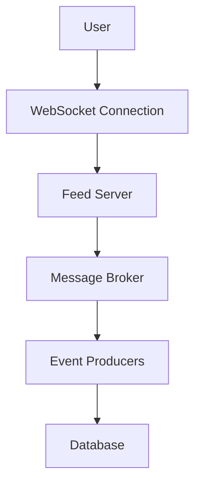

# Real-time Feeds

## Overview

Real-time feeds deliver live updates and notifications to users, ensuring timely information in applications like social media and messaging.

## Detailed Explanation

### Mechanisms

- **Push Notifications**: Server sends updates to clients.
- **WebSockets**: Persistent connections for bidirectional communication.
- **Server-Sent Events (SSE)**: One-way push from server.

### Architecture

- **Event Sources**: Generate updates (e.g., new posts).
- **Message Brokers**: Kafka or Redis for queuing.
- **Delivery Layer**: APIs or WebSockets to clients.
- **Caching**: To reduce load on databases.

### Challenges

- **Scalability**: Handling millions of concurrent connections.
- **Latency**: Minimizing delay in updates.
- **Reliability**: Ensuring message delivery.

## Real-world Examples & Use Cases

- **Social Media**: Twitter live feed of tweets.
- **Messaging**: WhatsApp real-time chats.
- **Sports Scores**: Live updates during games.
- **Stock Tickers**: Real-time price changes.

## Code Examples

### Java: Simple WebSocket Server

```java
import javax.websocket.*;
import javax.websocket.server.ServerEndpoint;

@ServerEndpoint("/feed")
public class FeedEndpoint {
    @OnOpen
    public void onOpen(Session session) {
        // Send initial data
    }

    @OnMessage
    public void onMessage(String message, Session session) {
        // Handle incoming messages
    }

    @OnClose
    public void onClose(Session session) {
        // Cleanup
    }
}
```

### Mermaid Diagram: Real-time Feed Architecture



## Common Pitfalls & Edge Cases

- **Connection Limits**: Handling disconnections and reconnections.
- **Data Consistency**: Ensuring order of updates.
- **Security**: Authenticating WebSocket connections.

## Tools & Libraries

- WebSocket API
- Apache Kafka
- Socket.IO

## References

- [WebSockets](https://developer.mozilla.org/en-US/docs/Web/API/WebSockets_API)
- [Real-time Web Apps](https://www.oreilly.com/library/view/real-time-web/9781492052624/)
- [Kafka for Real-time](https://kafka.apache.org/)

## Github-README Links & Related Topics

- [Event-Driven Architecture](system-design/event-driven-architecture/README.md)
- [Message Queues and Kafka](system-design/message-queues-and-kafka/README.md)
- [Facebook News Feed](facebook-news-feed/README.md)