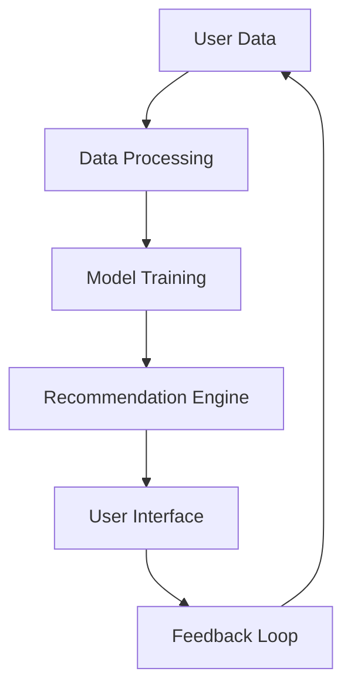

# Recommendation Systems

## Overview

Recommendation systems analyze user behavior and preferences to suggest relevant items, enhancing user engagement and driving revenue in platforms like e-commerce and streaming services.

## Detailed Explanation

### Types of Recommendation Systems

- **Collaborative Filtering**: Based on user-item interactions, finding similar users or items.
- **Content-Based Filtering**: Recommends items similar to those a user has liked before, based on item features.
- **Hybrid Systems**: Combines multiple approaches for better accuracy.

### Key Components

- **Data Collection**: Gathering user interactions (clicks, purchases, ratings).
- **Model Training**: Using algorithms like matrix factorization or neural networks.
- **Serving Layer**: Real-time recommendations via APIs.
- **Evaluation**: Metrics like precision, recall, and A/B testing.

### Challenges

- **Cold Start Problem**: New users or items with little data.
- **Scalability**: Handling large datasets.
- **Diversity vs. Accuracy**: Balancing recommendations.

## Real-world Examples & Use Cases

- **Streaming**: Netflix recommends movies based on viewing history.
- **E-commerce**: Amazon suggests products using collaborative filtering.
- **Social Media**: LinkedIn recommends connections and jobs.
- **Music**: Spotify curates playlists.

## Code Examples

### Java: Simple User-Based Collaborative Filtering

```java
import java.util.*;

public class CollaborativeFilter {
    private Map<String, Map<String, Double>> userRatings = new HashMap<>();

    public void addRating(String user, String item, double rating) {
        userRatings.computeIfAbsent(user, k -> new HashMap<>()).put(item, rating);
    }

    public List<String> recommend(String user, int topN) {
        Map<String, Double> similarities = new HashMap<>();
        for (String otherUser : userRatings.keySet()) {
            if (!otherUser.equals(user)) {
                double sim = cosineSimilarity(userRatings.get(user), userRatings.get(otherUser));
                similarities.put(otherUser, sim);
            }
        }
        // Sort and recommend items from similar users
        return new ArrayList<>(); // Simplified
    }

    private double cosineSimilarity(Map<String, Double> a, Map<String, Double> b) {
        // Implement cosine similarity
        return 0.0; // Placeholder
    }
}
```

### Mermaid Diagram: Recommendation Pipeline



## Common Pitfalls & Edge Cases

- **Bias in Data**: Skewed recommendations due to biased training data.
- **Privacy Concerns**: Handling user data ethically.
- **Overfitting**: Models that perform well on training but poorly on new data.

## Tools & Libraries

- Apache Mahout
- TensorFlow for Java
- Elasticsearch for content-based recs

## References

- [Recommender Systems Handbook](https://www.springer.com/gp/book/9780387858203)
- [Netflix Recommendation System](https://netflixtechblog.com/)
- [Collaborative Filtering](https://en.wikipedia.org/wiki/Collaborative_filtering)

## Github-README Links & Related Topics

- [Machine Learning in System Design](system-design/machine-learning-in-system-design/README.md)
- [Data Partitioning Strategies](system-design/data-partitioning-strategies/README.md)
- [Caching Strategies](system-design/caching-strategies/README.md)