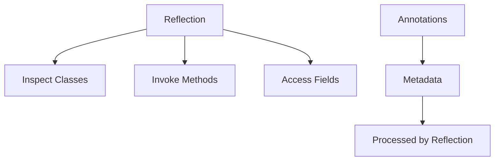

## Overview

Reflection in Java allows programs to inspect and modify the runtime behavior of classes, methods, fields, and other elements. Annotations provide a way to add metadata to code, which can be processed at compile-time or runtime, often in conjunction with reflection.

Canonical Interview Prompt: Implement a simple dependency injection container using reflection and annotations.

## Detailed Explanation

## Reflection API

- **Class Class**: Entry point for reflection, obtained via .class, getClass(), or Class.forName().
- **Fields, Methods, Constructors**: Inspect and invoke members dynamically.
- **Modifiers**: Check access levels (public, private, etc.).
- **Performance**: Reflection is slower than direct calls; use sparingly.

## Annotations

- **Built-in Annotations**: @Override, @Deprecated, @SuppressWarnings.
- **Meta-Annotations**: @Retention, @Target, @Documented, @Inherited.
- **Custom Annotations**: Define your own with @interface.
- **Processing**: Compile-time (APT) or runtime (reflection).



## Real-world Examples & Use Cases

- **Dependency Injection**: Frameworks like Spring use reflection to inject dependencies based on annotations.
- **ORM**: Hibernate uses annotations to map classes to database tables.
- **Testing**: JUnit uses annotations to mark test methods.
- **Serialization**: Custom serializers use reflection to access private fields.

## Code Examples

```java
// Getting class information
Class<?> clazz = String.class;
System.out.println(clazz.getName());
Method[] methods = clazz.getMethods();
for (Method m : methods) {
    System.out.println(m.getName());
}
```

```java
// Invoking a method reflectively
Class<?> clazz = Math.class;
Method sqrt = clazz.getMethod("sqrt", double.class);
double result = (double) sqrt.invoke(null, 16.0);
System.out.println(result); // 4.0
```

```java
// Custom annotation
@Retention(RetentionPolicy.RUNTIME)
@Target(ElementType.METHOD)
@interface MyAnnotation {
    String value();
}

class MyClass {
    @MyAnnotation("test")
    public void myMethod() {}
}
```

```java
// Processing annotation with reflection
Method method = MyClass.class.getMethod("myMethod");
MyAnnotation annotation = method.getAnnotation(MyAnnotation.class);
if (annotation != null) {
    System.out.println(annotation.value());
}
```

## Common Pitfalls & Edge Cases

- **Security**: Reflection can bypass access controls; use in trusted code.
- **Performance**: Cache reflective objects to avoid repeated lookups.
- **Exceptions**: Handle IllegalAccessException, NoSuchMethodException.
- **Generic Types**: Type erasure limits reflection on generics.

## Tools & Libraries

- Java Reflection API
- Annotation Processing Tool (APT)
- Frameworks: Spring, Hibernate

## References

- [Oracle Reflection Tutorial](https://docs.oracle.com/javase/tutorial/reflect/)
- [Oracle Annotations Tutorial](https://docs.oracle.com/javase/tutorial/java/annotations/)
- [Baeldung Reflection](https://www.baeldung.com/java-reflection)

## Github-README Links & Related Topics

[Java Reflection](java-reflection/README.md), [Java Annotations](java-annotations/README.md), [JVM Internals and Classloading](java/jvm-internals-and-classloading/README.md)