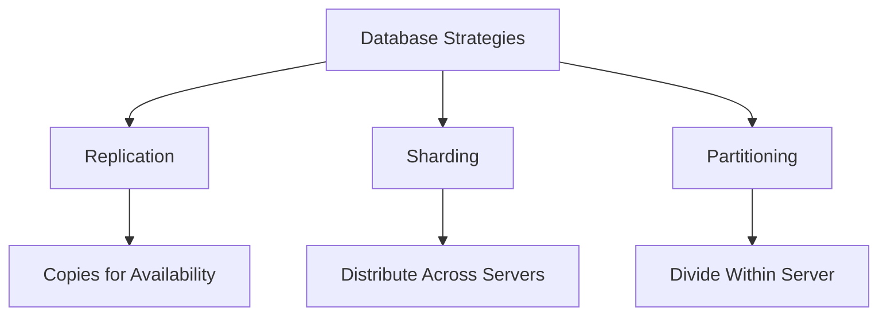

## Overview

In database systems, scaling and ensuring high availability often involve three key techniques: **replication**, **sharding**, and **partitioning**. These strategies address different challenges in handling large datasets, high traffic, and fault tolerance. Replication creates copies of data for redundancy and read scalability, sharding distributes data across multiple nodes to handle write and storage scalability, and partitioning divides data within a single database for better management and performance. Understanding their differences is crucial for designing robust, scalable systems.

## Detailed Explanation

### Replication
Replication involves maintaining multiple copies (replicas) of the same data across different nodes or servers. It improves availability, fault tolerance, and read performance by allowing queries to be served from multiple sources.

- **Types**:
  - **Single-Leader (Master-Slave)**: One primary node handles writes; replicas handle reads. Changes propagate asynchronously or synchronously.
  - **Multi-Leader**: Multiple nodes accept writes, with conflict resolution mechanisms.
  - **Leaderless**: Any node can handle reads/writes, using quorum-based consistency (e.g., Dynamo-style).

- **Benefits**: High availability, disaster recovery, load balancing for reads.
- **Drawbacks**: Increased storage costs, potential for data inconsistency (e.g., eventual consistency in async setups), complexity in conflict resolution.

### Sharding
Sharding (also called horizontal partitioning across nodes) splits data into smaller, independent pieces (shards) distributed across multiple servers. Each shard contains a subset of the data, and queries are routed to the appropriate shard based on a shard key.

- **Methods**:
  - **Range-Based**: Shards based on value ranges (e.g., user IDs 1-1000 in one shard).
  - **Hash-Based**: Uses a hash function for even distribution.
  - **Directory-Based**: Lookup table maps data to shards.
  - **Geo-Based**: Shards by geographical location.

- **Benefits**: Scales writes and storage horizontally, reduces query load per node.
- **Drawbacks**: Complex cross-shard queries, rebalancing challenges, potential hotspots if keys aren't well-distributed.

### Partitioning
Partitioning divides a large table into smaller, manageable pieces within a single database instance. Unlike sharding, partitions reside on the same server but can be on different disks or tablespaces.

- **Types**:
  - **Horizontal Partitioning**: Splits rows (e.g., by date ranges).
  - **Vertical Partitioning**: Splits columns (e.g., separating static and dynamic data).

- **Benefits**: Easier maintenance, improved query performance via pruning, better indexing.
- **Drawbacks**: Limited to single-server scalability; doesn't address node-level failures.

### Key Differences
| Aspect          | Replication                          | Sharding                              | Partitioning                          |
|-----------------|--------------------------------------|---------------------------------------|---------------------------------------|
| **Purpose**    | Redundancy & Read Scalability       | Write & Storage Scalability          | Data Management & Query Optimization |
| **Data Copies**| Multiple identical copies            | Unique subsets across nodes          | Subsets within one database          |
| **Scope**      | Across nodes/servers                 | Across nodes/servers                 | Within a single database             |
| **Consistency**| Eventual or strong (depending on type)| Strong per shard, weak across shards| Strong within partition              |
| **Query Impact**| Read load distributed                | Queries routed to specific shards    | Partition pruning optimizes queries  |
| **Use Case**   | High availability, global reads      | Massive datasets, high write loads   | Large tables, archival, analytics    |



## Real-world Examples & Use Cases

- **Replication**:
  - **Example**: PostgreSQL streaming replication for read replicas in a web app. Primary handles writes; replicas serve user dashboards.
  - **Use Case**: E-commerce sites like Amazon use multi-region replication for global availability and low-latency reads.

- **Sharding**:
  - **Example**: MongoDB sharding in a social media app, where user posts are sharded by user ID hash. Each shard handles a portion of users.
  - **Use Case**: Twitter shards tweets by user ID; Facebook shards data by user or region for massive scale.

- **Partitioning**:
  - **Example**: PostgreSQL table partitioning by date in a logging system, with monthly partitions for easy archival.
  - **Use Case**: Data warehouses partition fact tables by time dimensions; OLTP systems partition large tables for faster queries.

## Code Examples

### Replication (PostgreSQL Single-Leader)
```sql
-- Create a publication on the primary
CREATE PUBLICATION my_publication FOR TABLE my_table;

-- Subscribe on the replica
CREATE SUBSCRIPTION my_subscription 
    CONNECTION 'host=primary_host dbname=mydb user=repl_user' 
    PUBLICATION my_publication;
```

### Sharding (MongoDB Hash Sharding)
```javascript
// Enable sharding on database
sh.enableSharding("myDatabase");

// Shard collection by hashed key
sh.shardCollection("myDatabase.myCollection", { "_id": "hashed" });
```

### Partitioning (PostgreSQL Range Partitioning)
```sql
-- Create partitioned table
CREATE TABLE sales (
    id SERIAL,
    sale_date DATE,
    amount NUMERIC
) PARTITION BY RANGE (sale_date);

-- Create partitions
CREATE TABLE sales_2023 PARTITION OF sales 
    FOR VALUES FROM ('2023-01-01') TO ('2024-01-01');

CREATE TABLE sales_2024 PARTITION OF sales 
    FOR VALUES FROM ('2024-01-01') TO ('2025-01-01');
```

## Common Pitfalls & Edge Cases

- **Replication**: Stale reads in async replication; conflicts in multi-leader setups (e.g., last-write-wins may lose data).
- **Sharding**: Hotspots from poor key distribution; complex joins across shards; rebalancing downtime.
- **Partitioning**: Over-partitioning slows planning; under-partitioning leads to large indexes; updates changing partition keys fail.
- **Edge Case**: In sharding, monotonic keys (e.g., timestamps) cause uneven loads; use compound keys or hash functions.

## Tools & Libraries

- **Replication**: PostgreSQL logical replication, MySQL replication, Kafka for event-driven replication.
- **Sharding**: MongoDB sharding, Cassandra vnode sharding, Vitess for MySQL sharding.
- **Partitioning**: PostgreSQL declarative partitioning, Oracle partitioning, SQL Server partition functions.

## References

- [AWS: What is Database Sharding?](https://aws.amazon.com/what-is/database-sharding/)
- [Wikipedia: Replication (computing)](https://en.wikipedia.org/wiki/Replication_(computing))
- [Wikipedia: Partition (database)](https://en.wikipedia.org/wiki/Partition_(database))
- [MongoDB: Sharding](https://www.mongodb.com/basics/sharding)
- [PostgreSQL: Table Partitioning](https://www.postgresql.org/docs/current/ddl-partitioning.html)

## Github-README Links & Related Topics

- [Data Partitioning Strategies](system-design/data-partitioning-strategies/)
- [Database Sharding Strategies](system-design/database-sharding-strategies/)
- [CAP Theorem](cap-theorem-and-distributed-systems/)
- [Consistency Models](consistency-models/)