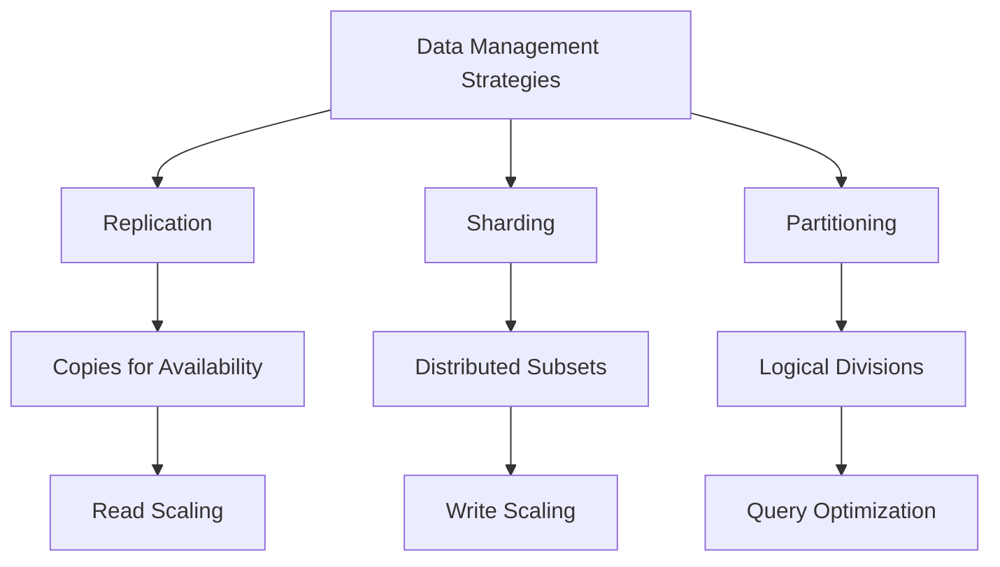

# Replication vs Sharding vs Partitioning

## Overview

In distributed databases and systems, **replication**, **sharding**, and **partitioning** are key strategies for achieving scalability, availability, and performance. Replication creates multiple copies of data across nodes for redundancy and fault tolerance. Sharding (a form of horizontal partitioning) splits data into smaller, independent subsets distributed across servers. Partitioning divides data into manageable pieces, either horizontally (by rows) or vertically (by columns), often within a single database instance. Understanding their differences is crucial for designing robust systems.

## Detailed Explanation

### Replication
Replication maintains multiple copies of the same data across different nodes or servers. It ensures data availability, fault tolerance, and load distribution for read operations.

- **Types**:
  - **Single-leader (Master-Slave)**: One primary node handles writes; replicas handle reads. Changes propagate asynchronously or synchronously.
  - **Multi-leader**: Multiple nodes accept writes, with conflict resolution mechanisms.
  - **Leaderless**: Any node can handle reads/writes, using quorum-based consistency (e.g., Dynamo-style).

- **Pros**:
  - Improves read performance and availability.
  - Provides fault tolerance; system continues if nodes fail.
  - Supports geographic distribution for low-latency access.

- **Cons**:
  - Increases storage costs.
  - Potential for data inconsistency in asynchronous setups (CAP theorem trade-offs).
  - Complexity in conflict resolution for multi-leader models.

### Sharding
Sharding is horizontal partitioning where data is divided into "shards" based on a key (e.g., user ID), and each shard is stored on a separate server. It scales writes and reduces query load by distributing data.

- **How it Works**: A sharding key determines shard assignment. Queries must target the correct shard(s). Often uses consistent hashing for even distribution.

- **Pros**:
  - Scales horizontally; add more servers for more data/traffic.
  - Reduces index size and improves query performance on individual shards.
  - Enables parallel processing.

- **Cons**:
  - Cross-shard queries are complex and slower.
  - Rebalancing shards is challenging and can cause downtime.
  - Increases operational complexity (backups, schema changes).

### Partitioning
Partitioning splits a database into smaller, manageable parts for better performance and maintenance. Unlike sharding, partitions can reside on the same server.

- **Types**:
  - **Horizontal (Row-based)**: Divides rows by criteria (e.g., date ranges). Each partition is a subset of rows.
  - **Vertical (Column-based)**: Splits columns into separate tables (e.g., static vs. dynamic data).
  - **Criteria**: Range (e.g., dates), list (e.g., regions), hash (even distribution), round-robin.

- **Pros**:
  - Improves query performance by limiting scans to relevant partitions.
  - Simplifies maintenance (e.g., archiving old partitions).
  - Can be transparent to applications.

- **Cons**:
  - May not scale across servers like sharding.
  - Uneven data distribution can create hotspots.
  - Partitioning keys must be chosen carefully to avoid skew.

### Key Differences

| Aspect          | Replication                          | Sharding                              | Partitioning                          |
|-----------------|--------------------------------------|---------------------------------------|---------------------------------------|
| **Purpose**    | Redundancy and availability         | Horizontal scalability               | Manageability and performance         |
| **Data Copies**| Multiple identical copies            | Unique subsets across servers        | Subsets within same/different servers |
| **Scope**      | Entire dataset replicated            | Data split by key                    | Data split logically                 |
| **Query Impact**| Reads distributed; writes to leader | Queries routed to specific shards    | Queries optimized per partition      |
| **Scalability**| Scales reads; writes bottlenecked    | Scales reads/writes linearly         | Scales within instance               |
| **Complexity**| Conflict resolution                  | Cross-shard joins; rebalancing       | Key selection; maintenance           |



## Real-world Examples & Use Cases

- **Replication**:
  - **MySQL Replication**: Master-slave setup for read-heavy apps like social media feeds. Replicas handle user timelines while master manages posts.
  - **Global CDN**: Data replicated across regions (e.g., AWS RDS Multi-AZ) for low-latency reads and disaster recovery.
  - **Use Case**: E-commerce sites needing high availability; if one region fails, others serve traffic.

- **Sharding**:
  - **MongoDB Sharding**: User data sharded by user ID in apps like Twitter. Tweets for user 1-100k on Shard A, 100k-200k on Shard B.
  - **Instagram**: Media metadata sharded across clusters to handle billions of photos.
  - **Use Case**: High-write apps (e.g., IoT sensors) where data grows rapidly; sharding prevents single-server overload.

- **Partitioning**:
  - **PostgreSQL Table Partitioning**: Time-series data partitioned by month (e.g., logs from Jan 2023 in one partition).
  - **BigQuery**: Automatic partitioning by ingestion time for analytics.
  - **Use Case**: Data warehouses with historical data; partition by date for efficient queries on recent data.

## Code Examples

### Replication (MySQL Master-Slave Setup)
```sql
-- On Master: Enable binary logging
[mysqld]
log-bin=mysql-bin
server-id=1

-- On Slave: Configure replication
CHANGE MASTER TO
  MASTER_HOST='master_host',
  MASTER_USER='repl_user',
  MASTER_PASSWORD='password',
  MASTER_LOG_FILE='mysql-bin.000001',
  MASTER_LOG_POS=0;

START SLAVE;
```

### Sharding (MongoDB)
```javascript
// Enable sharding on database
sh.enableSharding("mydb")

// Shard collection by user_id
sh.shardCollection("mydb.users", { "user_id": 1 })

// Insert data (auto-routed)
db.users.insert({ user_id: 123, name: "Alice" })
```

### Partitioning (PostgreSQL Range Partitioning)
```sql
-- Create partitioned table
CREATE TABLE sales (
    id SERIAL,
    sale_date DATE,
    amount NUMERIC
) PARTITION BY RANGE (sale_date);

-- Create partitions
CREATE TABLE sales_2023 PARTITION OF sales
    FOR VALUES FROM ('2023-01-01') TO ('2024-01-01');

CREATE TABLE sales_2024 PARTITION OF sales
    FOR VALUES FROM ('2024-01-01') TO ('2025-01-01');

-- Insert data (auto-partitioned)
INSERT INTO sales (sale_date, amount) VALUES ('2023-06-15', 100.00);
```

## Common Pitfalls & Edge Cases

- **Replication**: Stale reads in async replication; network partitions causing split-brain in multi-leader.
- **Sharding**: Hotspots from poor key choice (e.g., all users starting with 'A'); resharding during peak load.
- **Partitioning**: Over-partitioning leading to too many files; forgetting to update partition keys on schema changes.
- **Edge Case**: In CAP theorem, replication sacrifices consistency for availability; sharding may require eventual consistency across shards.

## References

- [Designing Data-Intensive Applications by Martin Kleppmann](https://www.oreilly.com/library/view/designing-data-intensive-applications/9781491903063/)
- [Wikipedia: Database Replication](https://en.wikipedia.org/wiki/Database_replication)
- [Wikipedia: Shard (database architecture)](https://en.wikipedia.org/wiki/Shard_(database_architecture))
- [Wikipedia: Partition (database)](https://en.wikipedia.org/wiki/Partition_(database))
- [MongoDB Sharding Documentation](https://docs.mongodb.com/manual/sharding/)
- [PostgreSQL Partitioning](https://www.postgresql.org/docs/current/ddl-partitioning.html)

## Github-README Links & Related Topics

- [Database ACID Properties](../database-acid-properties/)
- [CAP Theorem and Distributed Systems](../cap-theorem-and-distributed-systems/)
- [Distributed Caching with Redis](../distributed-caching-with-redis/)
- [Database Sharding Strategies](../database-sharding-strategies/)
- [Eventual Consistency](../eventual-consistency/)