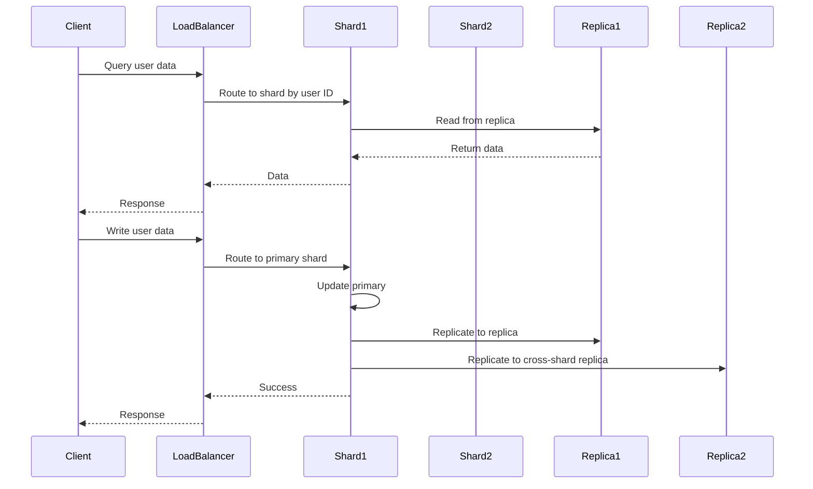

# Overview

In distributed databases and systems, replication, sharding, and partitioning are key strategies for achieving scalability, availability, and performance. Replication involves copying data across multiple nodes for redundancy and fault tolerance. Sharding (a form of horizontal partitioning) splits data across nodes to distribute load. Partitioning is a broader concept encompassing ways to divide data, including vertical and horizontal methods.

# Detailed Explanation

### Replication

Replication creates multiple copies of data across different nodes or servers. It ensures high availability and fault tolerance by allowing reads from any replica and writes to propagate.

- **Types**: Synchronous (strong consistency, slower), Asynchronous (eventual consistency, faster).
- **Benefits**: Read scalability, disaster recovery.
- **Drawbacks**: Write overhead, potential inconsistencies.

### Sharding

Sharding divides a dataset into smaller, independent pieces (shards) distributed across nodes. Each shard is a subset of the data, often based on a shard key (e.g., user ID).

- **Types**: Range-based, hash-based, directory-based.
- **Benefits**: Horizontal scalability, reduced load per node.
- **Drawbacks**: Complex queries across shards, rebalancing challenges.

### Partitioning

Partitioning splits data into smaller, manageable pieces. It can be vertical (by columns) or horizontal (by rows/shards).

- **Vertical Partitioning**: Splits tables by columns (e.g., hot vs. cold data).
- **Horizontal Partitioning**: Splits by rows (same as sharding).
- **Benefits**: Improved performance, easier management.
- **Drawbacks**: Depends on access patterns.

### Key Differences

| Aspect | Replication | Sharding | Partitioning |
|--------|-------------|----------|--------------|
| Purpose | Availability, redundancy | Scalability, load distribution | Data organization, performance |
| Data Copies | Multiple identical | Subsets, no overlap | Subsets or restructured |
| Consistency | Eventual or strong | Per shard | Per partition |
| Query Complexity | Simple | Cross-shard joins hard | Depends on type |
| Example | Read replicas in RDBMS | User data across servers | Table splits in MySQL |

# Real-world Examples & Use Cases

### Replication

- **PostgreSQL Read Replicas**: Multiple read-only copies for high read throughput.
- **MongoDB Replica Sets**: Automatic failover and data redundancy.

### Sharding

- **Instagram Sharding**: User photos sharded by user ID for massive scale.
- **Twitter Sharding**: Tweets partitioned by user or time.

### Partitioning

- **Vertical**: E-commerce DB: user table split into profile and activity.
- **Horizontal**: BigQuery tables partitioned by date for analytics.

# Code Examples

### Java: Simulating Sharding

```java
public class ShardManager {
    private List<Database> shards;

    public ShardManager(List<Database> shards) {
        this.shards = shards;
    }

    public Database getShard(String key) {
        int shardIndex = key.hashCode() % shards.size();
        return shards.get(shardIndex);
    }

    public void save(String key, String value) {
        getShard(key).save(key, value);
    }

    public String get(String key) {
        return getShard(key).get(key);
    }
}
```

### SQL: Partitioning Example

```sql
-- Horizontal partitioning in PostgreSQL
CREATE TABLE sales (
    id SERIAL,
    date DATE,
    amount DECIMAL
) PARTITION BY RANGE (date);

CREATE TABLE sales_2023 PARTITION OF sales FOR VALUES FROM ('2023-01-01') TO ('2024-01-01');
```

## STAR Summary

**Situation**: A growing e-commerce platform faced performance issues with a monolithic database handling millions of transactions daily.

**Task**: Implement data distribution strategies to scale the database horizontally while maintaining data consistency and availability.

**Action**: Analyzed access patterns, chose hash-based sharding for user data and range-based partitioning for order history, implemented read replicas for high availability, and set up automated rebalancing.

**Result**: Achieved 10x improvement in query performance, reduced downtime from hours to minutes, and supported 5x user growth without significant infrastructure costs.

## Journey / Sequence



## Data Models / Message Formats

### Shard Metadata

```json
{
  "shardId": "shard_001",
  "range": {
    "min": "00000000-0000-0000-0000-000000000000",
    "max": "7fffffff-ffff-ffff-ffff-ffffffffffff"
  },
  "replicas": [
    {
      "host": "db1.example.com",
      "port": 5432,
      "role": "primary"
    },
    {
      "host": "db2.example.com",
      "port": 5432,
      "role": "replica"
    }
  ],
  "status": "active",
  "lastRebalanced": "2023-09-26T00:00:00Z"
}
```

### Partition Key Structure

```json
{
  "table": "user_orders",
  "partitionKey": "user_id",
  "partitionType": "hash",
  "numPartitions": 256,
  "partitionFunction": "murmur3_32(user_id) % 256"
}
```

# Common Pitfalls & Edge Cases

- **Hot Shards**: Uneven data distribution causes bottlenecks.
- **Replication Lag**: Stale reads in async replication.
- **Cross-Shard Queries**: Expensive joins in sharded systems.
- **Edge Case**: Shard key changes require data migration.

# Tools & Libraries

- **Replication**: PostgreSQL streaming replication, MongoDB replica sets.
- **Sharding**: Cassandra, Elasticsearch.
- **Partitioning**: MySQL partitioning, Apache Kafka partitions.

# References

- [Database Sharding Explained](https://www.mongodb.com/basics/database-sharding-explained)
- [Replication Strategies](https://docs.microsoft.com/en-us/azure/architecture/patterns/replication)

# Github-README Links & Related Topics

- [Database Sharding Strategies](../database-sharding-strategies/)
- [Distributed Caching with Redis](../distributed-caching-with-redis/)
- [CAP Theorem & Distributed Systems](../cap-theorem-and-distributed-systems/)
