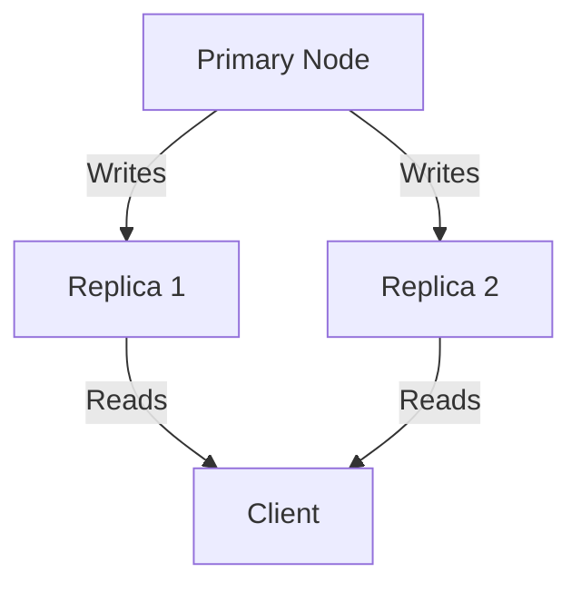
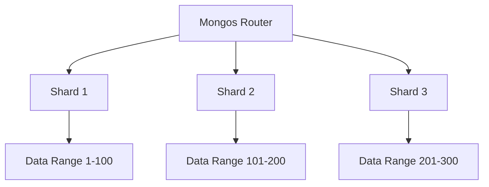
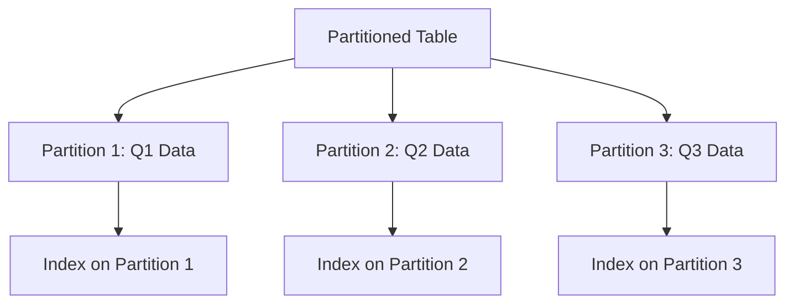

# Replication vs Sharding vs Partitioning

## Overview

Replication, sharding, and partitioning are fundamental strategies for scaling databases, ensuring high availability, and managing large datasets. While often used interchangeably, they address different aspects of data management:

- **Replication** creates multiple copies of data across servers for redundancy and read scalability.
- **Sharding** distributes data horizontally across multiple machines based on a key.
- **Partitioning** divides a logical database into smaller, independent physical units, often within a single server.

This guide compares these techniques, their trade-offs, and implementation patterns.

## Detailed Explanation

## Replication

Replication maintains identical copies of data on multiple servers. It provides fault tolerance, high availability, and load distribution for read operations.

### Types of Replication
- **Single-Leader (Primary-Replica)**: One primary handles writes; replicas handle reads.
- **Multi-Leader**: Multiple nodes accept writes, requiring conflict resolution.
- **Leaderless**: Any node can handle reads/writes, using quorum for consistency.

### Key Mechanisms
- Asynchronous replication via operation logs (oplog in MongoDB).
- Automatic failover via elections.
- Read preferences for directing queries to replicas.

### Trade-offs
- **Pros**: Improves read performance, provides redundancy.
- **Cons**: Write performance may degrade due to replication lag; increases storage costs.



## Sharding

Sharding splits data across multiple servers (shards), each holding a subset. It's ideal for horizontal scaling when a single server can't handle the load.

### Shard Key Selection
- **Ranged Sharding**: Data divided by key ranges (e.g., dates).
- **Hashed Sharding**: Hash function distributes data evenly.
- **Compound Sharding**: Combines multiple keys.

### Components
- **Shard**: Data-bearing replica set.
- **Mongos**: Query router.
- **Config Servers**: Metadata storage.

### Trade-offs
- **Pros**: Scales writes and storage linearly.
- **Cons**: Complex queries may require cross-shard operations; rebalancing can be costly.



## Partitioning

Partitioning divides a table or database into smaller, manageable pieces. Unlike sharding, partitions are often on the same server.

### Types of Partitioning
- **Horizontal (Row-based)**: Splits rows (e.g., by date).
- **Vertical (Column-based)**: Splits columns (e.g., separating static/dynamic data).
- **Range/List/Hash**: Similar to sharding but intra-server.

### Implementation
- In PostgreSQL: Declarative partitioning with `PARTITION BY`.
- In MySQL: Table partitioning for performance.

### Trade-offs
- **Pros**: Improves query performance on large tables; easier maintenance.
- **Cons**: Limited to single-server scaling; complex schema changes.



## Comparison Table

| Aspect          | Replication                          | Sharding                              | Partitioning                          |
|-----------------|--------------------------------------|---------------------------------------|---------------------------------------|
| **Purpose**    | Redundancy & Read Scaling           | Write/Storage Scaling                | Manageability & Query Optimization   |
| **Data Copies**| Multiple identical copies            | Subsets across servers               | Subsets within server                |
| **Scaling**    | Vertical (more powerful servers)     | Horizontal (more servers)             | Horizontal (intra-server)             |
| **Consistency**| Eventual (replication lag)           | Strong (per shard)                   | Strong (per partition)                |
| **Complexity**| Medium (failover, conflicts)         | High (routing, rebalancing)          | Low-Medium (schema design)           |
| **Use Case**   | High availability, read-heavy apps  | Massive datasets, global apps        | Large tables, archival data          |
| **Examples**   | MongoDB Replica Sets, PostgreSQL Streaming | MongoDB Sharding, Cassandra          | PostgreSQL Table Partitioning, MySQL |

# Real-world Examples & Use Cases

## Replication
- **E-commerce Platform**: Primary handles orders; replicas serve product catalogs for global users, reducing latency.
- **Social Media**: Multi-leader replication for geo-distributed writes, with conflict resolution for user posts.

## Sharding
- **Facebook News Feed**: Sharded by user ID for personalized feeds across billions of users.
- **Uber Ride Data**: Sharded by location and time for real-time analytics.

## Partitioning
- **Financial Ledger**: Partitioned by month for quick audits and archival.
- **IoT Sensor Data**: Horizontal partitioning by timestamp for efficient time-range queries.

# Code Examples

## Replication (MongoDB Replica Set)
```javascript
// Initiate replica set
rs.initiate({
  _id: "rs0",
  members: [
    { _id: 0, host: "localhost:27017" },
    { _id: 1, host: "localhost:27018" },
    { _id: 2, host: "localhost:27019" }
  ]
});

// Read from secondary
db.collection.find().readPref("secondary");
```

## Sharding (MongoDB)
```javascript
// Enable sharding on database
sh.enableSharding("mydb");

// Shard collection by hashed key
sh.shardCollection("mydb.collection", { "_id": "hashed" });
```

## Partitioning (PostgreSQL)
```sql
-- Create partitioned table
CREATE TABLE sales (
    id SERIAL,
    sale_date DATE NOT NULL,
    amount NUMERIC
) PARTITION BY RANGE (sale_date);

-- Create partitions
CREATE TABLE sales_2023 PARTITION OF sales
    FOR VALUES FROM ('2023-01-01') TO ('2024-01-01');

CREATE TABLE sales_2024 PARTITION OF sales
    FOR VALUES FROM ('2024-01-01') TO ('2025-01-01');
```

# References

- [Replication (computing) - Wikipedia](https://en.wikipedia.org/wiki/Replication_(computing))
- [Shard (database architecture) - Wikipedia](https://en.wikipedia.org/wiki/Shard_(database_architecture))
- [Partition (database) - Wikipedia](https://en.wikipedia.org/wiki/Partition_(database))
- [PostgreSQL Table Partitioning](https://www.postgresql.org/docs/current/ddl-partitioning.html)
- [MongoDB Sharding](https://docs.mongodb.com/manual/sharding/)
- [MongoDB Replication](https://docs.mongodb.com/manual/replication/)

# Github-README Links & Related Topics

- [database-replication-strategies](../database-replication-strategies/)
- [database-sharding-strategies](../database-sharding-strategies/)
- [database-normalization](../database-normalization/)
- [cap-theorem-and-distributed-systems](../cap-theorem-and-distributed-systems/)
- [distributed-caching-with-redis](../distributed-caching-with-redis/)