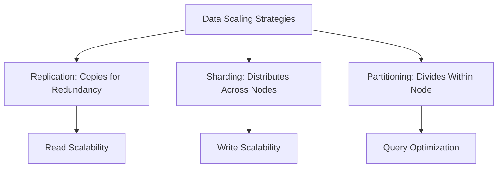

## Overview

In database systems, replication, sharding, and partitioning are strategies to handle large-scale data and high traffic. Replication creates copies of data for redundancy and read performance. Sharding distributes data across multiple servers to scale writes. Partitioning divides data within a single database for better query performance. Choosing the right strategy depends on read/write patterns, data size, and consistency requirements.

## Detailed Explanation

### Replication

Replication involves copying data to multiple nodes:

- **Types**: Master-slave (writes to master, reads from slaves), master-master (writes to any node).
- **Benefits**: High availability, read scalability, fault tolerance.
- **Drawbacks**: Write bottlenecks on master, consistency issues in master-master.
- **Use Case**: Read-heavy applications like social media feeds.

### Sharding

Sharding splits data across independent databases:

- **Sharding Key**: Attribute like user_id to determine shard.
- **Horizontal Sharding**: Rows distributed across shards.
- **Benefits**: Scales writes, reduces single-point failures.
- **Drawbacks**: Complex queries across shards, rebalancing challenges.
- **Use Case**: Massive datasets like user profiles in global apps.

### Partitioning

Partitioning divides data within a single database:

- **Horizontal Partitioning**: Split tables by rows (e.g., by date).
- **Vertical Partitioning**: Split tables by columns.
- **Benefits**: Faster queries, easier maintenance.
- **Drawbacks**: Limited to single server, no write scaling.
- **Use Case**: Time-series data or large tables.

### Comparison

| Strategy | Scope | Scaling | Complexity | Consistency |
|----------|-------|---------|------------|-------------|
| Replication | Copies data | Read scaling | Medium | Eventual |
| Sharding | Distributes data | Read/Write scaling | High | Partitioned |
| Partitioning | Divides data | Query performance | Low | Strong |



## Real-world Examples & Use Cases

- **Replication**: Facebook uses replication for news feed reads; master handles writes, slaves serve reads.
- **Sharding**: Instagram shards user data by user_id across global regions for fast access.
- **Partitioning**: E-commerce sites partition order tables by date for efficient historical queries.

## Code Examples

### Replication Setup (MySQL Master-Slave)

```sql
-- On Master
CHANGE MASTER TO MASTER_HOST='slave_host', MASTER_USER='repl', MASTER_PASSWORD='password';
START SLAVE;

-- On Slave
SHOW SLAVE STATUS;
```

### Sharding Example (Python with Sharding Logic)

```python
def get_shard(user_id, num_shards):
    return user_id % num_shards

def insert_user(user_id, data):
    shard = get_shard(user_id, 4)
    # Connect to shard_db[shard] and insert
    shard_db[shard].insert(data)
```

### Partitioning (PostgreSQL)

```sql
CREATE TABLE orders (
    id SERIAL,
    user_id INT,
    order_date DATE,
    amount DECIMAL
) PARTITION BY RANGE (order_date);

CREATE TABLE orders_2023 PARTITION OF orders FOR VALUES FROM ('2023-01-01') TO ('2024-01-01');
```

## Common Pitfalls & Edge Cases

- **Hot Shards**: Uneven data distribution causing overload.
- **Cross-Shard Queries**: Expensive joins in sharded systems.
- **Replication Lag**: Stale reads in eventual consistency.
- **Rebalancing**: Data migration during shard changes.

## Tools & Libraries

- **Replication**: MySQL Replication, PostgreSQL Streaming Replication.
- **Sharding**: MongoDB Sharding, Cassandra.
- **Partitioning**: PostgreSQL Table Partitioning, MySQL Partitioning.

## References

- [Database Sharding Explained](https://www.mongodb.com/basics/database-sharding-explained)
- [Replication Strategies](https://dev.mysql.com/doc/refman/8.0/en/replication.html)
- [Partitioning in PostgreSQL](https://www.postgresql.org/docs/current/ddl-partitioning.html)

## Github-README Links & Related Topics

- [Database Sharding Strategies](../database-sharding-strategies/)
- [Database Replication Strategies](../database-replication-strategies/)
- [Distributed Systems](../cap-theorem-and-distributed-systems/)