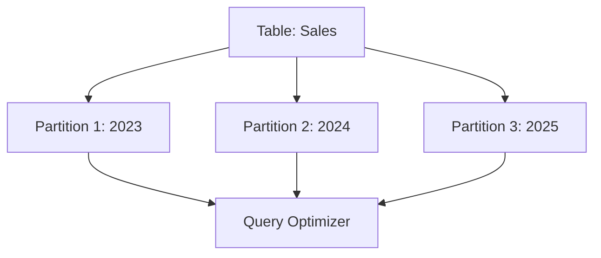

# Replication vs Sharding vs Partitioning

## Overview

Replication, sharding, and partitioning are core strategies for scaling databases and managing large datasets in distributed systems. Replication creates redundant copies for availability and read performance, sharding distributes data across nodes for horizontal scaling, and partitioning organizes data into segments for efficiency. This guide compares these techniques, their implementations, trade-offs, and real-world applications, providing a foundation for system design decisions.

## Detailed Explanation

### Replication

Replication maintains multiple copies of data to ensure consistency and availability. It is fundamental for fault tolerance, allowing systems to continue operating despite node failures.

#### Types of Replication
- **Active Replication**: Each replica processes the same request independently.
- **Passive Replication**: One primary replica handles writes, propagating changes to secondary replicas.
- **Single-Leader Replication**: One node (leader) accepts writes; followers replicate data asynchronously or synchronously.
- **Multi-Leader Replication**: Multiple nodes accept writes, with conflict resolution mechanisms.
- **Leaderless Replication**: Any node can accept writes, using quorum-based consistency.

Replication improves read scalability by distributing read loads across replicas and provides disaster recovery through data redundancy.


### Sharding

Sharding (horizontal partitioning) splits data by a shard key across nodes, enabling horizontal scaling. Each shard is independent, often with replication for durability.

#### Key Concepts
- **Shard Key**: A field or set of fields used to determine data distribution (e.g., user ID, timestamp).
- **Chunks**: Data ranges within shards, managed by a balancer for even distribution.
- **Strategies**:
  - **Ranged Sharding**: Assigns contiguous ranges of shard key values to shards.
  - **Hashed Sharding**: Uses a hash function on the shard key for even distribution.

Sharding supports massive scalability but complicates cross-shard queries and requires careful shard key selection to avoid hotspots.

```mermaid
graph TD
    A[Shard Key: user_id] --> B[Shard 1: 0-999]
    A --> C[Shard 2: 1000-1999]
    A --> D[Shard 3: 2000-2999]
    B --> E[MongoDB Router (mongos)]
    C --> E
    D --> E
```

### Partitioning

Partitioning divides a logical database into smaller physical pieces for better performance and management. Unlike sharding, partitions are typically on the same server.

#### Types of Partitioning
- **Horizontal Partitioning**: Divides rows into separate tables (e.g., by date ranges).
- **Vertical Partitioning**: Splits columns into separate tables (e.g., separating static and dynamic data).
- **Range Partitioning**: Uses value ranges (e.g., dates).
- **List Partitioning**: Explicitly lists partition values.
- **Hash Partitioning**: Distributes data using a hash function.

Partitioning improves query performance by reducing index sizes and enabling targeted operations, but requires careful key selection.



### Comparison

| Aspect              | Replication                          | Sharding                             | Partitioning                        |
|---------------------|--------------------------------------|--------------------------------------|-------------------------------------|
| **Purpose**        | Redundancy, availability, read scaling | Horizontal scaling, storage distribution | Manageability, performance within server |
| **Data Copies**    | Multiple identical copies            | Subsets across shards                | Subsets within server               |
| **Scalability**    | Read scaling, fault tolerance        | Massive horizontal scaling           | Limited to server capacity          |
| **Complexity**     | Conflict resolution in multi-leader  | Cross-shard queries, balancing       | Index management, query routing     |
| **Use Case**       | High availability, geo-distribution  | Large datasets, high throughput      | Large tables, archival              |
| **Examples**       | MongoDB replica sets, PostgreSQL streaming | MongoDB sharded clusters             | PostgreSQL table partitioning       |

## Real-world Examples & Use Cases

### Replication
- **Database High Availability**: PostgreSQL uses replication for failover and read replicas in multi-region deployments.
- **Content Delivery**: CDNs replicate data across global nodes for low-latency access.
- **Use Case**: E-commerce sites replicate user sessions and product catalogs for reliability during traffic spikes.

### Sharding
- **Social Media Feeds**: Platforms like Twitter shard user data by user ID to handle billions of users.
- **IoT Data**: Sensor networks shard by timestamp or device ID for efficient querying.
- **Use Case**: MongoDB Atlas shards collections for applications with terabytes of data.

### Partitioning
- **Time-Series Data**: Financial systems partition transaction logs by date for quick archival.
- **E-commerce Orders**: Partition orders by region or status for targeted analytics.
- **Use Case**: PostgreSQL partitions large tables in data warehouses for faster queries.

## Code Examples

### Replication (PostgreSQL Streaming Replication)
Set up a primary and standby replica:

```sql
-- On primary: Enable replication
ALTER SYSTEM SET wal_level = replica;
ALTER SYSTEM SET max_wal_senders = 3;

-- Create replication slot
SELECT * FROM pg_create_physical_replication_slot('replica_slot');

-- On standby: Restore from backup and configure recovery.conf
standby_mode = 'on'
primary_conninfo = 'host=primary_host port=5432 user=replicator'
primary_slot_name = 'replica_slot'
```

### Sharding (MongoDB)
Shard a collection by hashed shard key:

```javascript
// Enable sharding on database
sh.enableSharding("mydb")

// Shard collection with hashed key
sh.shardCollection("mydb.collection", { "_id": "hashed" })

// Insert data
db.collection.insertMany([
  { "_id": 1, "data": "example1" },
  { "_id": 2, "data": "example2" }
])
```

### Partitioning (PostgreSQL Declarative Partitioning)
Create a partitioned table by range:

```sql
-- Create partitioned table
CREATE TABLE sales (
    id SERIAL,
    sale_date DATE NOT NULL,
    amount NUMERIC
) PARTITION BY RANGE (sale_date);

-- Create partitions
CREATE TABLE sales_2023 PARTITION OF sales
    FOR VALUES FROM ('2023-01-01') TO ('2024-01-01');

CREATE TABLE sales_2024 PARTITION OF sales
    FOR VALUES FROM ('2024-01-01') TO ('2025-01-01');

-- Insert data
INSERT INTO sales (sale_date, amount) VALUES ('2023-06-01', 100.00);
INSERT INTO sales (sale_date, amount) VALUES ('2024-06-01', 200.00);
```

## Common Pitfalls & Edge Cases

- Selecting a shard key that causes hotspots
- Replication lag leading to stale data reads
- Partition maintenance causing downtime
- Cross-shard queries degrading performance
- Backup complexities in sharded systems

## Tools & Libraries

- **Replication:** PostgreSQL, MySQL, MongoDB
- **Sharding:** MongoDB, Cassandra, Elasticsearch
- **Partitioning:** PostgreSQL, Oracle, SQL Server

## References

- [Replication (computing) - Wikipedia](https://en.wikipedia.org/wiki/Replication_(computing))
- [Shard (database architecture) - Wikipedia](https://en.wikipedia.org/wiki/Shard_(database_architecture))
- [Partition (database) - Wikipedia](https://en.wikipedia.org/wiki/Partition_(database))
- [PostgreSQL: Table Partitioning](https://www.postgresql.org/docs/current/ddl-partitioning.html)
- [MongoDB Sharding](https://docs.mongodb.com/manual/sharding/)
- [MongoDB Replication](https://docs.mongodb.com/manual/replication/)

## Github-README Links & Related Topics

- [Database Sharding Strategies](../database-sharding-strategies/)
- [Database Replication Strategies](../database-replication-strategies/)
- [Database Normalization](../database-normalization/)
- [CAP Theorem and Distributed Systems](../cap-theorem-and-distributed-systems/)
- [Horizontal Scaling](../horizontal-scaling/)
- [Vertical Scaling](../vertical-scaling/)