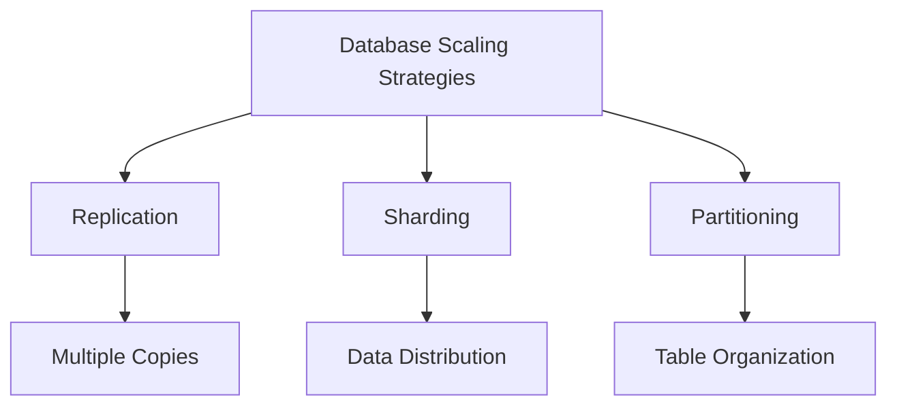

## Overview

Replication, sharding, and partitioning are fundamental database scaling strategies used to improve performance, availability, and manageability of large datasets. Replication creates copies of data for redundancy and read scalability, sharding distributes data across multiple servers for write scalability, and partitioning organizes data within a single server for better query performance.

## Detailed Explanation

### Replication

Replication involves creating and maintaining multiple copies of the same data across different database servers. It ensures high availability and improves read performance by distributing read operations.

**Types of Replication:**
- **Master-Slave Replication**: One master handles writes, slaves handle reads and serve as backups.
- **Master-Master Replication**: Multiple masters can handle writes, requiring conflict resolution.
- **Multi-Source Replication**: Data replicated from multiple sources.

**Benefits:**
- High availability and fault tolerance
- Improved read performance
- Geographic distribution for reduced latency

**Drawbacks:**
- Increased storage costs
- Potential for data inconsistency (eventual consistency)
- Complexity in conflict resolution for multi-master setups

### Sharding

Sharding, also known as horizontal partitioning, splits a large database into smaller, more manageable pieces called shards, distributed across multiple servers.

**Sharding Strategies:**
- **Range-based Sharding**: Data divided based on ranges of a key (e.g., user IDs 1-1000 on shard 1)
- **Hash-based Sharding**: Hash function determines shard placement
- **Directory-based Sharding**: Lookup table maps data to shards

**Benefits:**
- Improved write performance
- Better horizontal scalability
- Reduced index size per shard

**Drawbacks:**
- Increased complexity in queries spanning multiple shards
- Rebalancing challenges
- Potential for uneven data distribution

### Partitioning

Partitioning divides a table into smaller, more manageable pieces within the same database server, improving query performance and maintenance.

**Types of Partitioning:**
- **Horizontal Partitioning**: Rows divided into partitions (similar to sharding but within one server)
- **Vertical Partitioning**: Columns divided into separate tables
- **Composite Partitioning**: Combination of horizontal and vertical

**Benefits:**
- Improved query performance
- Easier maintenance and backup
- Better data organization

**Drawbacks:**
- Limited to single server scalability
- May not solve write scalability issues

### Key Differences

| Aspect | Replication | Sharding | Partitioning |
|--------|-------------|----------|--------------|
| **Scope** | Multiple servers | Multiple servers | Single server |
| **Data Copies** | Yes | No | No |
| **Scalability Focus** | Read operations | Write operations | Query performance |
| **Consistency** | Eventual consistency possible | Strong consistency | Strong consistency |
| **Use Case** | High availability, read-heavy workloads | Massive scale, write-heavy workloads | Large tables, query optimization |



## Real-world Examples & Use Cases

- **Replication Example**: MySQL master-slave setup for e-commerce site; master handles orders (writes), slaves serve product catalog (reads).
- **Sharding Example**: MongoDB sharded cluster for social media platform; users sharded by region for global distribution.
- **Partitioning Example**: PostgreSQL table partitioning by date for time-series data in IoT applications.
- **Combined Use Case**: Large-scale application using replication for availability and sharding for scalability (e.g., Twitter's data architecture).

## Code Examples

### MySQL Replication Setup (Conceptual)

```sql
-- On Master
CREATE USER 'repl'@'%' IDENTIFIED BY 'password';
GRANT REPLICATION SLAVE ON *.* TO 'repl'@'%';

-- On Slave
CHANGE MASTER TO
    MASTER_HOST='master_host',
    MASTER_USER='repl',
    MASTER_PASSWORD='password',
    MASTER_LOG_FILE='mysql-bin.000001',
    MASTER_LOG_POS=1;

START SLAVE;
```

### MongoDB Sharding Configuration

```javascript
// Enable sharding on database
sh.enableSharding("myDatabase")

// Shard collection with hashed shard key
sh.shardCollection("myDatabase.users", { "_id": "hashed" })

// Check shard status
sh.status()
```

### PostgreSQL Table Partitioning

```sql
-- Create partitioned table
CREATE TABLE sales (
    id SERIAL,
    sale_date DATE NOT NULL,
    amount DECIMAL(10,2)
) PARTITION BY RANGE (sale_date);

-- Create partitions
CREATE TABLE sales_2023 PARTITION OF sales
    FOR VALUES FROM ('2023-01-01') TO ('2024-01-01');

CREATE TABLE sales_2024 PARTITION OF sales
    FOR VALUES FROM ('2024-01-01') TO ('2025-01-01');
```

## Common Pitfalls & Edge Cases

- **Replication Lag**: Delays in data propagation causing stale reads; monitor and alert on lag.
- **Shard Imbalance**: Uneven data distribution; implement rebalancing strategies.
- **Cross-Shard Queries**: Expensive joins across shards; design schema to minimize.
- **Partition Maintenance**: Dropping old partitions; automate cleanup scripts.
- **Edge Case**: Network partitions in replicated systems; implement quorum-based consistency.

## Tools & Libraries

- **Replication**: MySQL Replication, PostgreSQL Streaming Replication, MongoDB Replica Sets
- **Sharding**: MongoDB Sharding, Cassandra, Elasticsearch
- **Partitioning**: PostgreSQL, MySQL Partitioning, Oracle Partitioning

## References

- [Database Sharding: Concepts & Examples](https://www.mongodb.com/basics/database-sharding)
- [MySQL Replication Documentation](https://dev.mysql.com/doc/refman/8.0/en/replication.html)
- [PostgreSQL Partitioning](https://www.postgresql.org/docs/current/ddl-partitioning.html)
- [Designing Data-Intensive Applications - Replication](https://dataintensive.net/ch5.html)
- [MongoDB Sharding](https://docs.mongodb.com/manual/sharding/)

## Github-README Links & Related Topics

- [Database Replication Strategies](database-replication-strategies/README.md)
- [Database Sharding Strategies](database-sharding-strategies/README.md)
- [CAP Theorem and Distributed Systems](cap-theorem-and-distributed-systems/README.md)
- [Distributed Transactions](distributed-transactions/README.md)
- [High Scalability Patterns](high-scalability-patterns/README.md)
