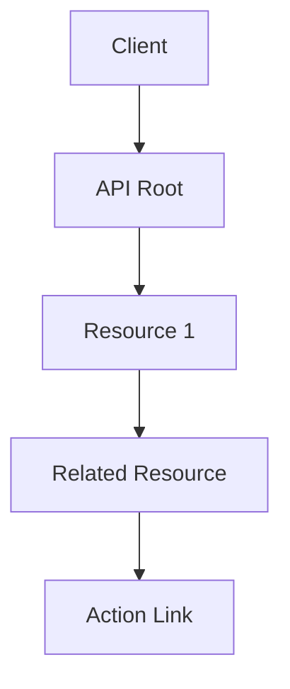

## Overview

RESTful API Design refers to the architectural style for designing networked applications, emphasizing scalability, simplicity, and stateless communication. Coined by Roy Fielding in his 2000 dissertation, REST (Representational State Transfer) leverages HTTP protocols to enable client-server interactions through standard methods like GET, POST, PUT, and DELETE. It focuses on resources identified by URIs, uniform interfaces, and hypermedia-driven navigation.

Key principles include statelessness, where each request contains all necessary information; resource-based URIs using nouns; and adherence to HTTP semantics for operations. This approach ensures APIs are intuitive, maintainable, and interoperable across diverse systems.

## Detailed Explanation

### Core Principles of REST

REST is guided by six architectural constraints:

1. **Client-Server Architecture**: Separation of concerns between client and server, allowing independent evolution.
2. **Statelessness**: Each request is self-contained; no session state is stored on the server, enhancing scalability and reliability.
3. **Cacheability**: Responses must define themselves as cacheable or not, improving performance.
4. **Uniform Interface**: Standardized interactions via HTTP methods, URIs, and representations.
5. **Layered System**: Components interact through layers, hiding complexities.
6. **Code on Demand (Optional)**: Servers can extend client functionality via executable code.

### Resource Naming and URIs

URIs should represent resources using nouns, avoiding verbs. Use hierarchical structures for clarity:

- Collection: `/users`
- Singleton: `/users/{id}`
- Sub-resource: `/users/{id}/orders`

Best practices:
- Use lowercase, hyphens for readability.
- Avoid file extensions; rely on Content-Type headers.
- Ensure consistency across the API.

### HTTP Methods

HTTP methods map to CRUD operations:

| Method | CRUD | Description | Idempotent | Safe |
|--------|------|-------------|------------|------|
| GET    | Read | Retrieve resource | Yes | Yes |
| POST   | Create | Create new resource | No | No |
| PUT    | Update | Replace resource | Yes | No |
| DELETE | Delete | Remove resource | Yes | No |
| PATCH  | Partial Update | Modify part of resource | No | No |

### HTTP Status Codes

Use standard codes for responses:

- 2xx: Success (e.g., 200 OK, 201 Created)
- 4xx: Client Errors (e.g., 400 Bad Request, 404 Not Found)
- 5xx: Server Errors (e.g., 500 Internal Server Error)

### Versioning

Handle API evolution with strategies like URI versioning (`/v1/resource`), header versioning (`Accept: application/vnd.api.v1+json`), or content negotiation.

### Security

Implement HTTPS, authentication (OAuth, JWT), input validation, and rate limiting to prevent abuse.

### Content Negotiation

Clients specify preferred formats via `Accept` headers (e.g., `application/json`). Servers respond accordingly.

### HATEOAS

Hypermedia As The Engine Of Application State: Include links in responses for discoverable navigation.



## Real-world Examples & Use Cases

- **GitHub API**: Uses REST for repositories, issues, and pull requests. Example: `GET /repos/{owner}/{repo}/issues` retrieves issues with pagination.
- **Twitter API**: Manages tweets and users. Example: `POST /statuses/update` creates a tweet.
- **Stripe API**: Handles payments. Example: `POST /v1/charges` processes a payment.
- **Use Cases**: E-commerce platforms for product catalogs, social media for feeds, IoT for device management.

## Code Examples

### Sample API Request/Response

**GET /users/123**

Request:
```
GET /users/123 HTTP/1.1
Accept: application/json
Authorization: Bearer <token>
```

Response:
```json
{
  "id": 123,
  "name": "John Doe",
  "email": "john@example.com",
  "links": [
    {"rel": "self", "href": "/users/123"},
    {"rel": "orders", "href": "/users/123/orders"}
  ]
}
```

### Creating a Resource

**POST /users**

Request:
```
POST /users HTTP/1.1
Content-Type: application/json

{
  "name": "Jane Doe",
  "email": "jane@example.com"
}
```

Response:
```
HTTP/1.1 201 Created
Location: /users/124
```

### Filtering and Pagination

**GET /products?category=electronics&page=1&size=10**

Returns paginated, filtered results.

## References

- [REST API Tutorial - restfulapi.net](https://restfulapi.net/)
- [Resource Naming Conventions - restfulapi.net](https://restfulapi.net/resource-naming/)
- [HTTP Methods - restfulapi.net](https://restfulapi.net/http-methods/)
- [HTTP Status Codes - restfulapi.net](https://restfulapi.net/http-status-codes/)
- [REST API Best Practices - restfulapi.net](https://restfulapi.net/rest-api-best-practices/)
- [API Versioning - restfulapi.net](https://restfulapi.net/versioning/)
- [Security Essentials - restfulapi.net](https://restfulapi.net/security/)
- [HATEOAS - restfulapi.net](https://restfulapi.net/hateoas/)
- [Content Negotiation - restfulapi.net](https://restfulapi.net/content-negotiation/)
- Fielding, R. T. (2000). Architectural Styles and the Design of Network-based Software Architectures. University of California, Irvine.

## Github-README Links & Related Topics

- [API Design Best Practices](../api-design-best-practices/)
- [API Design Principles](../api-design-principles/)
- [API Gateway Design](../api-gateway-design/)
- [API Security Best Practices](../api-security-best-practices/)
- [API Versioning Strategies](../api-versioning-strategies/)