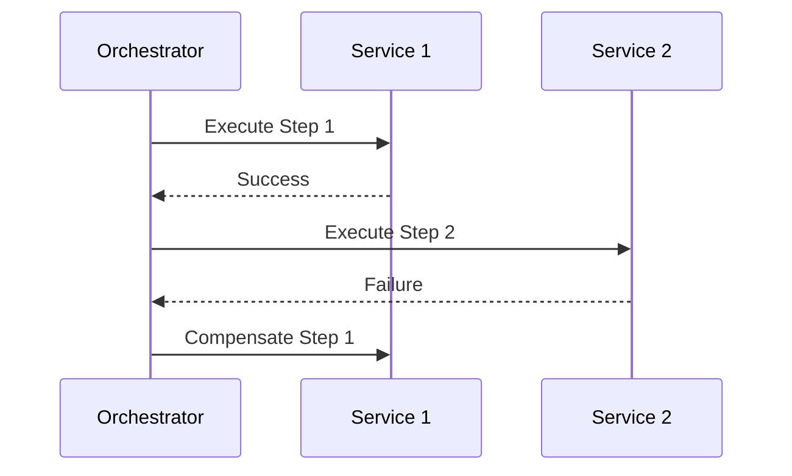

# Saga Pattern

## Overview

The Saga pattern is a design pattern for managing long-running transactions in microservices architectures. It breaks down a transaction into a series of smaller, local transactions, each with a compensating action to undo its effects if needed.

## Detailed Explanation

Sagas address the limitations of traditional ACID transactions in distributed systems by using eventual consistency. There are two main types: choreography and orchestration.

### Choreography
Each service publishes events that trigger actions in other services, with compensating transactions handled locally.

### Orchestration
A central saga orchestrator coordinates the steps and compensations.

### Sequence Diagram (Orchestration)



## Real-world Examples & Use Cases

- Order processing in e-commerce: Reserve inventory, charge payment, ship order, with compensations for failures.
- Travel booking: Book flight, hotel, car, with cancellations as compensations.
- Banking transfers across services.

## Code Examples

### Java Example with Spring

```java
@Service
public class OrderSagaOrchestrator {

    @Autowired
    private InventoryService inventoryService;

    @Autowired
    private PaymentService paymentService;

    public void processOrder(Order order) {
        try {
            inventoryService.reserve(order.getItems());
            paymentService.charge(order.getTotal());
            // Success
        } catch (Exception e) {
            // Compensate
            inventoryService.release(order.getItems());
            paymentService.refund(order.getTotal());
        }
    }
}
```

## References

- [Microservices Patterns: Saga](https://microservices.io/patterns/data/saga.html)
- [Saga Pattern on Martin Fowler's site](https://martinfowler.com/bliki/Saga.html)

## Github-README Links & Related Topics

- [Two-Phase Commit](../two-phase-commit/README.md)
- [CQRS Pattern](../cqrs-pattern/README.md)
- [Event Sourcing](../event-sourcing/README.md)
- [Microservices Architecture](../microservices-architecture/README.md)