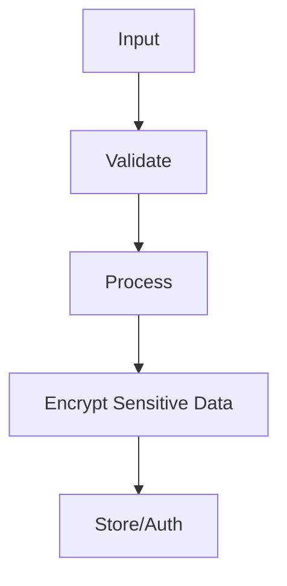

## Overview

Security in Java involves protecting applications from threats like injection, authentication failures, and data breaches. Best practices include secure coding, encryption, and access control.

## Detailed Explanation

Key areas:

- **Input Validation**: Sanitize inputs to prevent injection attacks.
- **Authentication & Authorization**: Use frameworks like Spring Security.
- **Encryption**: Protect data with AES, RSA.
- **Secure Coding**: Avoid vulnerabilities like SQL injection, XSS.

Common threats: OWASP Top 10, including injection, broken auth, sensitive data exposure.



## Real-world Examples & Use Cases

- **Web Apps**: Secure user login and data handling.
- **APIs**: Token-based auth for microservices.
- **Enterprise Software**: Compliance with GDPR, HIPAA.

## Code Examples

### Input Validation with Bean Validation

```java
import javax.validation.constraints.NotNull;
import javax.validation.constraints.Size;

public class User {
    @NotNull
    @Size(min = 3, max = 50)
    private String username;
}
```

### Password Hashing

```java
import java.security.MessageDigest;
import java.security.NoSuchAlgorithmException;

public String hashPassword(String password) throws NoSuchAlgorithmException {
    MessageDigest md = MessageDigest.getInstance("SHA-256");
    byte[] hash = md.digest(password.getBytes());
    return bytesToHex(hash);
}
```

## References

- [OWASP Java Security](https://owasp.org/www-project-java/)
- [Oracle Java Security Guide](https://docs.oracle.com/javase/8/docs/technotes/guides/security/)

## Github-README Links & Related Topics

- [Java Security Basics](../java-security-basics/README.md)
- [User Authentication](../user-authentication/README.md)
- [Reflection and Annotations](../reflection-and-annotations/README.md)