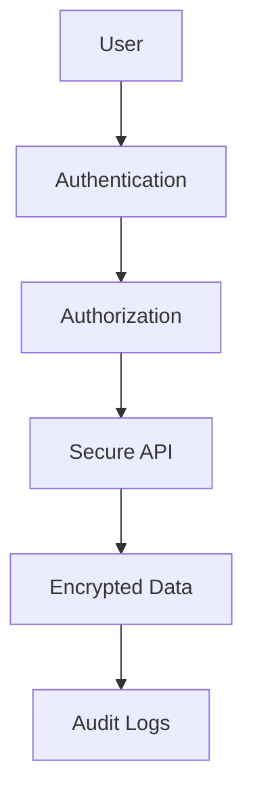

# Security in System Design

## Overview

Security in system design involves implementing protective measures across all layers of an application to prevent unauthorized access, data breaches, and other threats. This encompasses authentication, authorization, encryption, and secure communication protocols.

# Detailed Explanation

## Authentication
- **Password-based**: Secure storage with hashing (bcrypt, Argon2).
- **Multi-factor Authentication (MFA)**: Adds layers beyond passwords.
- **Token-based**: JWT, OAuth2 for stateless authentication.
- **Certificate-based**: Client certificates for strong authentication.

## Authorization
- **Role-Based Access Control (RBAC)**: Permissions based on user roles.
- **Attribute-Based Access Control (ABAC)**: Policies based on attributes.
- **OAuth2**: Delegated authorization for third-party access.

## Data Protection
- **Encryption at Rest**: AES for stored data.
- **Encryption in Transit**: TLS 1.3 for network communication.
- **Data Masking**: Hide sensitive data in logs and displays.

## Secure Communication
- **HTTPS**: SSL/TLS certificates.
- **API Security**: Rate limiting, input validation, CORS policies.

## Threat Mitigation
- **SQL Injection Prevention**: Prepared statements, ORM.
- **XSS Prevention**: Input sanitization, Content Security Policy.
- **CSRF Protection**: Tokens, SameSite cookies.

## Infrastructure Security
- **Network Segmentation**: VLANs, firewalls.
- **Zero Trust**: Verify all access requests.
- **Secrets Management**: Vault, AWS KMS for key storage.



## Real-world Examples & Use Cases

- **Banking App**: MFA, end-to-end encryption, audit logging.
- **E-commerce Platform**: PCI DSS compliance, secure payment processing.
- **Cloud Services**: IAM roles, encrypted storage, VPC isolation.

# Code Examples

## JWT Authentication with Spring Security
```java
@Configuration
@EnableWebSecurity
public class SecurityConfig extends WebSecurityConfigurerAdapter {
    
    @Override
    protected void configure(HttpSecurity http) throws Exception {
        http.csrf().disable()
            .authorizeRequests()
            .antMatchers("/api/auth/**").permitAll()
            .anyRequest().authenticated()
            .and()
            .sessionManagement().sessionCreationPolicy(SessionCreationPolicy.STATELESS);
        
        http.addFilterBefore(jwtAuthenticationFilter(), UsernamePasswordAuthenticationFilter.class);
    }
    
    @Bean
    public JwtAuthenticationFilter jwtAuthenticationFilter() {
        return new JwtAuthenticationFilter();
    }
}
```

## Password Hashing
```java
import org.springframework.security.crypto.bcrypt.BCryptPasswordEncoder;

@Service
public class UserService {
    private BCryptPasswordEncoder encoder = new BCryptPasswordEncoder();
    
    public String hashPassword(String password) {
        return encoder.encode(password);
    }
    
    public boolean verifyPassword(String rawPassword, String hashedPassword) {
        return encoder.matches(rawPassword, hashedPassword);
    }
}
```

## HTTPS Configuration
```java
@Configuration
public class HttpsConfig {
    @Bean
    public TomcatServletWebServerFactory servletContainer() {
        TomcatServletWebServerFactory tomcat = new TomcatServletWebServerFactory() {
            @Override
            protected void postProcessContext(Context context) {
                SecurityConstraint securityConstraint = new SecurityConstraint();
                securityConstraint.setUserConstraint("CONFIDENTIAL");
                SecurityCollection collection = new SecurityCollection();
                collection.addPattern("/*");
                securityConstraint.addCollection(collection);
                context.addConstraint(securityConstraint);
            }
        };
        tomcat.addAdditionalTomcatConnectors(redirectConnector());
        return tomcat;
    }
    
    private Connector redirectConnector() {
        Connector connector = new Connector("org.apache.coyote.http11.Http11NioProtocol");
        connector.setScheme("http");
        connector.setPort(8080);
        connector.setSecure(false);
        connector.setRedirectPort(8443);
        return connector;
    }
}
```

# References

- [OWASP Top 10](https://owasp.org/www-project-top-ten/)
- [NIST Cybersecurity Framework](https://www.nist.gov/cyberframework)
- [OAuth 2.0 Specification](https://tools.ietf.org/html/rfc6749)

# Github-README Links & Related Topics

- [API Security Best Practices](../api-security-best-practices/README.md)
- [Java Security Best Practices](../java-security-best-practices/README.md)
- [Infrastructure Security](../infrastructure-security/README.md)