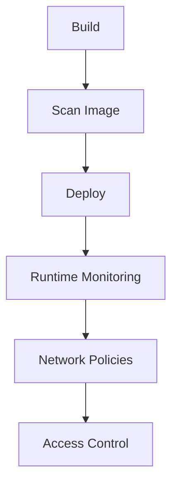

## Overview

Container security involves protecting containerized applications from vulnerabilities, unauthorized access, and runtime threats. It encompasses image scanning, runtime protection, network security, and compliance in environments like Docker and Kubernetes.

## Detailed Explanation

### Key Aspects
- **Image Security**: Scan for vulnerabilities in base images.
- **Runtime Security**: Monitor container behavior.
- **Network Security**: Secure inter-container communication.
- **Access Control**: Use RBAC and secrets management.

### Best Practices
- Use minimal base images (e.g., Alpine Linux).
- Regularly update images and scan for CVEs.
- Implement secrets management (e.g., HashiCorp Vault).
- Use security contexts in Kubernetes.



## Real-world Examples & Use Cases

- **Financial Services**: Scan container images for vulnerabilities before deployment to comply with regulations.
- **E-commerce**: Use runtime security to detect anomalous behavior in payment processing containers.
- **CI/CD Pipeline**: Integrate security scans in automated builds.

## Code Examples

### Dockerfile with Security Best Practices
```dockerfile
FROM alpine:latest
RUN apk add --no-cache ca-certificates
COPY app /app
USER nobody
CMD ["/app"]
```

### Kubernetes Security Context
```yaml
apiVersion: v1
kind: Pod
metadata:
  name: secure-pod
spec:
  securityContext:
    runAsUser: 1000
    runAsGroup: 1000
  containers:
  - name: app
    image: myapp:latest
    securityContext:
      allowPrivilegeEscalation: false
      readOnlyRootFilesystem: true
```

## Common Pitfalls & Edge Cases

- **Privileged Containers**: Avoid running as root.
- **Outdated Images**: Regularly update to patch vulnerabilities.
- **Secrets in Images**: Never bake secrets into container images.

## Tools & Libraries

- Trivy, Clair, Falco, Aqua Security, Twistlock.

## References

- [Docker Security Best Practices](https://docs.docker.com/develop/dev-best-practices/security/)
- [Kubernetes Security](https://kubernetes.io/docs/concepts/security/)
- [OWASP Container Security](https://owasp.org/www-project-container-security/)

## Github-README Links & Related Topics

- [docker-best-practices](../docker-best-practices/README.md)
- [kubernetes-security](../kubernetes-security/README.md)
- [security-best-practices-in-java](../security-best-practices-in-java/README.md)