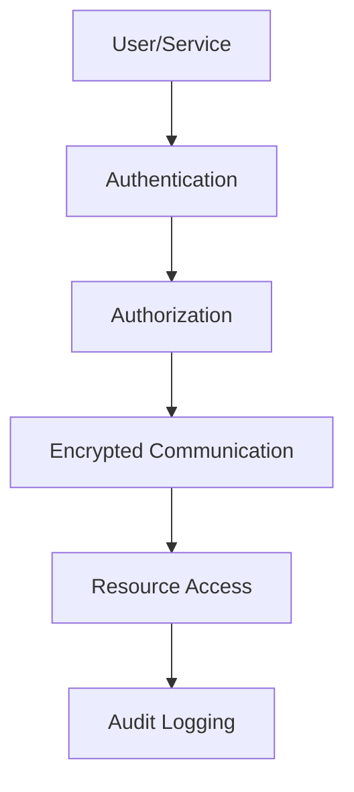

## Overview

Security in distributed systems involves protecting data, communications, and resources across multiple nodes, networks, and services. It addresses unique challenges like network vulnerabilities, data consistency, and fault tolerance while maintaining performance and scalability.

## Detailed Explanation

Distributed systems security encompasses authentication, authorization, encryption, secure communication, and threat mitigation. Key principles include defense in depth, least privilege, and zero trust.

- **Authentication**: Verifying identities of users, services, and devices.
- **Authorization**: Controlling access to resources based on roles and permissions.
- **Encryption**: Protecting data in transit and at rest.
- **Secure Communication**: Using protocols like TLS for network security.
- **Threat Modeling**: Identifying and mitigating risks such as man-in-the-middle attacks, DDoS, and data breaches.

Common challenges: Latency from encryption, key management, and securing inter-service communications.



## Real-world Examples & Use Cases

### Example 1: Microservices Security
In a microservices architecture, secure API gateways handle authentication and rate limiting, while service mesh like Istio manages mutual TLS between services.

### Example 2: Cloud Distributed Systems
AWS or GCP use IAM for role-based access, VPC for network isolation, and encryption for data storage and transfer.

### Use Cases
- E-commerce platforms securing user data across global datacenters.
- Banking systems ensuring transaction integrity in distributed ledgers.
- IoT networks protecting device communications from tampering.

## Code Examples

### JWT Authentication in Node.js
```javascript
const jwt = require('jsonwebtoken');

function generateToken(user) {
  return jwt.sign({ id: user.id }, 'secretKey', { expiresIn: '1h' });
}

function verifyToken(token) {
  try {
    return jwt.verify(token, 'secretKey');
  } catch (err) {
    return null;
  }
}
```

### TLS Configuration in Java
```java
import javax.net.ssl.SSLContext;
import javax.net.ssl.TrustManagerFactory;

SSLContext sslContext = SSLContext.getInstance("TLS");
TrustManagerFactory tmf = TrustManagerFactory.getInstance(TrustManagerFactory.getDefaultAlgorithm());
tmf.init(keyStore);
sslContext.init(null, tmf.getTrustManagers(), null);
```

## References

- [OWASP Distributed Systems Security](https://owasp.org/www-project-distributed-systems/)
- [NIST Cybersecurity Framework](https://www.nist.gov/cyberframework)
- [Distributed Systems Security - Wikipedia](https://en.wikipedia.org/wiki/Distributed_systems_security)

## Github-README Links & Related Topics

- [API Security Best Practices](../api-security-best-practices/)
- [Security Best Practices in Microservices](../security-best-practices-in-microservices/)
- [CAP Theorem & Distributed Systems](../cap-theorem-and-distributed-systems/)