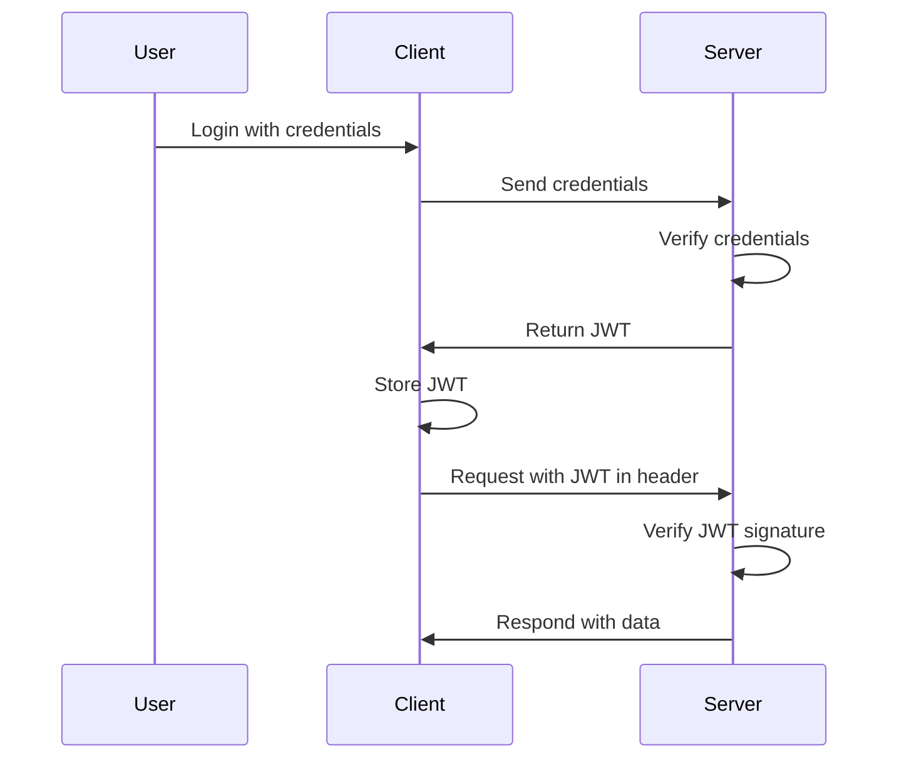

# JWT Authentication

## Overview

JSON Web Tokens (JWT) are a compact, URL-safe means of representing claims to be transferred between two parties. They are commonly used for authentication and authorization in web applications and APIs.

## Detailed Explanation

A JWT consists of three parts separated by dots: Header, Payload, and Signature.

- **Header**: Typically contains the type of token (JWT) and the signing algorithm (e.g., HS256, RS256).
- **Payload**: Contains the claims, which are statements about an entity (user) and additional metadata.
- **Signature**: Created by encoding the header and payload, then signing with a secret or private key.

The entire token is base64url encoded.

### JWT Workflow



### Security Best Practices

- Always use HTTPS to prevent token interception.
- Set short expiration times and implement refresh tokens.
- Store tokens securely (e.g., httpOnly cookies for web apps).
- Use strong signing algorithms; avoid 'none' algorithm.
- Validate issuer and audience claims.

## Real-world Examples & Use Cases

- **Single Page Applications**: Authenticate users without server-side sessions.
- **Microservices**: Pass user identity across services securely.
- **API Gateways**: Centralize authentication for multiple APIs.
- **Mobile Apps**: Stateless authentication for offline-capable apps.
- **OAuth 2.0**: Used in flows like Authorization Code Grant.

## Code Examples

### Java (using JJWT library)

```java
import io.jsonwebtoken.Jwts;
import io.jsonwebtoken.Claims;
import io.jsonwebtoken.SignatureAlgorithm;
import java.util.Date;

// Generate JWT
String secretKey = "mySecretKey";
String jwt = Jwts.builder()
    .setSubject("user123")
    .setIssuer("myApp")
    .setIssuedAt(new Date())
    .setExpiration(new Date(System.currentTimeMillis() + 3600000)) // 1 hour
    .signWith(SignatureAlgorithm.HS256, secretKey)
    .compact();

// Parse and verify JWT
Claims claims = Jwts.parser()
    .setSigningKey(secretKey)
    .parseClaimsJws(jwt)
    .getBody();

System.out.println("Subject: " + claims.getSubject());
```

### Node.js (using jsonwebtoken)

```javascript
const jwt = require('jsonwebtoken');

// Generate JWT
const payload = { userId: 123, role: 'admin' };
const secret = 'mySecretKey';
const token = jwt.sign(payload, secret, { expiresIn: '1h' });

// Verify JWT
jwt.verify(token, secret, (err, decoded) => {
    if (err) {
        console.error('Invalid token');
    } else {
        console.log('Decoded:', decoded);
    }
});
```

## References

- [RFC 7519: JSON Web Token (JWT)](https://tools.ietf.org/html/rfc7519)
- [JWT.io - Introduction to JWT](https://jwt.io/introduction/)
- [OWASP JWT Cheat Sheet](https://cheatsheetseries.owasp.org/cheatsheets/JSON_Web_Token_Cheat_Sheet_for_Java.html)

## Github-README Links & Related Topics

- [JJWT (Java JWT Library)](https://github.com/jwtk/jjwt)
- [jsonwebtoken (Node.js)](https://github.com/auth0/node-jsonwebtoken)
- Related Topics:
  - [OAuth and JWT](./oauth-and-jwt/README.md)
  - [API Authentication Methods](./api-authentication-methods/README.md)
  - [API Security Best Practices](./api-security-best-practices/README.md)