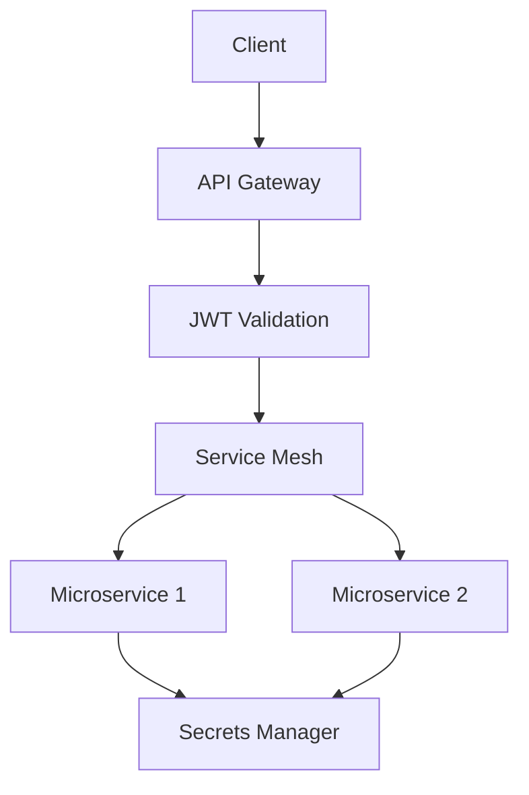

# Security Best Practices in Microservices

## Overview

Security in microservices involves protecting distributed systems from threats through authentication, encryption, and monitoring.

## Detailed Explanation

### Authentication and Authorization

Use JWT, OAuth for secure service-to-service communication.

### Encryption

Encrypt data in transit and at rest.

### Secrets Management

Use tools like HashiCorp Vault for managing secrets.

### Network Security

Implement service mesh for traffic encryption and policy enforcement.

### Monitoring and Auditing

Log security events and monitor for anomalies.

## Real-world Examples & Use Cases

- Financial services securing transaction data.
- Healthcare protecting patient information.
- E-commerce preventing data breaches.

## Code Examples

```java
// Spring Security JWT example
@Configuration
@EnableWebSecurity
public class SecurityConfig extends WebSecurityConfigurerAdapter {
    @Override
    protected void configure(HttpSecurity http) throws Exception {
        http.csrf().disable()
            .authorizeRequests()
            .antMatchers("/api/public").permitAll()
            .anyRequest().authenticated()
            .and()
            .addFilter(new JwtAuthenticationFilter(authenticationManager()));
    }
}
```

## References

- [OWASP Microservices Security Cheat Sheet](https://owasp.org/www-project-microservices-security-cheat-sheet/)
- [Spring Security](https://spring.io/projects/spring-security)

## Github-README Links & Related Topics

- [Microservices Security](./microservices-security/README.md)
- [API Security Best Practices](./api-security-best-practices/README.md)
- [Service Mesh Architecture](./service-mesh-architecture/README.md)

