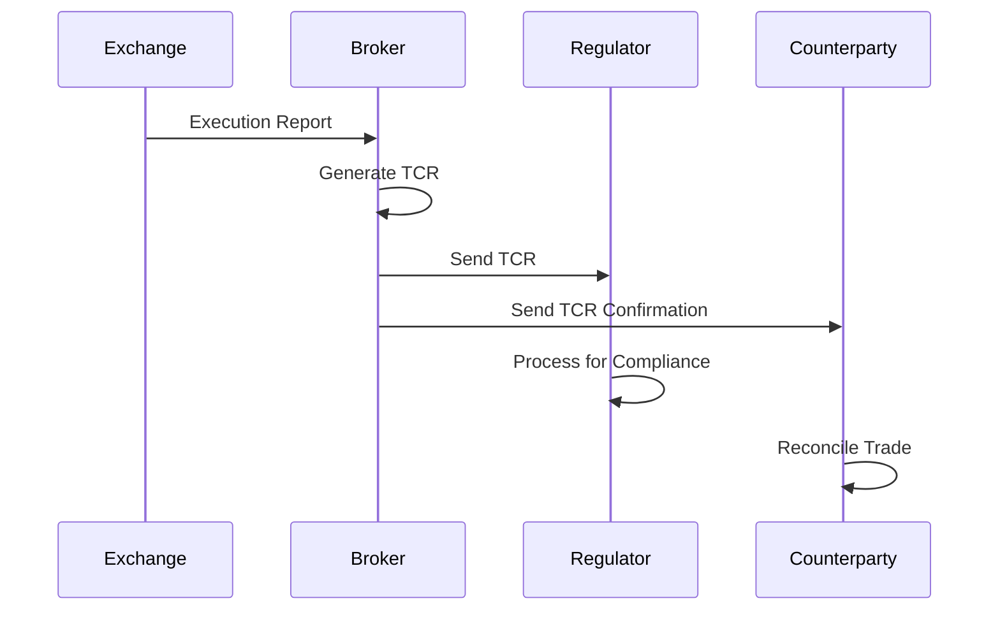

## Overview

Trade Capture Reports (TCRs) are standardized messages used for post-trade processing, including regulatory reporting, trade reconciliation, and confirmation. In FIX protocol, these are TradeCaptureReport messages (MsgType=AE). They capture comprehensive trade details for compliance with regulations like MiFID II, Dodd-Frank, and EMIR. TCRs ensure transparency and enable efficient settlement and risk management.

## STAR Summary

**SITUATION:** Post-trade processes require standardized reporting for regulatory compliance and operational efficiency.

**TASK:** Define Trade Capture Report structure and usage in trading workflows.

**ACTION:** Reviewed FIX TCR specifications and regulatory requirements for trade reporting.

**RESULT:** Produced a guide for implementing TCR handling in compliance and settlement systems.

## Detailed Explanation

TCRs are generated after trade execution to report details to regulators, counterparties, and internal systems. They include:

- Trade identifiers, parties involved, instrument details.
- Execution price, quantity, timestamps.
- Settlement instructions and regulatory flags.

TCRs support both bilateral (OTC) and exchange-traded transactions. They are often sent in batches or real-time depending on regulatory deadlines.

## Real-world Examples & Use Cases

**Regulatory Reporting:** A broker sends TCRs to FINRA for all US equity trades within required timeframes.

**OTC Derivative Confirmation:** Parties exchange TCRs for swap trades to confirm terms and initiate settlement.

**Reconciliation:** Custodians use TCRs to match trades against client accounts.

## Message Formats / Data Models

**FIX TradeCaptureReport Example:**
```
8=FIX.4.4|35=AE|49=BROKER|56=REGULATOR|34=1|52=20230926-10:00:00|571=TRADE123|55=TSLA|32=1000|31=50.00|75=20230926|60=20230926-10:00:00|10=123|
```

| Field | Tag | Description |
|-------|-----|-------------|
| TradeReportID | 571 | Unique trade identifier |
| Symbol | 55 | Instrument |
| LastQty | 32 | Traded quantity |
| LastPx | 31 | Traded price |
| TransactTime | 60 | Trade timestamp |
| TradeDate | 75 | Business date of trade |

## Journey of a Trade



## Common Pitfalls & Edge Cases

- **Timeliness:** Late TCR submissions can result in penalties.
- **Data Accuracy:** Errors in trade details can lead to failed reconciliations.
- **Duplicate Reporting:** Trades may be reported multiple times if not deduplicated.
- **Cross-Border Complexity:** Different jurisdictions have varying reporting requirements.
- **OTC Anonymity:** Public TCRs for OTC trades must balance transparency with confidentiality.

## Tools & Libraries

- **Compliance Platforms:** FIS, Broadridge for regulatory reporting.
- **FIX TCR Libraries:** Parsers for generating and validating TCRs.
- **Databases:** Time-series databases for storing trade histories.

```python
# Example: TCR generation (pseudocode)
def generate_tcr(trade_id, symbol, qty, price, timestamp):
    tcr = {
        'MsgType': 'AE',
        'TradeReportID': trade_id,
        'Symbol': symbol,
        'LastQty': qty,
        'LastPx': price,
        'TransactTime': timestamp
    }
    return tcr

# Usage
tcr = generate_tcr('T123', 'AAPL', 100, 150.00, '2023-09-26T10:00:00Z')
print(tcr)
```

## Github-README Links & Related Topics

- [FIX Protocol](/fix-protocol)
- [Execution Report](/execution-report)
- [Journey of a Trade](/journey-of-a-trade)
- [Regulatory Reports](/regulatory-reports)

## References

- [FIX TradeCaptureReport](https://www.fixtrading.org/documents/fix-protocol-specification/)
- [MiFID II Transaction Reporting](https://www.esma.europa.eu/mifid-ii-transaction-reporting)
- [FINRA Trade Reporting](https://www.finra.org/rules-guidance/rulebooks/finra-rules/6380)