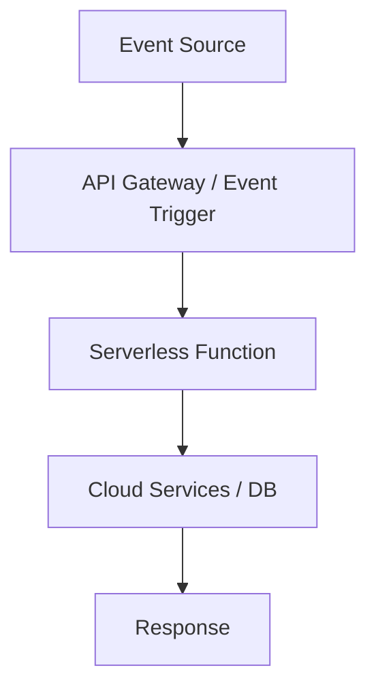

# Serverless Computing

## Overview

Serverless computing is a cloud computing execution model where the cloud provider dynamically manages the allocation and provisioning of servers. Developers write and deploy code as functions that run in response to events, without managing the underlying infrastructure.

## Detailed Explanation

In serverless architecture, applications are broken down into small, stateless functions triggered by events such as HTTP requests, database changes, or message queue events. The cloud provider handles scaling, patching, and maintenance automatically.

Key components:
- **Function as a Service (FaaS)**: Core of serverless, e.g., AWS Lambda, Azure Functions.
- **Event Sources**: Triggers like API Gateway, S3, DynamoDB streams.
- **Backend as a Service (BaaS)**: Managed services like databases, storage.

### Architecture Diagram



## Real-world Examples & Use Cases

- **Image Processing**: Automatically resize images uploaded to S3 using Lambda.
- **IoT Data Ingestion**: Process sensor data in real-time with Azure Functions.
- **Webhooks**: Handle GitHub webhooks for CI/CD pipelines.
- **Chatbots**: Serverless functions for natural language processing.

## Code Examples

### AWS Lambda Function (Node.js)

```javascript
exports.handler = async (event, context) => {
    try {
        // Process the event
        const data = JSON.parse(event.body);
        console.log('Received data:', data);
        
        // Perform business logic
        const result = { message: 'Processed successfully', data: data };
        
        return {
            statusCode: 200,
            body: JSON.stringify(result)
        };
    } catch (error) {
        console.error('Error:', error);
        return {
            statusCode: 500,
            body: JSON.stringify({ error: 'Internal Server Error' })
        };
    }
};
```

### Azure Function (C#)

```csharp
using System;
using Microsoft.AspNetCore.Mvc;
using Microsoft.Azure.WebJobs;
using Microsoft.Azure.WebJobs.Extensions.Http;
using Microsoft.AspNetCore.Http;

public static class HttpTriggerFunction
{
    [FunctionName("HttpTriggerFunction")]
    public static IActionResult Run(
        [HttpTrigger(AuthorizationLevel.Anonymous, "get", "post", Route = null)] HttpRequest req)
    {
        string name = req.Query["name"];
        return new OkObjectResult($"Hello, {name}!");
    }
}
```

## References

- [AWS Lambda Developer Guide](https://docs.aws.amazon.com/lambda/latest/dg/welcome.html)
- [Azure Functions Documentation](https://docs.microsoft.com/en-us/azure/azure-functions/)
- [Google Cloud Functions](https://cloud.google.com/functions/docs)
- [Serverless Framework](https://www.serverless.com/)

## Github-README Links & Related Topics

- [Serverless Architecture](serverless-architecture/README.md)
- [AWS Lambda and Serverless Computing](aws-lambda-and-serverless-computing/README.md)
- [Cloud Deployment Strategies](cloud-deployment-strategies/README.md)
- [Microservices Architecture](microservices-architecture/README.md)