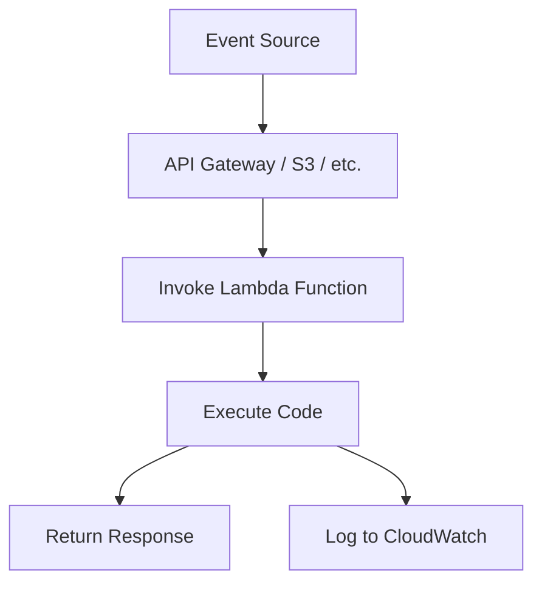

# Serverless Functions

## Overview

Serverless functions, also known as Function as a Service (FaaS), allow developers to run code in response to events without managing underlying infrastructure. AWS Lambda is a popular serverless platform that executes code only when needed, scaling automatically and charging only for compute time used.

## Detailed Explanation

Serverless functions abstract away server management, allowing focus on application logic. Key characteristics:

- **Event-driven**: Functions trigger on events like HTTP requests, database changes, or scheduled tasks.
- **Auto-scaling**: Platform handles scaling from zero to thousands of concurrent executions.
- **Pay-per-use**: Billing based on execution time and resources consumed.
- **Stateless**: Functions should be stateless; use external storage for persistence.
- **Runtime support**: Multiple languages (Node.js, Python, Java, Go, etc.) and custom runtimes.

AWS Lambda integrates with other AWS services and supports container images via Lambda layers.



## Real-world Examples & Use Cases

- **Web Backends**: Handle API requests for web and mobile applications.
- **Data Processing**: Process files uploaded to S3 or stream data from Kinesis.
- **Scheduled Tasks**: Run periodic jobs like data cleanup or report generation.
- **Real-time Processing**: Handle IoT sensor data or user activity streams.
- **Generative AI**: Serve AI models for inference requests.

## Code Examples

### Simple Lambda Function in Python

```python
import json

def lambda_handler(event, context):
    # Extract data from event
    name = event.get('name', 'World')
    
    # Process the request
    message = f"Hello, {name}!"
    
    # Return response
    return {
        'statusCode': 200,
        'body': json.dumps({
            'message': message
        })
    }
```

### Event-Driven Function for S3 Uploads

```python
import boto3
import json

s3 = boto3.client('s3')

def lambda_handler(event, context):
    for record in event['Records']:
        bucket = record['s3']['bucket']['name']
        key = record['s3']['object']['key']
        
        # Process the uploaded file
        print(f"Processing file: s3://{bucket}/{key}")
        
        # Example: Copy to another bucket
        copy_source = {'Bucket': bucket, 'Key': key}
        s3.copy_object(
            CopySource=copy_source,
            Bucket='processed-bucket',
            Key=f"processed-{key}"
        )
    
    return {
        'statusCode': 200,
        'body': 'File processed successfully'
    }
```

### Scheduled Function with CloudWatch Events

```yaml
# In serverless.yml or via AWS Console
functions:
  dailyCleanup:
    handler: handler.cleanup
    events:
      - schedule: cron(0 2 * * ? *)  # Daily at 2 AM UTC
```

## Common Pitfalls & Edge Cases

- **Cold Starts**: Initial invocation latency; mitigate with provisioned concurrency.
- **Timeout Limits**: Functions have maximum execution time (15 minutes for Lambda).
- **Memory Limits**: Configure appropriate memory allocation for performance.
- **Statelessness**: Avoid storing state in function instances.
- **Error Handling**: Implement proper error handling and retries.

## Tools & Libraries

- **AWS SAM**: Framework for building serverless applications.
- **Serverless Framework**: Multi-cloud serverless deployment tool.
- **AWS CDK**: Infrastructure as code for AWS resources.

## References

- [AWS Lambda Documentation](https://aws.amazon.com/lambda/)
- [AWS Lambda Features](https://aws.amazon.com/lambda/features/)
- [Serverless Computing Concepts](https://aws.amazon.com/serverless/)

## Github-README Links & Related Topics

- [AWS Lambda Getting Started](https://aws.amazon.com/lambda/getting-started/)
- [Serverless Architecture Patterns](https://aws.amazon.com/serverless/patterns/)