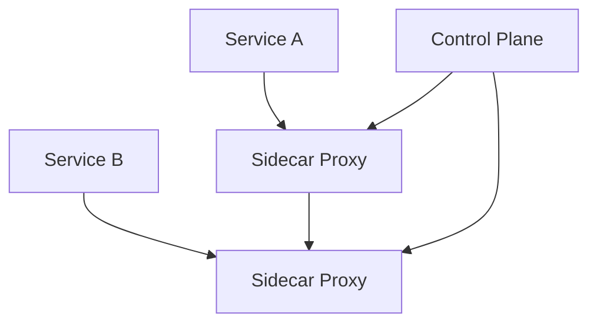

# Service Mesh Architecture

## Overview

A service mesh is a dedicated infrastructure layer for handling service-to-service communication in microservices architectures. It provides features like traffic management, observability, and security without requiring changes to application code.

## Detailed Explanation

### Components

- **Data Plane**: Handles actual data traffic between services. Consists of proxies (e.g., Envoy) deployed as sidecars.
- **Control Plane**: Manages and configures the data plane. Provides APIs for configuration.

### Key Features

- **Service Discovery**: Automatic detection of service instances.
- **Load Balancing**: Distribute traffic across service instances.
- **Traffic Management**: Routing rules, retries, timeouts.
- **Security**: Mutual TLS, authentication, authorization.
- **Observability**: Metrics, logs, tracing.

### Popular Implementations

- **Istio**: Feature-rich, integrates with Kubernetes.
- **Linkerd**: Lightweight, easy to install.
- **Consul**: HashiCorp's service mesh.



## Real-world Examples & Use Cases

- **Netflix**: Uses service mesh for microservices communication.
- **Uber**: Manages traffic in large-scale systems.
- **E-commerce Platforms**: Handle high traffic with resilience.

## Code Examples

### Istio Installation (Kubernetes)

```bash
kubectl apply -f https://raw.githubusercontent.com/istio/istio/release-1.20/samples/bookinfo/platform/kube/bookinfo.yaml
istioctl install --set profile=demo
```

### Traffic Routing with Istio

```yaml
apiVersion: networking.istio.io/v1beta1
kind: VirtualService
metadata:
  name: reviews
spec:
  http:
  - route:
    - destination:
        host: reviews
        subset: v1
    weight: 75
  - route:
    - destination:
        host: reviews
        subset: v2
    weight: 25
```

## Common Pitfalls & Edge Cases

- **Performance Overhead**: Proxies add latency.
- **Complexity**: Managing configurations.
- **Resource Usage**: Sidecars consume CPU/memory.

## Tools & Libraries

- Istio
- Linkerd
- Envoy Proxy

## References

- [Istio Documentation](https://istio.io/)
- [Linkerd](https://linkerd.io/)
- [Service Mesh Patterns](https://servicemesh.io/)

## Github-README Links & Related Topics

- [Microservices Architecture](../microservices-architecture/README.md)
- [Kubernetes Basics](../kubernetes-basics/README.md)
- [API Gateway Design](../api-gateway-design/README.md)